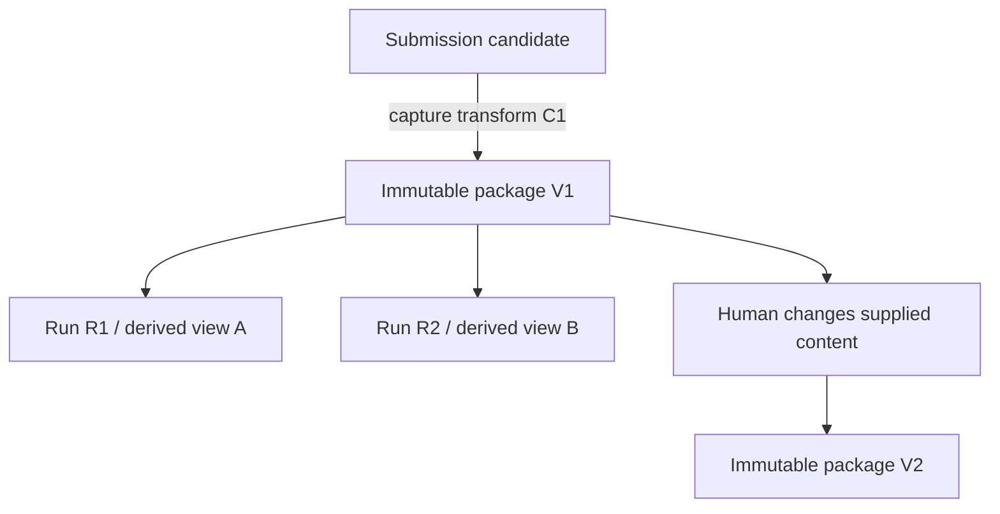
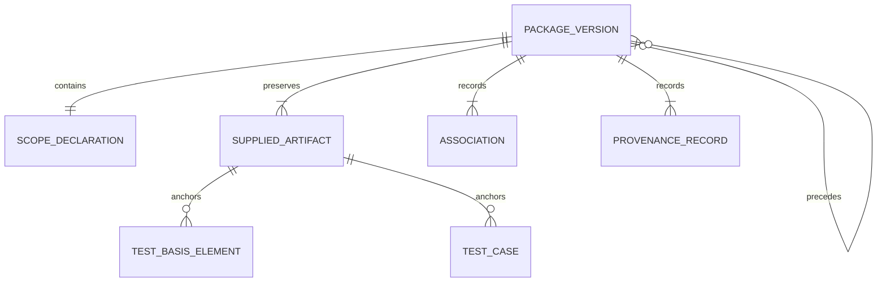

# Test Design Gatekeeper

## RA-03 — Review Package Content, Provenance, Validation, and Input Sufficiency

| Field | Value |
| --- | --- |
| Document version | 0.4 |
| Document date | 2026-09-21 |
| SDLC phase | Requirements Analysis |
| Workstream | `RA-03` |
| Status | CONTROLLED AMENDMENT CANDIDATE — CR-RA10-001 and CR-RA10-002 verified; Owner endorsement pending |
| Decision authority | Project Owner |
| Entry authorization | `PG-RA02-001` — `GO`, 2026-09-09 |
| Approved upstream baselines | Project Charter v0.4; RA-01 v0.3; RA-02 v0.3, designated by PG-RA03-001 v0.2 |
| Controlled amendment scope | RA-03 §15.3 only: condition definitions, IS-10/IS-11 applicability and consequence clarification; no REQ or VAL statement changes |
| Current content disposition | All 50 requirement statements and ten original policy decisions remain accepted; v0.3 remains the baseline until this amendment is endorsed |
| Implementation authorization | NOT GRANTED |
| Confidential-data use | NOT AUTHORIZED |

> **Current status notice:** The Project Owner accepted all fifty RA-03 requirements, designated v0.3 and granted GO to RA-04 in [PG-RA03-001 v0.2][gate03-current]. Those decisions remain effective. This v0.4 candidate changes only the input-sufficiency clarification identified in Section 15.3 and the administrative explanation of its status. [SR-RA10-001 v0.1][review10-current] records the two findings, proposed controlled amendments and completed correction verification. Their endorsement and designation of this replacement wording remain pending. No earlier gate is reopened and no requirement is awaiting repeated acceptance.

### v0.4 controlled amendment summary

| Change ID | Finding | Prepared change | Status |
| --- | --- | --- | --- |
| CR-RA10-001 | SR-RA10-F-001 | Define G as a relevant contradiction/coherence problem without presupposing global non-separability; X determines whether an independent supported subset exists | VERIFIED — OWNER ENDORSEMENT PENDING |
| CR-RA10-002 | SR-RA10-F-002 | Make X irrelevant in conflict-free IS-10 and IS-11; distinguish missing conditional evidence with and without independent supported work, without undoing a satisfied package minimum | VERIFIED — OWNER ENDORSEMENT PENDING |

All 50 requirement statements, all 32 validation-obligation rows, all ten original decisions, rule identifiers IS-01 through IS-11 and the original source examples are unchanged. The narrower corrections implement RA03-REQ-031/032/034/035/040/041/050 consistently with RA-05's later ledger and availability contract. No new capture permission, business rule, model task or runtime feature is introduced.

**Reading preserved history:** Except for this notice, the Section 15.3 amendment and the updated Section 25, the following text preserves the v0.3 snapshot. Its older source-version labels, PROPOSED columns, pending upstream actions, author-check results, planned allocations and exit discussion describe the 2026-09-12 authoring state. Current acceptance and baseline authority are supplied by PG-RA03-001 v0.2 and subsequent slice closure records, not those historical notices. In particular, all fifty statements have current status ACCEPTED, RA03-UA-001/002 are closed, and RA-04 through RA-09 have since closed. Historical text is retained to keep this correction diff confined and inspectable.

### v0.2 correction summary

| Review input | Severity | Accepted correction | Verification state |
| --- | --- | --- | --- |
| `RA03-REV-001` | Medium | Define the relationship among normative `shall`, priority `MUST`, and requirement status `PROPOSED` or `ACCEPTED` | Incorporated in Section 17 |
| `RA03-REV-002` | High | Make `OD-RA03-004` the priority origin decision and base positive eligibility on attributable human accountability rather than purity of authorship | Owner accepted on 2026-09-12; incorporated with upstream impact recorded as `RA03-UA-002` |
| `RA03-REV-003` | Medium | Establish explicit downstream validation coverage for every proposed `MUST` requirement | Incorporated; deterministic reverse check reports 50/50 in Section 22 |
| `RA03-REV-004` | Low | Clarify test-case cardinality, add origin/accountability dimensions, and point role identifiers to RA-01 | Incorporated in Sections 3, 7, and 11 |

These findings originated in a Project Owner walkthrough supported by an additional model review. Their correction does not constitute independent assurance or replace the focused static review required by the RA-03 exit criteria.

### v0.3 decision-consolidation summary

| Change group | Accepted decisions | Consolidated effect |
| --- | --- | --- |
| Package and run identity | `OD-RA03-001`, `007`, `009`, `010` | Separate capture from assessment, keep inference run-scoped, allow single-predecessor branching, and prohibit fingerprint-only merging |
| Test-case admissibility and basis | `OD-RA03-002`, `003`, `004` | Define recognizable behavioral content, make direct trace links optional, preserve explicit experience-based rationale, and use attributable human accountability for origin eligibility |
| Identity, supplied-content boundary, and provenance | `OD-RA03-005`, `006`, `008` | Permit visible internal IDs, reject reference-only evidence, preserve authorized extraction uncertainty, and require attributable provenance without authenticity claims |

## 1. Purpose

RA-03 defines what TDG must receive, preserve, identify, relate, and validate before it can represent a Review Package as suitable for any supported assessment.

The document prevents six recurring errors:

- treating successful parsing or file import as proof that meaningful review can proceed;
- treating every absent field as equally fatal, or every present field as sufficient;
- treating a hyperlink, filename, or external identifier as if the referenced content had been supplied;
- treating TDG-derived extraction, normalization, or inference as original source fact;
- treating co-location of requirements and test cases as direct traceability;
- allowing content, scope, or provenance changes to overwrite an already assessed package version.

RA-03 makes missing and conflicting information testable without turning TDG into the author or repairer of the submitted testware.

## 2. Scope of RA-03

RA-03 covers:

- the serialization-neutral logical composition of one Review Package;
- package, source, scope, test-basis, test-case, association, provenance, and lineage concepts;
- core-minimum, conditionally required, supplementary, and system-recorded content;
- logical cardinalities and referential-integrity rules;
- minimum admissibility and assessment-specific sufficiency;
- preservation of unknown, malformed, duplicate, contradictory, opaque, and unmapped content;
- the boundary among supplied content, system observations, human declarations, and TDG-derived interpretations;
- immutable package-version identity and human-controlled lineage;
- validation-issue information and consequences;
- requirements, decision points, and downstream validation obligations.

RA-03 does not define:

- final scope-classification taxonomy, evidence weighting, or black-box eligibility — `RA-04`;
- final finding, disposition, status, persistence, retention, or audit data model — `RA-05`;
- technique applicability or coverage algorithms for EP, BVA, Decision Tables, or State Transitions — `RA-06`;
- permitted LLM roles, prompts, model identity, qualification, or requalification — `RA-07`;
- detailed security, privacy, authentication, authorization, logging, retention, or threat controls — `RA-08`;
- physical JSON Schema, CSV profiles, parser behavior, capture/import mapping profiles, or export serialization — `RA-09`;
- benchmark composition, metrics, usability criteria, or product acceptance thresholds — `RA-10`;
- solution architecture, implementation technology, repository structure, or executable tests.

RA-03 may identify information that later workstreams require. It must not decide their detailed semantics prematurely.

## 3. Source baseline and precedence

| Source | Binding contribution to RA-03 |
| --- | --- |
| Project Charter v0.3, Sections 6–13 | Primary flow, minimum Review Package, scope, findings, input, and confidentiality boundaries |
| Project Charter v0.3, Sections 15–17 | Synthetic reference package, evaluation evidence, and separation of model-derived behavior |
| Requirements Analysis Entry Record v0.1 | `RA-IN-002` through `RA-IN-006` and `RA-IN-008` |
| RA-01 v0.2 | Human authority, supplied-data boundary, combined roles, and laboratory/sealed distinction |
| RA-02 v0.2 | Workflow, alternate paths, package/run separation, accepted requirements, and routed RA-03 obligations |
| `PG-RA02-001` | Authorization and explicit boundary for RA-03 only |
| Project Owner dispositions `OD-RA03-001` through `OD-RA03-010`, 2026-09-12 | Accepted RA-03 decision directions incorporated in this candidate and routed to controlled upstream amendments where required |

Precedence is:

1. the approved Charter governs the product and MVP boundary;
2. RA-01 governs human authority;
3. RA-02 governs workflow and package/run separation;
4. `PG-RA02-001` limits current work to RA-03;
5. a conflict requires controlled change rather than silent reinterpretation.

### 3.1 Upstream wording requiring clarification or correction

`RA03-UA-001` records that RA-02 and `PG-RA02-001` use the general word “mapping” when stating that a behavior change against unchanged supplied content creates a new assessment run. RA-03 exposes two materially different cases:

- an import or capture mapping helps establish which logical content belongs to the immutable package snapshot;
- an assessment mapping interprets an already captured package for a particular review run.

The Project Owner accepted through `OD-RA03-001` that recapture under a changed import transformation creates a new package version, while a changed assessment mapping creates only a new run against unchanged captured content. RA-02 v0.3 applies that distinction as controlled amendment `CR-RA03-003`. `RA03-UA-001` remains administratively open only until the RA-02 amendment passes focused delta review and replaces v0.2; the accepted meaning itself is no longer open.

`RA03-UA-002` records that the approved Charter v0.3 repeatedly uses “human-authored” or “tester-authored” for the product vision, primary workflow, minimum Review Package, supported MVP scope, and decision `D-004`. RA-01 v0.2 Section 7 also assigns ROLE-03 ownership of “submitted human-authored test cases.” The Project Owner accepted on 2026-09-12 that eligibility should instead be governed by attributable human accountability rather than purity of authorship. RA-03 therefore treats both human-authored and human-controlled AI-assisted testware as positive origin classes only when an identified ROLE-03 accepts accountability. Generated testware without accountable human ownership, other origin, and unknown origin do not satisfy that positive rule by themselves.

This decision does not authorize TDG to write test cases, infer authorship from style, review tests of AI/LLM systems as a target domain, or weaken human control. Charter v0.4 and RA-01 v0.3 apply the required controlled wording corrections as `CR-RA03-001`; the Charter also applies the accepted experience-basis clarification as `CR-RA03-002`. `RA03-UA-002` remains administratively open only until those amendment candidates pass focused delta review and replace their approved predecessors. RA-03 records the impact instead of silently rewriting historical baselines or gate records.

Role identifiers `ROLE-01` through `ROLE-10` and their decision authorities are defined exclusively in the approved RA-01 v0.2 Sections 7 and 9; RA-01 v0.3 contains the controlled ROLE-03 wording candidate. RA-03 uses those identifiers by reference and does not redefine them.

## 4. Terminology

| Term | Meaning in RA-03 |
| --- | --- |
| Submission candidate | Deliberately selected files, records, declarations, or other local material offered for intake before TDG has established an immutable package snapshot or attributable rejection |
| Submission context | Operational record of who submitted what, when, under which declared role and operating profile; distinct from the supplied business content |
| Capture transformation | Identified parsing, import mapping, or fail-visible structural normalization used to create a traceable logical package snapshot from deliberately supplied source artifacts |
| Review Package lineage | Human-controlled sequence or branch of related package versions concerning the same declared review purpose |
| Review Package version | Immutable identity for the exact supplied source content, human declarations, and captured logical projection established through an identified capture transformation |
| Package manifest | Logical inventory that identifies the package version, its content items, relationships, provenance, and lineage without prescribing a physical format |
| Scope declaration | Human-supplied or human-confirmed statement of the bounded feature or small process intended for review |
| Supplied artifact | An immutable content instance deliberately included in the submission, such as a document, structured row set, diagram, excerpt, or test-case export |
| Test-basis element | An addressable supplied requirement, user story, acceptance criterion, business rule, risk, prior defect, state description, decision rule, process fragment, attributable experience-based rationale, or other basis item |
| Test case | An addressable test-design item submitted for review; positive MVP eligibility requires an accepted origin declaration plus attributable ROLE-03 accountability, while other origins remain preserved as negative, unsupported, or undetermined input |
| Behavioral segment | Non-title supplied content expressing at least one test condition, input or test datum, action, event, expected behavior, outcome, or equivalent behavioral statement; an identifier, title, link, or precondition alone is not a behavioral segment |
| Experience-based rationale | A human-supplied and attributable statement that a test derives from risk, a prior defect, an observed failure, a heuristic, or relevant experience; it is evidence of the declared design basis, not invented requirement coverage or proof that a formal requirement exists |
| Source locator | Stable location within a supplied artifact that allows a human or TDG to find the cited content in that exact package version |
| Provenance assertion | Supplied or system-recorded information about an item's origin, identity, version, supplier, capture, or relationship to another source |
| Scope-membership association | Human declaration that an item is submitted as a candidate member of the package boundary; not proof of detailed requirement coverage |
| Direct trace link | Supplied explicit relationship between a test case and one or more test-basis elements |
| Derived assessment view | Version-identified semantic mapping, extraction, or interpretation used by an assessment run after package capture; it references but does not mutate the supplied package version |
| Opaque artifact | Supplied item whose substantive content cannot be addressed by the active intake capability; it may be inventoried but not silently treated as evaluated evidence |
| Core-minimum content | Information whose absence prevents substantive review of the package as a whole |
| Conditional evidence | Information required only for a specified assessment, technique, item, or claim; its absence limits the affected assessment rather than automatically invalidating the package |
| Supplementary content | Information that may improve review quality but whose absence alone does not block a supported assessment |
| System-recorded metadata | Identity, time, integrity, or operational context recorded by TDG without being represented as a supplied business fact |
| Internal identifier | TDG-controlled identity used to distinguish a package item even when its external source lacks a reliable identifier |
| External identifier | Identifier declared by the supplied source, retained as source data and not assumed unique or correct without validation |
| Minimum admissibility | The condition in which core-minimum content is identifiable and coherent enough to permit scope qualification and at least one potentially meaningful substantive assessment |
| Assessment-specific sufficiency | Availability of the particular evidence required for one requested review dimension or technique |

The definitive persisted entity schema and cross-run status model remain allocated to later workstreams. These terms define semantic distinctions that those models must preserve.

## 5. Review Package principles

| ID | Principle |
| --- | --- |
| RP-01 | Supplied content, human declarations, system observations, and TDG-derived interpretations remain distinguishable |
| RP-02 | TDG establishes stable identity and provenance before relying on semantic content |
| RP-03 | Minimum admissibility means that review may begin; it is not a quality, completeness, or approval verdict |
| RP-04 | Package membership is not direct test-basis-to-test-case traceability |
| RP-05 | A generated internal identifier may preserve identity but must not conceal a missing, duplicate, or conflicting external identifier |
| RP-06 | An input problem has the narrowest defensible consequence: package-wide only when a non-separable minimum or policy condition fails |
| RP-07 | An assessed package version is immutable; human changes create a distinct version and preserve lineage |
| RP-08 | A reference to external material neither supplies that material nor authorizes TDG to retrieve it |
| RP-09 | Provenance supports attribution and reviewability; it does not by itself prove source truth, authority, or authenticity |
| RP-10 | Logical content semantics remain independent of JSON, CSV, Jira, Xray, Zephyr, document, or UI representation |
| RP-11 | TDG does not silently repair supplied content, identifiers, relationships, or source precedence |
| RP-12 | The package preserves enough evidence for later difficult classification and technique analysis without performing those later analyses in RA-03 |

## 6. Three-layer intake model

RA-03 separates three layers that must not be collapsed.

| Layer | Contains | May change when | Must not be represented as |
| --- | --- | --- | --- |
| Submission context | Actor, acting role, operating profile, request time, selected local inputs, applicable operational configuration | A new submission or operational request occurs | Supplied business rule or immutable package content |
| Immutable package version | Exact supplied artifacts, human declarations, traceable logical item projection, capture-transformation identity, scope, provenance, associations, and lineage reference | Never in place; changed supplied content or recapture under a changed import transformation creates a new version | Assessment result, mutable working copy, or semantic model interpretation |
| Derived assessment view | Versioned assessment mapping, semantic extraction, normalization, and interpretation used by one assessment | A new run uses changed assessment behavior, prompt, model, rule, control, or configuration | Original supplied fact or a silent package revision |

RA-03 distinguishes two mapping categories:

- a **capture or import transformation** establishes the package's logical projection from exact supplied artifacts; recapture under a changed transformation creates a distinct package version and records both source identity and transformation identity;
- an **assessment mapping or interpretation** operates on an already captured package; changing it against the same package version creates a new assessment run, not a package version.

A human change to scope, source material, testware, supplied associations, or provenance-affecting declarations also creates a new package version.

Snapshot creation and minimum admissibility are separate outcomes. When policy permits exact safe capture, TDG may preserve an immutable package version that later fails minimum-admissibility validation. When exact trustworthy capture itself is impossible, only an attributable submission rejection exists. Neither outcome may be presented as a completed substantive review.

## 7. Logical content inventory

### 7.1 Content categories

| Category | Meaning | Absence consequence |
| --- | --- | --- |
| CORE MINIMUM | Required to establish one minimally admissible Review Package | Blocks substantive review of the package |
| CONDITIONAL | Required for a particular item, requested assessment, technique, or evidentiary claim | Blocks or limits only the dependent assessment where separable |
| SUPPLEMENTARY | Potentially useful context not required by itself | No automatic block; limitation may still be reported |
| SYSTEM RECORDED | Created by TDG for identity, integrity, attribution, or operation | Failure to record may block the affected operation, but the value is not a supplied business fact |

### 7.2 Object inventory and cardinality

| Logical object | Cardinality per package version | Category | Principal source or authority | Purpose |
| --- | ---: | --- | --- | --- |
| Package manifest, internal package-version identity, and capture-transformation identity | Exactly 1 | SYSTEM RECORDED | TDG | Inventory, immutable package reference, and reproducible logical capture |
| Review Package lineage identity | Exactly 1 | SYSTEM RECORDED or human-selected existing lineage | TDG under human-controlled submission | Relate versions without overwriting history |
| Direct predecessor reference | 0 or 1 | CONDITIONAL | Human declaration validated by TDG | Record derivation from an earlier package version |
| Scope declaration | Exactly 1 | CORE MINIMUM | ROLE-02 decision, possibly recorded through ROLE-01 | Bound the feature or small process |
| Supplied artifact | 1 or more | CORE MINIMUM | Human-supplied | Preserve exact submitted content containers |
| Test-basis element | 1 or more | CORE MINIMUM | Human-supplied and anchored to a supplied artifact | Provide an addressable basis for review |
| Test case | 1 or more recognizable items; at least 1 must meet the accepted origin-and-accountability rule, while remaining cases may declare another origin | CORE MINIMUM | Supplied testware under attributable ROLE-03 accountability for positive eligibility | Provide the test design to review without silently discarding mixed-origin items |
| Scope-membership association | At least 1 for every basis element and test case | CORE MINIMUM | Human declaration through package assembly | State intended package membership without claiming detailed coverage |
| Direct trace link | 0 or more | CONDITIONAL or SUPPLEMENTARY | Supplied source or human declaration | Express explicit basis-to-test-case traceability where available |
| Provenance record | At least 1 per supplied artifact and addressable item | CORE MINIMUM | Supplied declaration plus system observation | Preserve source identity and location |
| Context declaration | 0 or more | CONDITIONAL or SUPPLEMENTARY | Human-supplied | Record declared test level, type, execution mode, role, objective, environment, or other context |
| Risk item | 0 or more | CONDITIONAL or SUPPLEMENTARY | Human-supplied | Support risk-coverage assessment when requested |
| Supporting evidence or attachment | 0 or more | CONDITIONAL or SUPPLEMENTARY | Human-supplied | Supply diagrams, matrices, examples, or excerpts |
| Package-level note or open question | 0 or more | SUPPLEMENTARY | Human-supplied | Preserve known uncertainty without inventing an answer |

One supplied artifact may contain many basis elements, many test cases, or both. Cardinality applies to logical addressable items, not necessarily to the number of physical files.

## 8. Structural relationships

The logical relationships require that:

- every test-basis element and test case belongs to exactly one immutable package version;
- every addressable supplied item points to one supplied artifact and one stable source locator or whole-artifact marker;
- every supplied artifact and addressable item has package-local identity and provenance;
- every basis element and test case has a scope-membership association;
- a direct trace link may relate many test cases to many basis elements;
- missing direct trace links remain visible and are never replaced by silent inferred links;
- a package version may identify at most one direct predecessor in the proposed MVP lineage model, while one predecessor may have multiple later variants;
- assessment runs, findings, human dispositions, and exports reference the package version but are not contained as supplied package content.

## 9. Scope declaration

### 9.1 Core-minimum scope semantics

One scope declaration must identify:

- a human-readable scope title;
- the target business-system context or application context;
- one feature or small business process to be reviewed;
- a positive description of behavior included in the boundary;
- the ROLE-02 authority or attributable combined-role decision responsible for the boundary.

The declaration may additionally identify excluded behavior, business objective, user or business role, assumed dependencies, interfaces, environment, requested review dimensions, and known limitations.

### 9.2 Structural presence versus qualified boundary

RA-03 validates whether a scope declaration is present, identifiable, non-empty, and connected to the submitted items. It does not decide the complete RA-04 taxonomy or prove that the declaration is genuinely small enough.

An apparently cross-process, multi-feature, internally inconsistent, or content-mismatched boundary remains visible and is routed to scope qualification. TDG must not repair it by silently selecting a narrower scope.

### 9.3 Authority behavior

A valid explicit scope already recorded by a person acting as ROLE-02 need not be reconfirmed on every run against the unchanged package version. Missing, ambiguous, changed, or TDG-proposed scope requires a new ROLE-02 decision. The LLM cannot be the source of the authoritative package boundary.

## 10. Supplied artifacts and test-basis elements

### 10.1 Supplied artifact minimum

Every supplied artifact must have:

- a package-local internal identifier;
- a human-visible source label;
- an exact retained content instance or an integrity-protected reference to content retained inside the package snapshot;
- a declared or observed content kind where available;
- a provenance record;
- a relationship to the package version.

An external path, URL, Jira key, document number, or filename may identify origin but does not replace the supplied content instance. TDG must not dereference it during review unless a human deliberately imports that content into a new package version through an authorized path.

### 10.2 Test-basis element semantics

A test-basis element may represent:

- a requirement or functional requirement;
- a user story or use case;
- an acceptance criterion;
- a business rule or constraint;
- a risk statement;
- a prior defect, observed failure, heuristic, or attributable experience-based rationale supplied by a human;
- a process step or alternate path;
- a state, event, transition, or guard description;
- a decision condition, action, or rule;
- a specification excerpt, diagram fragment, table row, or other addressable evidence;
- another supplied item whose type is declared as other or unknown.

Each element requires package-local identity, an anchor to one supplied artifact, a stable source locator or explicit whole-artifact marker, and substantive supplied content accessible within the snapshot.

The declared kind may remain unknown or later be challenged. An incorrect or missing kind does not authorize TDG to rewrite the source; it may affect classification or assessment sufficiency.

### 10.3 Addressable versus opaque content

An opaque artifact may be inventoried and preserved. It cannot by itself satisfy the minimum test-basis requirement unless the active authorized capability can expose its relevant content in an addressable, reviewable form or a human deliberately supplies an addressable excerpt or description. When an authorized OCR or equivalent extraction capability exposes content, the extracted material must retain its artifact locator, derivation, and uncertainty; mere extraction success does not prove semantic correctness.

The system must not imply that a diagram, scan, binary attachment, inaccessible reference, or unsupported format was evaluated merely because it was present in the package.

A file using Jira-like fields, keys, or a customized Jira-shaped structure is evaluated according to its supplied content and the applicable declared import profile. TDG is not required to establish that the file was actually exported from Jira, and it must not represent the shape or metadata as proof of that origin.

### 10.4 Supplied content versus extracted interpretation

A rule, state, boundary, condition, or trace link extracted or inferred by TDG belongs to the derived assessment view. It must retain its source evidence, derivation, uncertainty, and behavior version.

It becomes supplied package content only when a human deliberately adds or confirms it as content in a new package version. Human confirmation recorded for an assessment may authorize an affected claim without silently rewriting the earlier package snapshot.

## 11. Test-case logical representation

### 11.1 Representation-neutral test case

RA-03 does not require one editorial template. A test case may be represented as classic fields, tabular steps, a narrative scenario, Given/When/Then, or another supported structure, provided its content remains addressable and its semantic parts can be preserved without invention.

### 11.2 Accepted recognizable-case and positive-eligibility boundary

Under `OD-RA03-002`, a supplied item counts as a recognizable test case only when it is:

- identifiable through a supplied identifier or a visible package-local internal identifier;
- described by a non-empty title, summary, objective, or scenario description; and
- supported by at least one deliberately supplied, non-title behavioral segment describing a test condition, input or test datum, action, event, expected behavior, outcome, or semantically equivalent test content.

An identifier, title, external link, or precondition alone is insufficient, including a combination of those elements that still contains no behavioral segment. The item remains preserved and its deficiency remains visible.

Recognizability is not a completeness or quality verdict. A recognizable case may still omit material content. Missing expected behavior does not erase recognizability when another qualifying behavioral segment is present, but it is a material content gap or an assessment limitation. Preconditions are conditionally required whenever the case depends on state, data, authority, environment, or another prerequisite. Expected behavior may be recorded per step or in an addressable narrative description. Classic fields, step tables, and BDD-style forms remain eligible when they preserve equivalent semantics.

For use inside a minimally admissible package, a recognizable case must also be anchored to supplied testware, associated with the declared scope, covered by identifiable provenance, and carry an explicit origin declaration attributable to the item or an unambiguous containing set. For the package to satisfy the accepted positive origin rule, at least one recognizable test case must be declared either human-authored or human-controlled with AI assistance and must have an identified ROLE-03 who accepts accountability for that supplied testware. Other recognizable cases may remain in the same package with generated, other, or unknown origin; they remain visible and do not become positively eligible merely because an accountable case is also present.

### 11.3 Test-case content dimensions

| Content dimension | Minimum status | Absence or ambiguity consequence |
| --- | --- | --- |
| Internal identity | Required | Item cannot be referenced reliably until TDG assigns a visible local identity |
| Source artifact and locator | Required | Provenance and evidence are insufficient for that item |
| Title, summary, objective, or scenario description | Required for recognizability | Item is preserved but does not count as a recognizable test case |
| At least one non-title behavioral segment | Required for recognizability | Identifier, title, link, or precondition alone remains structurally insufficient |
| Testware-origin declaration | Required for every test case, either directly or through an unambiguous containing set | Unknown, missing, mixed, or conflicting origin remains visible; TDG must not infer a value from style |
| ROLE-03 accountability declaration | Required for a recognizable case to satisfy the positive MVP origin rule | The case remains preserved but cannot satisfy the package minimum by itself |
| Preconditions | Conditional and required when applicable | May create a reviewable gap or limit interpretation; does not automatically reject the package |
| Steps, actions, or events | Conditional | Required when the representation and requested assessment depend on them |
| Input or test data | Conditional | Limits data-domain, EP, BVA, or rule assessment where relevant |
| Expected result or observable outcome | Conditional; may be per step or in an addressable narrative | Its absence does not erase recognizability when other behavioral content exists, but creates a material content gap or may make observability or coverage assessment ungradable |
| Postcondition | Supplementary or conditional | Required only when later behavior depends on the resulting state |
| Test level, test type, design basis, or execution mode declarations | Conditional | Missing or conflicting declarations route to RA-04; labels are not verdicts |
| Priority, business risk, owner, lifecycle status, or environment | Supplementary or conditional | Limits only assessments that rely on that context |
| Direct test-basis trace link | Conditional or supplementary | Absence may itself be reviewed as a traceability gap; it is not a minimum-intake failure |

The package must preserve empty, missing, or ambiguous content as such. It must not generate a precondition, step, input, or expected result merely to make the test case appear complete.

### 11.4 Human accountability and origin

TDG cannot prove authorship or the degree of AI assistance from writing style. RA-03 therefore requires an explicit supplied origin declaration and keeps it distinct from the accountable human role.

Candidate origin meanings are:

- human-authored;
- human-controlled with AI assistance;
- generated or supplied from another process without accountable human adoption;
- other;
- unknown.

Under the Project Owner decision recorded in `OD-RA03-004`, both human-authored and human-controlled AI-assisted testware satisfy the positive origin rule when an identified ROLE-03 explicitly accepts accountability. Eligibility follows accountable human control, not a claim that no AI tool participated. A generated case may enter the human-controlled class only through a deliberate human adoption or correction recorded in supplied declarations; changing that declaration or adopting the content creates a new package version.

Generated content without accountable human adoption, other origin, and unknown origin remain valid preserved inputs but do not satisfy the positive package minimum by themselves. In a mixed-origin package, RA-04 must qualify item-level consequences without allowing one eligible case to transfer eligibility to another. TDG must not infer, challenge, or upgrade origin solely from prose style, formatting, vocabulary, metadata patterns, or perceived LLM characteristics. Regardless of origin, ROLE-03 remains the only authority for changes to source testware.

## 12. Associations and traceability

### 12.1 Scope membership

Every test-basis element and test case must be explicitly submitted as a candidate member of the declared Review Package scope. Package assembly may establish this containment relationship.

Scope membership means only:

> “The responsible human supplied this item for consideration within this declared boundary.”

It does not mean that the item truly belongs to the boundary, that it covers a requirement, or that TDG has validated it as in scope.

### 12.2 Direct trace links

Direct links between test cases and test-basis elements are not proposed as core-minimum content. Requiring them at intake would prevent TDG from reviewing the common and important defect of missing traceability.

When present, each direct link must identify:

- its source and whether it was explicitly supplied or later declared by a human;
- one or more addressable source and target items;
- any supplied relationship type or rationale;
- ambiguity, dangling references, duplicates, or contradictions.

A test case may therefore have zero, one, or multiple direct test-basis links. It may also carry a human-supplied experience-based rationale such as an identified risk, prior defect, observed failure, or heuristic. TDG must preserve the rationale and its human attribution, but it must not invent hidden tester experience, transform that rationale into a nonexistent documented requirement, or claim documented-requirement coverage from it.

Recognizing this basis does not add detailed assessment of experience-based techniques such as error guessing, exploratory testing, or checklist-based testing to the initial four-technique MVP. The information may support general review and later scope or roadmap decisions; EP, BVA, Decision Table Testing, and State Transition Testing remain the only techniques assessed in the initial technique set.

### 12.3 Inferred association

An LLM-assisted or rule-derived candidate link is not a supplied trace link. It belongs to an identified assessment run, carries evidence and uncertainty, begins without human acceptance, and cannot silently satisfy a deterministic traceability requirement.

If a human incorporates that link into the package, the change creates a new package version. Human acceptance of a review suggestion alone must remain distinguishable from editing the supplied testware or package metadata.

### 12.4 Orphans and mismatches

Unlinked, multiply linked, dangling, or apparently mismatched items must remain visible. TDG may isolate unaffected items, but it must not silently delete an orphan, redirect a broken reference, or manufacture a relationship.

## 13. Provenance model

### 13.1 Minimum provenance set

For every supplied artifact and addressable basis or test-case item, provenance must provide enough information to:

- distinguish the exact content instance inside the package;
- identify a human-visible source label or source key;
- locate the item within the supplied snapshot;
- identify the package version in which it was captured;
- identify the capture transformation used to establish its logical projection;
- identify the submitting human or local actor identifier and submission time through the submission context;
- preserve any supplied external identifier, source version, author, timestamp, system, export, or revision metadata without treating it as verified automatically;
- distinguish supplied declarations from system observations and derived inferences.

RA-03 does not require proof that the originating organization, author, external system, or document was authentic. It requires honest attribution and preservation of what was and was not established.

### 13.2 Provenance evidence classes

| Evidence class | Example | Permitted meaning |
| --- | --- | --- |
| SUPPLIED DECLARATION | Operator states that a document is requirement version 4 | Retain the declaration and its supplier; do not label it independently verified |
| SUPPLIED SOURCE METADATA | Export contains a Jira key, author, or update time | Preserve the exact supplied value and source location |
| SYSTEM OBSERVATION | TDG records intake time, file size, detected type, or integrity identity | May support reproducibility; is not a business fact |
| HUMAN CONFIRMATION | ROLE-04 confirms an interpretation or precedence for an assessment | Authorizes the bounded human decision; does not rewrite the source snapshot automatically |
| DERIVED INFERENCE | LLM proposes that two differently named rules are equivalent | Assessment evidence only, with uncertainty; never supplied fact by default |

### 13.3 Provenance sufficiency meanings

RA-03 uses the following semantic conditions without finalizing RA-05 statuses:

| Condition | Meaning | Default consequence |
| --- | --- | --- |
| Identifiable | Exact supplied content and source location can be distinguished inside the package | May support dependent assessment |
| Partial | Some origin metadata is absent, but exact package content and location remain identifiable | Limit only claims that require the missing metadata |
| Conflicting | Supplied origin, version, identity, or precedence information disagrees | Preserve conflict; block or narrow dependent claims |
| Unavailable | Exact supporting content or its package-local source cannot be identified | Does not satisfy the affected minimum or conditional evidence need |

A filesystem path is not required as minimum provenance and may itself be sensitive. A user-visible logical source label, package-local identity, source locator, and retained content identity are preferred. Detailed path handling and redaction belong to RA-08 and RA-09.

### 13.4 Integrity identity

TDG must be able to detect whether the content used by a run is the exact package snapshot identified in the result. The algorithm and storage form are design decisions.

An integrity fingerprint must not be treated as proof of semantic equivalence, source authenticity, ownership, or permission. Identical bytes also do not authorize automatic merging of independently submitted packages.

## 14. Conditional evidence by later assessment

The table identifies information categories that may become necessary. It does not define the later assessment algorithms.

| Requested assessment or decision | Typical conditional evidence | Consequence when absent or conflicting |
| --- | --- | --- |
| Scope qualification | Declared test level, test type, design basis, execution mode, target, role, and intended behavior | RA-04 may return undetermined, mixed, mismatched, or partially assessable outcome |
| Requirement-to-test traceability | Explicit identifiers, direct links, addressable basis elements, case intent | Absence may be the gap under review; unsupported coverage claim is prohibited |
| Preconditions and observability | Preconditions, actions or events, expected behavior, environment or state | Affected case or dimension may be ungradable or produce a scoped quality observation |
| Negative and alternate behavior | Supplied invalid conditions, exceptions, forbidden actions, alternate paths, or business constraints | Assessment restricted to documented evidence; TDG must not invent missing paths |
| Risk coverage | Supplied risk identity, description, affected behavior, or priority | Risk-based review is unavailable or partial without invalidating unrelated dimensions |
| EP | Supplied input domains, categories, validity rules, exclusions, or representative values | EP applicability or coverage may be unassessable; details belong to RA-06 |
| BVA | Supplied ordered domain, limits, inclusivity, units, precision, or adjacent-value semantics | BVA applicability or boundary coverage may be unassessable; details belong to RA-06 |
| Decision Table Testing | Supplied conditions, actions, combinations, dependencies, impossibilities, or rule outcomes | Decision-rule coverage may be unassessable; details belong to RA-06 |
| State Transition Testing | Supplied states, initial or terminal state, events, transitions, guards, invalid transitions, or outcomes | State coverage may be unassessable; details belong to RA-06 |
| Deterministic coverage claim | Sufficiently confirmed structured rule plus traceable normalized input and identified control/mapping versions | Deterministic claim prohibited; another independent assessment may remain possible |
| LLM-assisted semantic suggestion | Addressable source evidence, permitted role, qualified behavior, and enough context to ground the claim | LLM role must abstain, narrow, or remain unavailable; details belong to RA-07 |

Conditional evidence may be present in prose, tables, diagrams, structured records, or another supported representation. Later workstreams decide whether the active capability can interpret it reliably.

## 15. Validation and input-sufficiency behavior

### 15.1 Validation stages

Validation proceeds conceptually in this order:

1. record the submission context and verify that the requested intake path is permitted;
2. determine whether the exact supplied content can be captured and inventoried without silent loss;
3. assign package-local identities and establish an immutable candidate snapshot;
4. validate core-minimum content and required relationships;
5. validate referential integrity, duplicates, source locators, and provenance;
6. expose contradictions, ambiguity, opaque content, and scope-content mismatch without resolving them silently;
7. evaluate assessment-specific evidence sufficiency at the narrowest defensible granularity;
8. expose package-wide, item-level, and assessment-level consequences before substantive results rely on affected content.

Physical parsing and field mapping are specified in RA-09; policy authorization is specified in RA-08. RA-03 defines the logical consequences that those later controls must preserve.

### 15.2 Validation-issue information contract

Every reported intake or package-validation issue must identify, where applicable:

- an issue identity and category;
- the submission candidate or package version;
- the affected artifact, element, relationship, field, or source locator;
- the observed missing, malformed, duplicate, dangling, contradictory, opaque, unknown, or unmapped condition;
- evidence sufficient for a human to inspect the issue without inventing content;
- whether the consequence blocks snapshot creation, package-wide substantive review, one item, one relationship, or one assessment dimension;
- the affected assessment or claim;
- the human role or action capable of supplying a corrected new version, clarification, mapping, or authority;
- derivation and uncertainty when the issue is not purely structural or deterministic.

The issue contract must not require unsafe repetition of protected source values in logs or messages. Detailed redaction belongs to RA-08.

### 15.3 Input-sufficiency decision table

Abbreviations:

- `P` — processing path permits capture;
- `I` — exact supplied content can be inventoried and identified;
- `S` — core-minimum scope declaration exists;
- `B` — at least one addressable test-basis element exists;
- `T` — at least one recognizable test case exists;
- `A` — at least one recognizable test case satisfies the accepted origin-and-ROLE-03-accountability rule;
- `V` — minimum provenance is sufficient;
- `G` — a contradiction or integrity/coherence problem in the retained basis affects at least one requested assessment after the earlier capture and provenance checks; this condition does not decide whether the effect is package-wide;
- `D` — the conditional evidence required for the requested assessment boundary exists; `N` means at least one requested assessment lacks necessary conditional evidence;
- `X` — at least one unaffected, independently supported assessment subset can be isolated when earlier deficiencies or a relevant conflict limit the requested boundary.

`–` means that the condition does not affect selection of that row. For IS-01 through IS-07, an earlier prerequisite determines the consequence. For IS-08/IS-09, G identifies the relevant conflict and X selects its consequence; D does not override that conflict consequence. For conflict-free IS-10/IS-11, D determines the input-sufficiency consequence and X is not an additional admission requirement. Unknown or conflicting observations do not silently count as Y or N; their evidence and bounded uncertainty remain subject to Sections 13–15.

| Rule | P | I | S | B | T | A | V | G | D | X | Required consequence |
| --- | --- | --- | --- | --- | --- | --- | --- | --- | --- | --- | --- |
| IS-01 | N | – | – | – | – | – | – | – | – | – | Record only permitted rejection metadata; do not perform prohibited capture or substantive review |
| IS-02 | Y | N | – | – | – | – | – | – | – | – | Return attributable intake rejection; do not claim that an immutable logical package was established |
| IS-03 | Y | Y | N | – | – | – | – | – | – | – | Preserve the candidate snapshot where permitted; identify missing scope; stop package-wide substantive review |
| IS-04 | Y | Y | Y | N | – | – | – | – | – | – | Identify missing addressable test basis; stop package-wide substantive review |
| IS-05 | Y | Y | Y | Y | N | – | – | – | – | – | Identify missing recognizable test case; stop package-wide substantive review |
| IS-06 | Y | Y | Y | Y | Y | N | – | – | – | – | Preserve every supplied case and origin declaration; identify that no recognizable case satisfies accountable positive origin; stop package-wide substantive review |
| IS-07 | Y | Y | Y | Y | Y | Y | N | – | – | – | Identify insufficient source identity or location; stop or narrow only if a trustworthy subset remains distinguishable |
| IS-08 | Y | Y | Y | Y | Y | Y | Y | Y | – | N | Preserve competing evidence; mark the package basis conflicting or ungradable; do not select precedence |
| IS-09 | Y | Y | Y | Y | Y | Y | Y | Y | – | Y | Isolate the unaffected subset and expose the conflict and excluded area explicitly |
| IS-10 | Y | Y | Y | Y | Y | Y | Y | N | N | – | Admit the package minimum; mark assessments depending on missing conditional evidence ungradable; preserve any independently supported assessment, and expose that no substantive conclusion is available if none remains |
| IS-11 | Y | Y | Y | Y | Y | Y | Y | N | Y | – | Permit qualification and the identified supported assessments; make no completeness or approval claim |

This decision table specifies input-sufficiency consequences, not a guarantee that a later qualified capability exists or that assessment has run. Missing conditional evidence does not retroactively erase satisfied core minima or the faithful permitted snapshot. Under accepted RA-05, an attempted dependent dimension is UNGRADABLE; before such work the input-sufficiency limitation is recorded without inventing a completed assessment. At termination, no safely completed substantive entry means availability NONE, while at least one supported entry with remaining limitations means PARTIAL. A supported basis-gap observation can itself be substantive work if actually performed under an applicable requested dimension; its availability must be derived from the recorded ledger, not presumed absent or present from D alone. No generic run state is inferred solely from G, D or X. Policy, domain qualification, capability and fault causes retain their separate later checks.

**Amendment boundary examples.** With the first seven prerequisites satisfied: a local contradiction plus an independent unaffected assessment uses G=Y, X=Y and IS-09; a conflict affecting every meaningful assessment uses G=Y, X=N and IS-08. With G=N and D=N, both the supported-subset and no-supported-subset cases use IS-10; their later ledgers and availability differ. With G=N and D=Y, IS-11 requires no additional X precondition. These are static reasoning examples, not executed product tests or new business rules.

### 15.4 Duplicate and missing identifiers

TDG may assign a visible package-local internal identifier so that every captured item remains referable. It must preserve the original external identifier exactly, including absence or duplication, and report ambiguity wherever a relationship depends on it.

A local identifier is an identity aid, not a silent correction of source testware. Duplicate external identifiers block only dependent relationships or assessments when unaffected items remain distinguishable.

### 15.5 Narrowest defensible consequence

An issue becomes package-wide only when it prevents trusted capture, removes a core-minimum element, violates applicable policy, or affects every meaningful assessment. Otherwise TDG must expose the affected items and dimensions and preserve a clearly bounded supported subset where safe.

## 16. Package identity, immutability, and lineage

### 16.1 Identities that must remain distinct

| Identity | Meaning | Must not be collapsed with |
| --- | --- | --- |
| Package lineage identity | Related human-controlled package history | One physical filename or one assessment run |
| Package version identity | Exact immutable supplied content and declarations | Content fingerprint alone, external source version, or latest working copy |
| Internal item identity | One captured item within one package version | Potentially missing or duplicate external identifier |
| External source identity | Identifier declared by Jira, Xray, Zephyr, document, spreadsheet, or other origin | TDG's internal identity or proof of authenticity |
| Content integrity identity | Evidence that bytes or normalized retained content used by a run match the captured snapshot | Semantic equivalence or authority |
| Capture-transformation identity | Parser, import mapping, and fail-visible structural normalization used to establish a package version | Assessment mapping or source content identity |
| Assessment-run identity | One execution of identified behavior against one package version | Package version or human review cycle |
| Behavior-artifact identity | Assessment mapping, rule, control, prompt, model, or configuration affecting a run | Supplied package content or capture-transformation identity |

### 16.2 Package-version triggers

| Event | New package version? | Required treatment |
| --- | --- | --- |
| Initial successful capture of deliberately supplied content | Yes | Establish lineage and immutable first version |
| Human changes declared scope or boundary | Yes | Create new version; retain ROLE-02 authority and predecessor link |
| Human adds, removes, or changes a supplied artifact, basis element, test case, risk, context declaration, or supplied association | Yes | Create new version and preserve earlier snapshot |
| Human changes assessment-relevant source identity, source version, provenance declaration, or source-precedence content | Yes | Create new version; do not rewrite prior provenance |
| Source artifact is updated under the same external key | Yes | Preserve the earlier external-key occurrence and capture the new content as a distinct version |
| Capture parser or import mapping changes and the supplied candidate is captured again | Yes | Create a distinct package version; preserve exact source identity and record the new capture-transformation identity |
| Assessment mapping, semantic normalization, rule, control, prompt, model, or runtime changes while the captured package is unchanged | No | Create a new assessment run and record changed behavior identity |
| Human confirms a rule only for an assessment without editing supplied content | No | Record the attributable decision outside the immutable package; create a new version only if incorporated as supplied content |
| An authorized human confirms an unchanged existing scope declaration without editing package content | No | Record the attributable decision outside the immutable package and retain the same package version |
| Finding disposition changes | No | Preserve disposition history outside source package content |
| Same package version is assessed again | No | Create a distinct assessment run |
| Package is viewed or exported without changing canonical content | No | Preserve package identity and record only applicable access/export evidence |

### 16.3 Lineage behavior

The accepted MVP model permits a package version to have zero or one direct predecessor and any number of later child versions. This supports an initial version, linear revision, and branching variants. Multi-parent merge semantics are outside the MVP.

A lineage link records human-declared derivation and validated package existence. It does not mean that all earlier findings were fixed, that content changes are correct, or that the newer version supersedes the older version for every purpose.

### 16.4 Identical content and deduplication

An integrity fingerprint may detect byte or retained-content equality. TDG must not automatically merge package versions or lineages solely because fingerprints match. Two independently supplied packages may have different scope, authority, provenance, or purpose despite identical files.

Deliberate human selection of an existing immutable package version reuses that version and creates a distinct assessment run. A re-upload of identical content without such selection remains a separately attributable submission and package version; TDG must not merge it automatically. A future controlled exact-identity rule may change this only through explicit change approval covering content, scope, provenance, authority, and lineage rather than fingerprint equality alone.

## 17. Candidate RA-03 requirements

All requirements below are proposed for Project Owner review. In this section, `shall` expresses the intended mandatory behavior of a candidate requirement. While its status is `PROPOSED`, it is not a baselined obligation and must not be cited as accepted. It becomes binding for downstream work only after its status changes to `ACCEPTED` and the applicable review and baseline controls are complete. Priority `MUST` means that removing the requirement would weaken an approved upstream boundary or the minimum coherent RA-03 model; it does not select an implementation mechanism or override requirement status.

| ID | Requirement | Priority | Status | Primary trace |
| --- | --- | --- | --- | --- |
| RA03-REQ-001 | TDG shall represent Review Package content through a serialization-neutral logical model independent of JSON, CSV, Jira, Xray, Zephyr, document, database, or UI representation | MUST | PROPOSED | `PG-RA02-001`; RP-10 |
| RA03-REQ-002 | TDG shall keep submission context, immutable package version, and derived assessment view as distinct semantic layers | MUST | PROPOSED | WP-06; Section 6 |
| RA03-REQ-003 | An immutable package version shall contain exact supplied source content, attributable human declarations, an identified traceable logical projection, and system-recorded capture metadata, but shall not silently incorporate semantic TDG interpretations or assessment results | MUST | PROPOSED | RP-01; Sections 6 and 10.4 |
| RA03-REQ-004 | TDG shall distinguish supplied declaration, supplied source metadata, system observation, human confirmation, and derived inference wherever their authority or evidentiary meaning differs | MUST | PROPOSED | WP-05; Section 13.2 |
| RA03-REQ-005 | An external reference, path, URL, issue key, or document identifier shall not be treated as supplied substantive content or as authorization to retrieve that content; a Jira-shaped file shall be assessed by supplied content without authenticating that Jira produced it | MUST | PROPOSED | RA-IN-005; RP-08; `OD-RA03-006` |
| RA03-REQ-006 | TDG shall preserve exact supplied source content separately from its identified capture projection and separately from any semantic mapping, extraction, or interpretation used by an assessment | MUST | PROPOSED | RA02-REQ-018; Section 6 |
| RA03-REQ-007 | Every captured package version shall have one package-local version identity, one lineage identity, and one logical manifest identifying its source content, captured logical projection, and capture-transformation identity | MUST | PROPOSED | RA02-REQ-001/017/018/028 |
| RA03-REQ-008 | A minimally admissible package shall contain exactly one attributable scope declaration identifying a target context, one feature or small process, included behavior, and the applicable ROLE-02 decision | MUST | PROPOSED | Charter Section 7; RA01-REQ-004; Section 9 |
| RA03-REQ-009 | A minimally admissible package shall contain at least one supplied artifact whose exact content instance is captured or integrity-identifiable inside the package snapshot | MUST | PROPOSED | Charter Section 7; Section 10.1 |
| RA03-REQ-010 | A minimally admissible package shall contain at least one substantive, addressable test-basis element anchored to a supplied artifact and source locator or whole-artifact marker | MUST | PROPOSED | Charter Section 7; Section 10.2 |
| RA03-REQ-011 | A minimally admissible package shall contain at least one identifiable test case having a non-empty title, summary, objective, or scenario plus at least one non-title behavioral segment; that case shall be anchored to supplied testware, associated with the declared scope, declared either human-authored or human-controlled with AI assistance, and governed by an identified ROLE-03 who accepts accountability; other origin classes shall remain visible but shall not satisfy this minimum by themselves | MUST | PROPOSED | Charter Sections 6–8; Sections 11.2/11.4; `OD-RA03-002/004` |
| RA03-REQ-012 | TDG shall preserve equivalent test-case semantics from classic fields, tabular steps, narrative scenarios, Given/When/Then, and other supported representations without requiring one editorial template | MUST | PROPOSED | RP-10; Section 11.1 |
| RA03-REQ-013 | Every package, artifact, basis element, test case, association, and other addressable captured item shall have an unambiguous package-local internal identifier | MUST | PROPOSED | RP-02/RP-05; Section 16.1 |
| RA03-REQ-014 | TDG shall preserve missing, duplicate, or conflicting external identifiers exactly and shall not represent an assigned internal identifier as a correction of the source | MUST | PROPOSED | RP-05/RP-11; Section 15.4 |
| RA03-REQ-015 | Every test-basis element and test case shall have an explicit scope-membership association without that association being represented as direct coverage traceability | MUST | PROPOSED | RP-04; Section 12.1 |
| RA03-REQ-016 | A test case shall be permitted to have zero, one, or multiple direct test-basis links, and absence of such links shall not by itself make an otherwise minimum-admissible package invalid; any supplied experience-based rationale shall remain attributable and distinct from documented requirement coverage | MUST | PROPOSED | Charter Section 8.3; Section 12.2; `OD-RA03-003` |
| RA03-REQ-017 | Every supplied direct trace link shall preserve its source, endpoints, relationship meaning where supplied, and any detected dangling, duplicate, ambiguous, or contradictory reference | MUST | PROPOSED | RA02-REQ-010/015; Section 12.2 |
| RA03-REQ-018 | TDG-derived candidate associations shall remain assessment artifacts with derivation, evidence, uncertainty, and behavior identity and shall not silently become supplied direct trace links | MUST | PROPOSED | Charter Section 10.2; Section 12.3 |
| RA03-REQ-019 | An opaque or inaccessible artifact shall be inventoried visibly but shall not alone satisfy a substantive test-basis evidence requirement; content exposed by an authorized OCR or equivalent extraction shall retain its locator, derivation, and uncertainty before supporting an assessment | MUST | PROPOSED | RA02-REQ-010; Section 10.3; `OD-RA03-006` |
| RA03-REQ-020 | Every addressable basis element and test case shall identify its supplied artifact and stable package-local source locator or explicit whole-artifact scope | MUST | PROPOSED | RA-IN-004/005; Sections 10–13 |
| RA03-REQ-021 | TDG shall preserve an explicit supplied testware-origin declaration for every test case directly or through an unambiguous containing set, shall keep origin distinct from ROLE-03 accountability, and shall not infer or upgrade authorship, AI assistance, human adoption, or accountability solely from writing style or content patterns | MUST | PROPOSED | Charter Sections 6 and 8; Section 11.4; OD-RA03-004 |
| RA03-REQ-022 | Missing or empty preconditions, steps, inputs, test data, expected results, postconditions, or contextual fields shall remain visible and shall not be filled through invention during package intake; a missing expected result shall be reported as a material gap or affected-assessment limitation without erasing recognizability when other qualifying behavioral content exists | MUST | PROPOSED | RA-IN-002/005; RP-11; `OD-RA03-002` |
| RA03-REQ-023 | TDG shall preserve declared test level, test type, design basis, execution mode, target role, and environment as independent source declarations rather than treating their labels as classification verdicts | MUST | PROPOSED | RA-IN-003; WP-04; RA02-REQ-011/012 |
| RA03-REQ-024 | When risks, prior defects, observed failures, heuristics, experience-based rationales, business objectives, constraints, exclusions, diagrams, matrices, notes, or other supplementary items are supplied, TDG shall retain their identities, human attribution, provenance, and relationships without treating absent optional items as universal package failure or inventing documented requirement coverage | MUST | PROPOSED | Charter Sections 7–8; WP-03; `OD-RA03-003` |
| RA03-REQ-025 | TDG shall preserve unknown, malformed, opaque, or unmapped assessment-relevant content and shall make its effect visible rather than silently dropping it | MUST | PROPOSED | RA02-REQ-010; AF-RA02-001 |
| RA03-REQ-026 | Every supplied artifact and addressable item shall have provenance sufficient to distinguish the exact content instance, source label, package-local location, package version, capture transformation, and applicable submission context | MUST | PROPOSED | Charter Section 7; RA-IN-004; Section 13.1 |
| RA03-REQ-027 | TDG shall record whether each provenance claim is supplied, system-observed, human-confirmed, or derived when the distinction affects review authority or evidence | MUST | PROPOSED | WP-05; Section 13.2 |
| RA03-REQ-028 | TDG shall not represent package provenance or an integrity identity as proof of source truth, authenticity, ownership, authorization, or semantic equivalence | MUST | PROPOSED | RP-09; Sections 13.1/13.4 |
| RA03-REQ-029 | Partial or conflicting provenance shall block or limit only the items and claims that depend on the unavailable or conflicting information when a trustworthy independent subset remains identifiable | MUST | PROPOSED | WP-03; OD-RA02-002; Section 13.3 |
| RA03-REQ-030 | Minimum provenance shall not require persistence of an absolute workstation path; environment-specific location data shall be minimized and handled under later security and import requirements | MUST | PROPOSED | RA-IN-006; Sections 13.1/13.3 |
| RA03-REQ-031 | TDG shall complete applicable policy, capture, identity, core-minimum, referential-integrity, provenance, coherence, and assessment-sufficiency checks before presenting an affected substantive assessment as supported | MUST | PROPOSED | WP-02; RA02-REQ-007; Section 15.1 |
| RA03-REQ-032 | Successful file parsing, field mapping, or snapshot capture shall not by itself be represented as minimum admissibility, assessment sufficiency, scope eligibility, or review success | MUST | PROPOSED | RA02 PWF-02 through PWF-09; Section 15 |
| RA03-REQ-033 | When core-minimum content is absent, TDG shall identify each missing minimum, its affected package version or candidate, the package-wide consequence, and the human action needed before substantive review | MUST | PROPOSED | AF-RA02-002; RA02-REQ-008 |
| RA03-REQ-034 | When conditional evidence is missing, TDG shall identify the dependent item or assessment and shall preserve independent supported assessments with explicit limitations where safe | MUST | PROPOSED | AF-RA02-003; RA02-REQ-009 |
| RA03-REQ-035 | TDG shall preserve contradictory supplied evidence and source identity and shall not select precedence or confirm a business rule without an attributable ROLE-04 decision | MUST | PROPOSED | RA01-REQ-005; RA02-REQ-016 |
| RA03-REQ-036 | TDG shall detect duplicate, dangling, ambiguous, or cross-version references and shall prevent them from silently satisfying required relationships | MUST | PROPOSED | RP-11; Sections 12 and 15.4 |
| RA03-REQ-037 | Assignment of a package-local identifier shall permit safe reference to captured content while leaving every source-identity deficiency visible to humans and dependent assessments | MUST | PROPOSED | RP-05; Section 15.4 |
| RA03-REQ-038 | Every intake or package-validation issue shall identify its category, affected location, evidence, consequence granularity, affected assessment where applicable, and possible human repair or clarification path | MUST | PROPOSED | RA-IN-002; Section 15.2 |
| RA03-REQ-039 | A non-structural or probabilistic input observation shall identify derivation and uncertainty and shall not be represented as a deterministic validation fact | MUST | PROPOSED | Charter Section 10; Section 15.2 |
| RA03-REQ-040 | TDG shall apply a package-wide blocking consequence only when trusted capture, applicable policy, a core-minimum element, or every meaningful assessment is affected | MUST | PROPOSED | OD-RA02-001/002; Section 15.5 |
| RA03-REQ-041 | When invalid, unsupported, conflicting, or insufficient items can be isolated safely, TDG shall expose a supported subset and every exclusion without producing misleading package-wide coverage | MUST | PROPOSED | RA02-REQ-013/014; IS-09/10 |
| RA03-REQ-042 | TDG shall identify the operating profile and shall prevent laboratory processing of confidential or possibly protected package content before prohibited substantive processing occurs | MUST | PROPOSED | RA01-REQ-011; AF-RA02-014 |
| RA03-REQ-043 | Once captured for assessment, a Review Package version and every supplied content instance within it shall be immutable | MUST | PROPOSED | OD-RA02-004; RA02-REQ-001/028 |
| RA03-REQ-044 | Any human change to supplied scope, source content, testware, supplied relationship, risk, context, or provenance-affecting declaration, and any recapture under a changed import transformation, shall create a distinct package version linked to preserved prior lineage where applicable | MUST | PROPOSED | WP-06/07; Section 16.2 |
| RA03-REQ-045 | A behavior-affecting assessment mapping, semantic normalization, rule, control, prompt, model, configuration, or runtime change against an unchanged captured package shall create a distinct assessment run and shall not silently create or mutate a package version | MUST | PROPOSED | RA02-REQ-018/029; Section 16.2 |
| RA03-REQ-046 | Reassessment of the same immutable package version shall create a distinct assessment-run identity while preserving the package-version identity | MUST | PROPOSED | OD-RA02-005; RA02-REQ-017/029 |
| RA03-REQ-047 | A package version shall declare zero or one direct predecessor, may have multiple later child versions, shall expose an invalid or multiple-predecessor declaration, and shall not overwrite, delete, or silently resolve evidence associated with an earlier version | MUST | PROPOSED | RA02-REQ-028/030; Section 16.3; `OD-RA03-009` |
| RA03-REQ-048 | Content-integrity equality shall not by itself merge package lineages or versions, establish semantic equivalence, or replace deliberate human selection of an existing version; re-uploaded identical content without such selection shall remain a separately attributable submission and package version | MUST | PROPOSED | RP-09; Section 16.4; `OD-RA03-010` |
| RA03-REQ-049 | Assessment findings, human dispositions, exports, view activity, and formal approval records shall reference but shall not mutate supplied Review Package content | MUST | PROPOSED | RA01-REQ-006/008; RA02 Section 12 |
| RA03-REQ-050 | Minimum admissibility, validation success, provenance sufficiency, or a complete logical package structure shall not produce a claim of test-suite completeness, testware approval, product quality, or official ISTQB conformity | MUST | PROPOSED | Charter Section 10.4; RA01-REQ-014 |

These requirements define observable information and behavior. They do not prescribe classes, database tables, API payloads, UI fields, or validation-library implementation.

## 18. Downstream validation obligations

These obligations will become test-analysis and STLC inputs after the relevant baselines exist. They are not executable test cases and do not yet assign final test levels.

| ID | Future verification objective | Principal test-design direction | Primary trace |
| --- | --- | --- | --- |
| RA03-VAL-001 | Verify minimum-admissible intake containing one bounded scope, one addressable basis element, one recognizable test case meeting the accepted origin-and-ROLE-03-accountability rule, associations, and identifiable provenance | Positive logical-contract test | RA03-REQ-007 through 011/015/026 |
| RA03-VAL-002 | Verify package-wide blocking and exact repair guidance for each absent core-minimum scope element | Decision-table negative tests | IS-03; RA03-REQ-008/033 |
| RA03-VAL-003 | Verify package-wide blocking when no substantive addressable test-basis element exists despite filenames, URLs, keys, or opaque attachments being present | Negative partitions | IS-04; RA03-REQ-005/010/019 |
| RA03-VAL-004 | Verify that identity plus a non-empty title/summary/objective/scenario and at least one non-title behavioral segment is recognizable, while identifier-only, title-only, link-only, precondition-only, and non-test records are not; independently verify that missing expected behavior remains a material gap without erasing recognizability when other behavioral content exists | Equivalence partitions and boundary examples | IS-05; RA03-REQ-011/022; `OD-RA03-002` |
| RA03-VAL-005 | Verify that missing minimum provenance blocks or narrows only according to whether exact items remain distinguishable | Decision table and provenance partitions | IS-07; RA03-REQ-026/029 |
| RA03-VAL-006 | Verify equivalent preservation of classic step tables, narrative cases, and Given/When/Then without inventing absent semantic fields | Metamorphic representation tests | RA03-REQ-012/022 |
| RA03-VAL-007 | Verify that absent applicable preconditions, expected results, test data, context, risks, or technique-specific evidence becomes a visible gap or scoped limitation without automatically invalidating unrelated supported assessment dimensions | Pairwise conditional-evidence tests | Section 14; RA03-REQ-022/024/034 |
| RA03-VAL-008 | Verify zero, one, and multiple direct basis-to-case links; confirm that lack of links leaves an otherwise admissible package reviewable; and preserve human-supplied risk, prior-defect, observed-failure, heuristic, or experience rationale without inventing documented requirement coverage or invoking an unsupported fifth technique assessment | Positive and negative traceability and basis-partition tests | RA03-REQ-015/016/024; `OD-RA03-003` |
| RA03-VAL-009 | Verify preservation of supplied explicit trace links and fail-visible behavior for dangling, duplicate, ambiguous, and cross-version endpoints | Referential-integrity tests | RA03-REQ-017/036 |
| RA03-VAL-010 | Verify that inferred candidate links remain run-scoped suggestions and never silently become supplied links or deterministic coverage | Negative authority and derivation tests | RA03-REQ-018; Section 12.3 |
| RA03-VAL-011 | Verify that unknown, malformed, opaque, and unmapped assessment-relevant content remains inventoried and visible without being counted as evaluated evidence, while authorized OCR or equivalent extraction retains locator, derivation, and uncertainty | Negative import and extraction-contract tests | RA03-REQ-019/025 |
| RA03-VAL-012 | Verify that duplicate or missing external identifiers receive distinct visible internal identities without source repair or silent relationship resolution | Equivalence partitions and referential-integrity tests | RA03-REQ-013/014/037 |
| RA03-VAL-013 | Verify global blocking for a non-separable contradiction and partial continuation for an isolated contradiction with an independent subset | Decision-table rules IS-08/09 | RA03-REQ-035/040/041 |
| RA03-VAL-014 | Verify every input-sufficiency decision-table rule and combinations around its package-wide versus item-level boundary | Decision Table Testing plus MC/DC-inspired rule review where useful | IS-01 through IS-11 |
| RA03-VAL-015 | Verify that source declarations, source metadata, system observations, human confirmations, and derived inferences retain distinct labels and authority | Provenance-classification tests | RA03-REQ-004/027 |
| RA03-VAL-016 | Verify that provenance and integrity evidence never produces authenticity, ownership, authorization, truth, or semantic-equivalence claims | Prohibited-claim tests | RA03-REQ-028/048/050 |
| RA03-VAL-017 | Verify that an external URL, path, Jira/Xray/Zephyr key, or document identifier neither triggers retrieval nor counts as supplied substantive evidence, and that a manually created Jira-shaped file is assessed by supplied content without an authenticity claim about its producer | Negative supplied-boundary and provenance-claim tests | RA03-REQ-005; RP-08 |
| RA03-VAL-018 | Verify that minimum provenance remains possible without storing an absolute workstation path and that later redaction rules cannot destroy package-local traceability | Privacy-aware contract tests | RA03-REQ-030; RA-IN-006 |
| RA03-VAL-019 | Verify that human-authored and human-controlled AI-assisted cases with explicit ROLE-03 accountability satisfy the positive origin rule; generated-without-accountability, other, and unknown origins do not; and no origin or accountability value is guessed from style or perceived LLM patterns | Equivalence partitions, metamorphic tests, and negative authority tests | IS-06; RA03-REQ-011/021; OD-RA03-004 |
| RA03-VAL-020 | Verify creation of a new immutable package version after every assessment-relevant human content, scope, association, or provenance change | State-transition and change-partition tests | RA03-REQ-043/044 |
| RA03-VAL-021 | Verify that recapture under a changed import transformation creates a new package version, while an assessment mapping, rule, control, prompt, model, or runtime change against an unchanged captured package creates only a new run | Metamorphic configuration-change and state-transition tests | RA03-REQ-044 through 046 |
| RA03-VAL-022 | Verify lineage preservation for initial, linear, and branched package versions, acceptance of zero or one direct predecessor, rejection of multi-parent declarations, and absence of silent overwrite or finding resolution | State-transition and audit-history tests | RA03-REQ-047; `OD-RA03-009` |
| RA03-VAL-023 | Verify that deliberate reuse of an existing package version creates a new run, while an identical-content re-upload without that selection remains separately attributable and fingerprints never automatically merge versions, lineages, or semantic meaning | Negative deduplication and identity state-transition tests | RA03-REQ-048; `OD-RA03-010` |
| RA03-VAL-024 | Verify fail-closed laboratory handling of confidential or possibly protected input before prohibited substantive processing | Security-policy negative tests | RA03-REQ-042; AF-RA02-014 |
| RA03-VAL-025 | Verify that every validation issue exposes location, evidence, granularity, affected assessment, and human action while preserving uncertainty where applicable | Output-contract tests | RA03-REQ-038/039 |
| RA03-VAL-026 | Verify that minimum admissibility, successful validation, or complete package structure never yields completeness, approval, product-quality, or ISTQB-conformity wording | Prohibited-output tests | RA03-REQ-050 |
| RA03-VAL-027 | Verify that equivalent logical Review Package content and relationships remain semantically consistent across supported physical serializations without making the logical model depend on JSON, CSV, Jira, Xray, Zephyr, documents, a database, or a UI | Cross-representation contract and metamorphic tests after RA-09 formats exist | RA03-REQ-001 |
| RA03-VAL-028 | Verify that exact supplied source, capture projection, and derived assessment view remain distinct; changed capture transformation creates a new package version while changed assessment interpretation against unchanged capture creates only a new run | State-transition, provenance, and configuration-change tests | RA03-REQ-002/003/006 |
| RA03-VAL-029 | Verify that every addressable basis element and test case resolves to its exact supplied artifact and stable package-local locator, including explicit whole-artifact scope, without external retrieval | Referential-integrity and locator-boundary tests | RA03-REQ-020 |
| RA03-VAL-030 | Verify that declared test level, test type, design basis, execution mode, target role, and environment remain independent when labels are missing, misleading, contradictory, or deliberately mixed | Orthogonal classification, pairwise, and metamorphic tests using difficult “floating” cases | RA03-REQ-023; RA-IN-003 |
| RA03-VAL-031 | Verify validation-stage ordering and prove that successful parsing, field mapping, or snapshot capture never implies minimum admissibility, assessment sufficiency, scope eligibility, or review success | State-transition and prohibited-state tests | RA03-REQ-031/032 |
| RA03-VAL-032 | Verify that findings, human dispositions, exports, view activity, and formal approval references cannot modify immutable supplied Review Package content | Immutability, authorization-boundary, and audit-history tests | RA03-REQ-049 |

The future corpus must include packages where structural completeness and semantic sufficiency disagree. A perfectly structured but substantively weak package and a messy but partly assessable package are both required; otherwise the minimum-versus-quality boundary will not be tested honestly.

## 19. Synthetic reference example

The first example remains the synthetic customer-creation process approved in the Charter. The example below illustrates logical content and negative variants; it is not a final JSON payload or a complete test suite.

### 19.1 Minimum positive candidate

| Logical object | Illustrative supplied content | RA-03 interpretation |
| --- | --- | --- |
| Scope declaration | “Create one retail customer in Customer Administration; validate age, country/document requirements, required consent, duplicate handling, and resulting customer status” | One small process candidate; RA-04 will still qualify the boundary |
| Basis artifact | Synthetic specification `CUST-SPEC-01`, revision declared as 1 | Supplied source label and content snapshot, not externally authenticated truth |
| Basis elements | `BR-AGE-01`, `BR-DOC-01`, `BR-CONSENT-01`, `BR-DUP-01`, `BR-STATUS-01` | Five addressable items with source locators |
| Test-case artifact | Synthetic export `CUST-TC-01` | Testware declared human-authored or human-controlled with AI assistance; identified ROLE-03 accepts accountability |
| Test cases | At least one identifiable case with a non-empty title/summary/objective/scenario, non-title behavioral content, and the accepted origin-and-accountability rule | Satisfies the accepted recognizable-case and positive-origin minimum; quality remains unjudged |
| Scope membership | All five rules and supplied cases declared as candidate members | Containment only, not proof of coverage |
| Direct trace links | Zero, one, or multiple per case | Package can remain admissible without them; supplied links remain valuable and their absence becomes traceability-review evidence |
| Provenance | Package-local identities, source labels, locators, submitter context, retained content identity | Identifiable provenance without requiring a real enterprise system |

### 19.2 Controlled negative and equivalence variants

| Variant | Deliberate change | Expected RA-03 consequence |
| --- | --- | --- |
| EX-01 | Remove the scope declaration | Minimum inadmissible; stop package-wide substantive review |
| EX-02 | Replace the basis content with a URL to an unavailable specification | No substantive supplied basis; URL is provenance metadata only |
| EX-03 | Retain only a test-case key and title | Under the accepted rule, item is preserved but does not satisfy the recognizable-test-case minimum |
| EX-04 | Remove every direct basis-to-case link while retaining scope membership | Package remains minimum admissible; traceability assessment may report absence |
| EX-05 | Remove age limits but retain a statement that age validation exists | General requirement may remain assessable; BVA evidence is insufficient |
| EX-06 | Supply two contradictory minimum ages from separately identifiable sources | Preserve both; ROLE-04 must resolve or leave the dependent assessment conflicting |
| EX-07 | Duplicate external test-case identifier `TC-04` on two distinguishable records | Assign separate internal identities, preserve duplication, block ambiguous references only |
| EX-08 | Add an unrelated mortgage-approval test case | Preserve it, expose likely scope mismatch, and do not count it as customer-creation coverage |
| EX-09 | Add a scanned state diagram that the active capability cannot address | Inventory as opaque; do not claim state-transition evidence was reviewed |
| EX-10 | Change only an assessment mapping used to interpret the unchanged captured package | Same package version, new assessment run and derived view |
| EX-11 | Human adds an expected result to a source test case | New package version linked to its predecessor |
| EX-12 | Submit possibly confidential enterprise content in laboratory profile | Block before prohibited substantive processing |
| EX-13 | Recapture the same source CSV through a corrected import mapping that changes its logical field projection | New package version preserving the original source identity and recording the new capture transformation |
| EX-14 | Change the qualifying test case from human-authored to human-controlled with AI assistance while retaining explicit ROLE-03 accountability | Remains positively eligible with respect to origin; no claim about quality or actual authorship purity is produced |
| EX-15 | Declare every recognizable test case generated without human adoption, other, or unknown and supply no accountable ROLE-03 ownership | Preserve the cases and declarations; fail the positive origin minimum under IS-06 and stop package-wide substantive review |
| EX-16 | Supply an identifier, title, link, and precondition but no test condition, data, action, event, expected behavior, or equivalent behavioral segment | Preserve the item and gaps; it does not count as a recognizable test case |
| EX-17 | Supply an identifiable titled case with an action but no expected result | The case is recognizable, but the absent expected behavior is a material content gap and may make observability or dependent coverage assessment ungradable |
| EX-18 | Supply a case with no direct requirement link and an attributable rationale that it targets a recurring defect observed by the tester | Preserve the experience-based basis and keep the package potentially admissible; do not invent a formal requirement link, claim documented-requirement coverage, or perform a fifth technique assessment |

The example deliberately mixes structural, provenance, scope, technique-evidence, and security problems. Later workstreams will add the detailed verdicts appropriate to their own authority.

## 20. Decision disposition record

The Project Owner dispositioned all ten RA-03 decisions on 2026-09-12. No RA-03 decision remains open. These decisions establish the directions incorporated in this candidate; they do not automatically change the status of the fifty requirements from `PROPOSED` to `ACCEPTED` and do not replace the required static review.

| Decision | Accepted direction | Principal affected requirements | Status |
| --- | --- | --- | --- |
| OD-RA03-001 | Separate capture transformation from assessment interpretation | RA03-REQ-002/003/006/007/044/045 | ACCEPTED as recommended — 2026-09-12 |
| OD-RA03-002 | Apply the clarified recognizable-case boundary in Section 11.2 | RA03-REQ-011/022 | ACCEPTED WITH CLARIFICATION — 2026-09-12 |
| OD-RA03-003 | Require scope membership, keep direct links optional, and preserve attributable experience-based rationale | RA03-REQ-015 through 018/024 | ACCEPTED WITH CLARIFICATION — 2026-09-12 |
| OD-RA03-004 | Use explicit origin plus ROLE-03 accountability; human-authored and human-controlled AI-assisted classes qualify | RA03-REQ-011/021 | ACCEPTED — 2026-09-12 |
| OD-RA03-005 | Permit visible package-local IDs without source repair | RA03-REQ-013/014/037 | ACCEPTED as recommended — 2026-09-12 |
| OD-RA03-006 | Reference-only or opaque material cannot satisfy substantive minimum by itself | RA03-REQ-005/019/025 | ACCEPTED as recommended — 2026-09-12 |
| OD-RA03-007 | Keep extraction run-scoped; incorporation requires a new package version | RA03-REQ-003/004/018/044/049 | ACCEPTED as recommended — 2026-09-12 |
| OD-RA03-008 | Require attributable provenance without authenticity proof or absolute path | RA03-REQ-026 through 030 | ACCEPTED as recommended — 2026-09-12 |
| OD-RA03-009 | Allow zero or one direct predecessor and branching; exclude multi-parent merge from MVP | RA03-REQ-047 | ACCEPTED as recommended — 2026-09-12 |
| OD-RA03-010 | Prohibit fingerprint-only automatic deduplication | RA03-REQ-048 | ACCEPTED as recommended — 2026-09-12 |

### OD-RA03-001 — Boundary among submission, package content, and derived interpretation

Decision: **Adopt the three-layer model in Section 6.**

Submission context records operation and authority. The immutable package version records exact supplied sources, human declarations, and an identified capture projection. The derived assessment view records semantic mapping, extraction, and interpretation. A changed capture/import transformation that changes captured logical content creates a new package version. A changed assessment mapping, semantic normalization, rule, prompt, model, control, or relevant configuration against unchanged captured content creates a new assessment run only. RA-02 v0.3 carries the corresponding controlled wording amendment.

### OD-RA03-002 — Minimum recognizable test case

Decision: **Require identity, a non-empty title or equivalent description, and at least one non-title behavioral segment, with the clarifications in Section 11.2.**

An identifier, title, external link, or precondition alone is insufficient. Missing expected behavior does not erase recognizability when another qualifying behavioral segment exists, but it is a material gap or may limit the affected assessment. Preconditions are required when applicable, expected behavior may appear per step or in an addressable narrative, and semantically equivalent classic, narrative, or BDD forms remain eligible.

### OD-RA03-003 — Direct trace links and experience-based basis

Decision: **Require scope membership but permit zero, one, or multiple direct links; preserve an attributable experience-based rationale without inventing formal traceability.**

A case may be based on a supplied risk, prior defect, observed failure, heuristic, or tester experience. TDG may use that declared basis for general review but cannot infer hidden experience, represent it as a documented requirement, or claim requirement coverage that was not supplied. This clarification does not add error guessing, exploratory testing, checklist-based testing, or another experience-based technique assessment to the initial four-technique MVP.

### OD-RA03-004 — Human accountability and testware origin

Decision: **Use explicit origin and attributable ROLE-03 accountability; eligibility follows human accountability, not purity of authorship.**

Human-authored and human-controlled AI-assisted testware are positive origin classes only when an identified ROLE-03 explicitly accepts accountability. Generated content without accountable human adoption, other origin, and unknown origin remain visible but cannot satisfy the positive package minimum by themselves. TDG never infers or upgrades origin or accountability from writing style.

This decision does not authorize test generation, autonomous repair, or review of AI/LLM systems as a target domain. Charter v0.4 and RA-01 v0.3 carry the corresponding controlled wording amendment. RA-04 must apply item-level eligibility to mixed-origin packages without allowing one qualifying case to transfer eligibility to another.

### OD-RA03-005 — Missing or deficient source identifiers

Decision: **Create visible package-local internal identifiers but never rewrite or conceal the source identifier state.**

Internal IDs permit reliable evidence references and duplicate handling. Missing or duplicate external IDs remain preserved and visible. TDG cannot repair the source, write identifiers back, or automatically resolve an ambiguous relationship.

### OD-RA03-006 — External references, Jira-shaped files, and opaque artifacts

Decision: **A reference or opaque artifact cannot satisfy the substantive minimum by itself.**

Substantive content must be deliberately supplied and addressable through an authorized capability. A URL, path, issue key, filename, scan, or unsupported binary may remain provenance or inventory evidence but cannot be counted silently as evaluated content. Authorized OCR or equivalent extraction may expose traceable content only with derivation and uncertainty. A file shaped like a customized Jira export is assessed by its supplied content; TDG neither needs to prove nor may claim that Jira actually produced it.

### OD-RA03-007 — Extraction, confirmation, and package mutation

Decision: **TDG extraction remains run-scoped; human confirmation may support the run but enters supplied package content only through a deliberate new version.**

This preserves exact source history and keeps semantic decisions attributable. A human confirmation recorded for an unchanged run does not mutate the package; incorporating it into supplied scope, basis, testware, provenance, or associations creates a new package version.

### OD-RA03-008 — Minimum provenance

Decision: **Require package-local content identity, human-visible source label, source locator, package-version and capture-transformation references, and submission attribution; do not require external authenticity proof or an absolute workstation path.**

Additional source version, author, system, timestamp, export, and revision metadata are preserved when supplied and labeled by evidence class. A fingerprint supports integrity checking but does not establish truth, origin, authorization, ownership, or semantic equivalence.

### OD-RA03-009 — MVP lineage shape

Decision: **Allow zero or one direct predecessor and multiple child versions; exclude multi-parent merge semantics from the MVP.**

This supports initial, linear, and branched human revisions without premature merge logic. Invalid or multiple-predecessor declarations remain visible and cannot silently rewrite lineage.

### OD-RA03-010 — Identical content and deduplication

Decision: **Do not merge automatically on fingerprint equality.**

Deliberate selection of an existing immutable package version reuses that version and creates a new run. Re-uploading identical content without that selection creates a separately attributable submission and package version. Any future exact-identity rule requires controlled approval and must consider scope, provenance, authority, and lineage rather than bytes alone.

## 21. Assumptions, constraints, and downstream allocation

### 21.1 Assumptions and constraints

| ID | Assumption or constraint | Required treatment |
| --- | --- | --- |
| RA03-AC-001 | One Review Package remains bounded to one feature or small business process | Preserve as core scope rule; detailed boundary classification belongs to RA-04 |
| RA03-AC-002 | Laboratory analysis uses only public or synthetic material | Mandatory until RA-08 controls are approved and verified |
| RA03-AC-003 | Canonical JSON and defined CSV remain the approved MVP direction | RA-03 remains serialization neutral; physical contracts belong to RA-09 |
| RA03-AC-004 | Source document and test-case formats are not yet fully selected | Logical semantics must survive later format choices; unsupported content remains visible |
| RA03-AC-005 | A captured candidate snapshot may be preserved even when minimum inadmissible if policy permits exact safe capture | Snapshot existence must not be represented as substantive-review eligibility |
| RA03-AC-006 | Integrity, identifier, and fingerprint algorithms are unselected | Require observable identity properties without choosing technology |
| RA03-AC-007 | Capture transformations and assessment interpretations have different identity consequences | Version recapture as a package change; keep assessment interpretation run-scoped |
| RA03-AC-008 | Final package, validation, finding, and lifecycle status names are unselected | Preserve semantic conditions and consequences; finalize vocabulary in RA-05/RA-09 |
| RA03-AC-009 | Multi-parent lineage merge is outside the accepted MVP direction | Support initial, linear, and branched versions; revisit only through controlled change supported by evidence of need |
| RA03-AC-010 | Testware-origin and ROLE-03-accountability declarations do not prove authorship history or the absence of AI assistance | Use as attributable qualification input, never as forensic certainty; do not infer or upgrade either value from style |
| RA03-AC-011 | An attributable experience-based rationale may form part of the supplied test basis | Preserve it without inventing formal requirement coverage or expanding the initial technique set beyond EP, BVA, Decision Table, and State Transition assessment |

### 21.2 Allocation to later workstreams

| Later workstream | RA-03 output supplied | Required later elaboration |
| --- | --- | --- |
| RA-04 — Scope qualification | Scope declaration, membership, declared axes, origin, supplied experience-based rationale, mismatches, opaque and mixed items | Classification taxonomy, evidence weighting, precedence, uncertainty, supported-subset rules, and difficult verdict examples |
| RA-05 — Findings and persistence | Package/version/item identities, validation-issue contract, provenance classes, lineage, run separation | Definitive entities, statuses, transitions, findings, dispositions, history, persistence, comparison, retention hooks, and audit behavior |
| RA-06 — Four techniques | Conditional evidence categories and addressable test-basis/test-case content | EP, BVA, Decision Table, and State Transition applicability and coverage requirements, deterministic controls, and evidence contracts; no silent addition of detailed experience-based technique assessment |
| RA-07 — LLM roles | Derived-view boundary, inference provenance, uncertainty, no silent package mutation | Permitted roles, grounding, prompt/model identity, qualification, abstention, and requalification |
| RA-08 — Security and privacy | Package content and provenance as assets, profile-aware intake, path minimization, protected-input block | Classification, trust boundary, identity, authorization, logs, temporary data, storage, retention, deletion, backup, export, and threat controls |
| RA-09 — Input and export | Serialization-neutral objects, cardinalities, validation consequences, unknown-field and opaque-content behavior | Canonical JSON Schema, CSV profiles, parsers, capture/import transformations, validation codes/messages, round trip, and export formats |
| RA-10 — Evaluation and acceptance | Minimum/conditional partitions, negative variants, issue-contract checks, version and lineage obligations | Dataset design, human oracle, sampling, metrics, thresholds, usability, robustness, and acceptance constraints |

No downstream workstream may collapse supplied content with inference, package membership with direct traceability, package version with assessment run, or minimum admissibility with test-design quality without controlled change approval.

## 22. Authoring quality check

This is an initial authoring self-check, not the focused static review required before the RA-04 gate.

| Check | Result |
| --- | --- |
| `PG-RA02-001` authorization boundary preserved | PASS |
| Charter minimum Review Package elaborated without silent broadening | PASS AS CANDIDATE — Charter v0.4 applies `CR-RA03-001/002`; focused upstream delta review pending |
| RA-01 human authority and supplied-data-only rules preserved | PASS |
| RA-02 package/run, minimum/conditional, and supported-subset decisions preserved | PASS |
| Ambiguous upstream use of “mapping” resolved by explicit controlled change | PASS AS CANDIDATE — `OD-RA03-001`; RA-02 v0.3 applies `CR-RA03-003`; delta review pending |
| Accepted human-accountability direction reconciled with upstream “human-authored” wording | PASS AS CANDIDATE — `OD-RA03-004`; Charter v0.4 and RA-01 v0.3 apply `CR-RA03-001`; delta review pending |
| Logical content separated from JSON/CSV and implementation design | PASS |
| Submission context, immutable source snapshot, and derived assessment view separated | PASS |
| Package membership separated from direct traceability | PASS |
| Recognizable-case boundary reflects the accepted identity, description, behavioral-content, and missing-expected-result rules | PASS — `OD-RA03-002`; RA03-REQ-011/022; RA03-VAL-004 |
| Experience-based rationale is preserved without invented requirement coverage or technique-set expansion | PASS — `OD-RA03-003`; RA03-REQ-016/024; RA03-VAL-008 |
| Provenance separated from truth and authenticity claims | PASS |
| Missing, opaque, duplicate, contradictory, and unmapped content represented | PASS |
| Package-wide and narrow insufficiency consequences represented | PASS |
| Human repair and package versioning preserved | PASS |
| Confidential-data prohibition preserved | PASS |
| Prohibited completeness, approval, and ISTQB-conformity claims preserved | PASS |
| Normative `shall`, priority `MUST`, and proposal/acceptance status distinguished | PASS |
| Candidate requirements identified | PASS — 50 proposed requirements |
| Every proposed `MUST` requirement has at least one explicit downstream `VAL` reference | PASS — 50/50 by deterministic reverse trace check |
| Downstream validation obligations identified | PASS — 32 obligations |
| Decision disposition state identified | PASS — 10 of 10 accepted; 0 open |
| Synthetic positive, negative, and equivalence examples identified | PASS — 1 positive shape and 18 controlled variants |

The author-reviewer independence limitation from earlier workstreams remains relevant. A later focused static review must state explicitly that it is not independent assurance unless another qualified reviewer participates.

## 23. RA-03 exit criteria

RA-03 may close only when:

- the three-layer intake model is accepted or deliberately revised;
- logical package objects, relationships, and cardinalities are accepted;
- the core-minimum package boundary is accepted;
- conditional and supplementary evidence behavior is accepted;
- scope declaration semantics and ROLE-02 authority are accepted;
- supplied artifact, basis element, and test-case minimums are accepted;
- scope membership and direct traceability remain correctly separated;
- provenance minimum and evidence classes are accepted;
- validation stages, issue information, and consequence granularity are accepted;
- the input-sufficiency decision table is accepted or deliberately revised;
- package identity, immutability, version triggers, lineage, and deduplication behavior are accepted;
- all ten RA-03 decisions are dispositioned;
- `RA03-UA-001` is closed through controlled correction and verification of the affected RA-02 wording;
- `RA03-UA-002` is closed through controlled corrections of the affected Charter and RA-01 wording;
- RA-03 requirements and current priorities are accepted or deliberately revised;
- downstream validation obligations and allocations remain traceable;
- a focused structured static review is complete;
- no unresolved Critical or High RA-03 finding remains;
- Medium findings are resolved or explicitly accepted or deferred;
- the Project Owner explicitly authorizes transition to `RA-04`.

None of these acceptance or gate conditions is inferred from document generation. Project Owner review and the later static-review record remain required.

At v0.3, all ten decision dispositions are complete and the four controlled amendment candidates have been prepared. The remaining exit work is: focused upstream delta review and correction verification; explicit Project Owner acceptance or revision of the fifty candidate requirements; focused RA-03 static review and correction verification; and a separate Project Owner gate decision for RA-04.

## 24. Traceability summary

| Upstream source | RA-03 realization |
| --- | --- |
| Charter Section 6 | Three-layer intake and human-controlled repair/version loop |
| Charter Section 7 | Core minimum, content inventory, scope, basis, test-case, and provenance rules |
| Charter Sections 8–9 | Conditional evidence, independent classification declarations, mismatch preservation, and supported-subset inputs |
| Project Owner decisions `OD-RA03-001` through `003`, 2026-09-12 | Capture/assessment separation, recognizable-case boundary, optional direct links, and attributable experience-based basis |
| Project Owner decision `OD-RA03-004`, 2026-09-12 | Human-authored and human-controlled AI-assisted eligibility under explicit ROLE-03 accountability; Charter and RA-01 wording impact recorded in `RA03-UA-002` |
| Project Owner decisions `OD-RA03-005` through `010`, 2026-09-12 | Internal IDs, supplied-content boundary, run-scoped derivation, provenance, lineage, and deduplication rules |
| Charter Section 10 | Supplied-versus-derived evidence, uncertainty, validation issue contract, and prohibited claims |
| Charter Sections 11–12 | Opaque/unsupported input, no external discovery, serialization-neutral boundary, and RA-09 allocation |
| Charter Section 13 | Laboratory input restriction and RA-08 routing |
| Charter Sections 15–17 | Synthetic customer-creation example, evidence identity, and separation of model behavior from package content |
| RA-IN-002 | Core/conditional insufficiency, contradictions, human repair, and issue information |
| RA-IN-003 | Preservation of independent declarations and evidence for later difficult qualification cases |
| RA-IN-004 | Package/item identity, provenance, version, lineage, and run separation |
| RA-IN-005 | External-reference rule, exact supplied content, no discovery, and no invention |
| RA-IN-006 | Profile-aware intake, path minimization, protected-input block, and RA-08 allocation |
| RA-IN-008 | Derived-view and behavior-version separation from immutable package content |
| RA-01 AP-01 through AP-07 | Scope authority, human confirmation, no source repair, and supplied-data boundary |
| RA01-REQ-004 through 006/011/012/015 | Scope, rule authority, source immutability, protected data, no discovery, and attributable history |
| RA-02 WP-01 through WP-10 | Package boundary, minimum/conditional behavior, identities, repair loop, and scoped outcomes |
| RA02-REQ-001 through 018 | Logical package, intake, sufficiency, classification inputs, contradictions, package/run identities, and behavior trace |
| RA02-REQ-022/028 through 036 | Result reference, lineage, history, cancellation, boundaries, and parked domains |
| RA02-VAL-002 through 008/012 through 014/019 | Negative input, sufficiency, contradiction, mixed cases, protected data, and versioning obligations |
| `PG-RA02-001` | RA-03 scope authorization, deferrals, minimum trace set, and carried tests |

## 25. Current amendment state and next action

RA-03 v0.3 remains the accepted baseline under PG-RA03-001 v0.2. The original RA-03 review and GO to RA-04 remain closed; the two issues identified during the later RA-10 bridge review are newly recorded findings, not retroactive edits to that history.

The next decision is Owner endorsement of CR-RA10-001 and CR-RA10-002, their correction verification in SR-RA10-001, and this v0.4 replacement wording. The exact accepted REQ/VAL statements need no repeated item-by-item decision. RA-10 v0.2's controlled bridge and refined VAL-015 identify the changed source and validation consequence. The bridge observation can close only after the combined amendment and review disposition is accepted.

This amendment alone neither closes Requirements Analysis nor grants GO to Solution and Architecture Design, implementation, product acceptance or confidential-data use.

| Version | Date | Change |
| --- | --- | --- |
| 0.4 | 2026-09-21 | Controlled §15.3 correction candidate under CR-RA10-001/002; accepted requirement and VAL wording retained; correction verification complete, endorsement pending |

[gate03-current]: https://github.com/MarcinMikula/test-design-gatekeeper/blob/be657405920aba0f2da2653f56266942a6ecc22e/docs/reviews/test-design-gatekeeper-ra-03-gate-record-v0.2.md
[review10-current]: test-design-gatekeeper-ra-10-focused-static-review-v0.1.md
