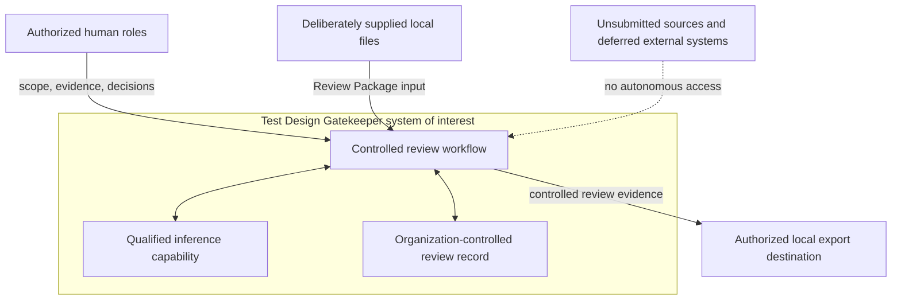
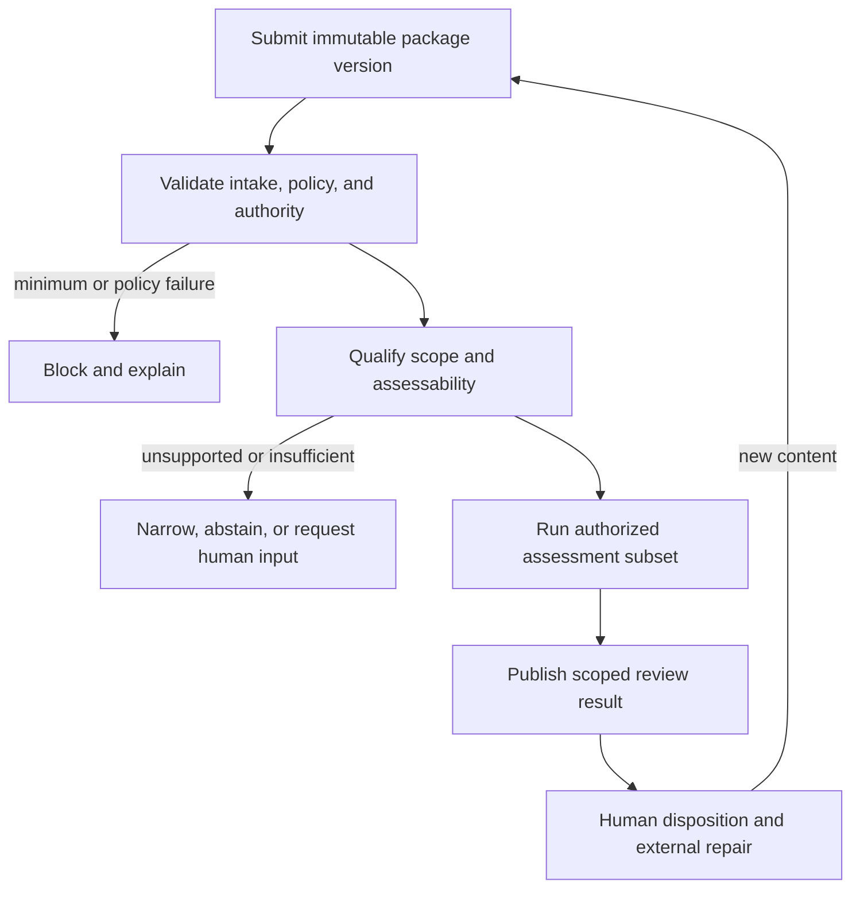

# Test Design Gatekeeper

## RA-02 — System Context, Primary Workflow, Alternate Flows, and Use Cases

| Field | Value |
| --- | --- |
| Document version | 0.3 |
| Document date | 2026-09-12 |
| SDLC phase | Requirements Analysis |
| Workstream | `RA-02` |
| Status | CONTROLLED AMENDMENT CANDIDATE — RA-02 v0.2 and `PG-RA02-001` remain effective; focused delta review required |
| Decision authority | Project Owner |
| Entry authorization | `PG-RA01-001` — `GO`, 2026-09-09 |
| Phase-gate record | `PG-RA02-001` — `GO` to RA-03, 2026-09-09 |
| Approved upstream baselines | Project Charter v0.3; RA-01 v0.2 |
| Amendment source | `OD-RA03-001`, accepted by Project Owner on 2026-09-12 |
| Project Owner review | Sections 1–22 accepted; all ten recommendations accepted on 2026-09-09 |
| Project Owner correction disposition | `SR-RA02-F-002` through `SR-RA02-F-005` accepted on 2026-09-09 |
| Static-review result | `SR-RA02-001` closed; 5 of 5 findings corrected and verified |
| Implementation authorization | NOT GRANTED |
| Confidential-data use | NOT AUTHORIZED |

> **Document status notice:** The Project Owner accepted the RA-02 subject matter, all ten recommended decisions, and all five static-review corrections on 2026-09-09; `PG-RA02-001` subsequently authorized RA-03. RA-02 v0.2 and that historical gate remain effective. This v0.3 candidate applies only the mapping-category clarification accepted through `OD-RA03-001`. It requires focused delta review before replacing v0.2. It does not authorize implementation, confidential-data use, or a later phase transition.

### v0.3 controlled amendment summary

| Change | Source | Effect | Boundary preserved |
| --- | --- | --- | --- |
| `CR-RA03-003` | `OD-RA03-001` | Distinguish capture/import transformations, which can change captured package content, from assessment mappings, which affect a run against unchanged capture | Package history is not overwritten; changed behavior is not disguised as the same run |

## 1. Purpose

RA-02 defines the externally observable TDG system context, actor goals, one bounded pre-review workflow, its alternate paths, and the points at which the system must narrow, block, fail, or abstain.

RA-01 remains the sole approved source for role definitions and decision authority. RA-02 applies that model to behavior; it does not redefine it.

## 2. Scope of RA-02

RA-02 covers the system boundary, actor-to-system participation, the primary and non-nominal review flows, workflow-level use cases, lifecycle distinctions, requirements, and later validation obligations.

Detailed package, classification, status, technique, LLM, security, import/export, and evaluation requirements remain allocated to `RA-03` through `RA-10` as summarized in Section 15. User-interface, architecture, and implementation choices remain outside Requirements Analysis. Synthetic examples may clarify behavior but do not authorize implementation or confidential-data processing.

## 3. Source baseline and precedence

| Source | Binding contribution |
| --- | --- |
| Project Charter v0.3, Sections 5–13 | Product boundary, primary use case, Review Package, scope, results, integration, and confidentiality |
| Requirements Analysis Entry Record v0.1 | `RA-IN-002` through `RA-IN-006` and `RA-IN-008` carried into this workstream |
| `PG-RA01-001` | Authorization for RA-02 only |
| RA-01 v0.2 | Sole source for `AP-01` through `AP-07`, `AUTH-01` through `AUTH-14`, roles, and `RA01-REQ-001` through `016` |
| `OD-RA03-001` and RA-03 v0.3 amendment candidate | Accepted distinction between capture/import transformation and assessment mapping; controlled RA-02 wording impact only |

The Charter takes precedence for MVP scope, and RA-01 takes precedence for human authority. Any conflict requires explicit change control rather than duplicated reinterpretation in RA-02.

## 4. Terminology and object distinctions

| Term | Meaning in RA-02 |
| --- | --- |
| System of interest | Test Design Gatekeeper considered as a black box whose externally observable responsibilities are being specified |
| Review Package | A deliberately bounded set of supplied scope, test-basis material, test cases, and provenance concerning one feature or small business process |
| Package version | An immutable identity for the exact supplied content used by an assessment; content change requires a distinct version |
| Assessment run | One execution of identified TDG behavior against one exact package version |
| Capture/import transformation | Identified parsing, import mapping, or structural normalization used to establish the captured logical content of a package version; changed recapture may therefore create a new package version |
| Assessment mapping | Versioned behavior artifact used to interpret an already captured package during assessment; a change against unchanged captured content creates a new run, not a package version |
| Assessment scope | The package items and review dimensions that TDG can support in a particular run |
| Supported subset | Items and assessment dimensions that may be reviewed without pretending that excluded or unassessable material was covered |
| Substantive assessment | Evaluation of test-design quality or coverage after intake, policy, scope, and sufficiency checks permit it |
| Review result | The scoped set of findings, suggestions, limitations, evidence, and run metadata produced by an assessment |
| Human disposition | A ROLE-05 decision on an individual finding, separate from its derivation and from testware approval |
| Review cycle | Submission, qualification, assessment, human consideration, optional external repair, and optional versioned re-review |
| Re-review | A later assessment of a new package version after human changes, or a new run of an unchanged version under explicitly identified assessment behavior |
| Fail closed | Refuse the affected processing or action when a required authority, policy, verified control, or approved processing path is absent |
| External discovery | Retrieval or search of material not deliberately included in the submitted Review Package; prohibited for the MVP review workflow |

The definitive identifiers and status vocabulary belong primarily to `RA-03` through `RA-05`. RA-02 defines the semantic distinctions that those later models must preserve.

## 5. Workflow principles and inherited constraints

Rows marked `INHERITED` apply an approved upstream rule and do not create a second authority source. Rows marked `RA-02` define workflow semantics introduced by this workstream.

| ID | Concise rule | Origin |
| --- | --- | --- |
| WP-01 | One package concerns one declared feature or small process; TDG does not broaden it | RA-02, constrained by Charter Sections 6–7 |
| WP-02 | Qualification precedes every affected substantive assessment | RA-02 |
| WP-03 | Preserve an explicit supported subset where safe; block when a non-separable precondition fails | RA-02 |
| WP-04 | Test level, test type, design basis or technique, and execution mode remain independent axes | RA-02, constrained by Charter Section 9 |
| WP-05 | Supplied fact, interpretation, uncertainty, conflict, and missing support remain distinguishable | INHERITED — RA-01 AP-07 and Charter Section 10 |
| WP-06 | Package-content identity and assessment-behavior identity remain separate and versioned | RA-02 |
| WP-07 | Testware repair remains a human-controlled external loop | INHERITED — RA-01 ROLE-03 and RA01-REQ-006 |
| WP-08 | Machine completion, human disposition, repair, readiness, and approval remain separate milestones | RA-02, constrained by RA-01 AP-05/AP-06 |
| WP-09 | Missing input or capability never permits external discovery or silent fallback | INHERITED — RA-01 AP-07 and Charter Sections 6/13 |
| WP-10 | Every result remains scoped and cannot imply completeness, approval, or ISTQB conformity | INHERITED — Charter Section 10.4 and RA01-REQ-014 |

## 6. System context

### 6.1 Context view

The diagram is logical, not architectural. It does not decide whether a capability is an in-process module, local service, adapter, or another implementation form.

### 6.2 Context entities and boundary participants

| ID | External entity or boundary participant | Relationship with TDG | MVP status |
| --- | --- | --- | --- |
| CTX-01 | Authorized human roles | Supply scope and evidence, operate review, make human decisions, and receive results according to RA-01 authority | REQUIRED |
| CTX-02 | Local import source | Provides deliberately selected canonical JSON and defined CSV-based input without granting access to the surrounding repository | REQUIRED |
| CTX-03 | Organization-controlled review record | Internal TDG responsibility that retains package, run, evidence, finding, disposition, and behavior-version identity under later-defined persistence rules | REQUIRED |
| CTX-04 | Qualified inference capability | Logical TDG capability, potentially backed by a controlled deployment dependency, that may support only explicitly permitted semantic assessments inside the applicable approved trust boundary | CONDITIONAL |
| CTX-05 | Approved behavior-affecting artifacts | Controlled TDG inputs comprising identified rules, controls, prompts, assessment mappings, model identity, and relevant configuration approved for their role; capture/import transformations remain intake artifacts | REQUIRED WHEN APPLICABLE |
| CTX-06 | Controlled local export destination | Receives an explicitly requested review record under applicable authority and policy | MVP-SUPPORTED DIRECTION |
| CTX-07 | Unsubmitted project documentation, repositories, web sources, or knowledge stores | Must not be searched, inferred as reviewed, or used as hidden evidence | PROHIBITED |
| CTX-08 | Jira, Xray, Zephyr, and other test-management APIs | No direct MVP dependency or write-back; future read-only adapter remains deferred | DEFERRED |
| CTX-09 | External/cloud LLM service | May be used only with public or synthetic data in an explicitly configured laboratory comparison; never as sealed-profile fallback | LABORATORY ONLY |

### 6.3 Boundary summary

| Within the TDG system responsibility | Outside or prohibited |
| --- | --- |
| Deliberate local intake; package identity and provenance; validation and qualification; authorized assessment; scoped evidence; attributable human interaction; local history; controlled output; explicit narrowing, blocking, abstention, cancellation, or failure | External discovery; requirement or test-case repair; test execution; organizational readiness or approval; official ISTQB conformity or certification; any guarantee that undetected gaps do not exist |

### 6.4 Trust-boundary statement at RA-02 level

The laboratory profile permits public or synthetic material only. The sealed profile requires a later approved trust boundary, local inference, organization-controlled processing and storage, authorized import and export, and fail-closed behavior. RA-02 specifies workflow consequences; `RA-08` will define the detailed security and privacy requirements and the test basis needed to verify them.

## 7. Inherited actors and RA-02 participation classes

RA-02 introduces no role and changes no authority. RA-01 v0.2 remains the source of truth; Section 8 maps those roles to use cases.

| Participation class | Inherited roles | RA-02 relevance |
| --- | --- | --- |
| Core review interaction | ROLE-01 through ROLE-05 | Submission, scope, source interpretation, result inspection, human disposition, and external repair loop |
| Supporting operation and governance | ROLE-07 through ROLE-09 | Approved operational artifacts, behavior qualification, and data/security policy |
| External governance | ROLE-06 and ROLE-10 | Organizational testware approval and SDLC gates remain outside direct MVP business use cases |

Combined-role and independence rules are not repeated here; every use-case interaction inherits them from RA-01.

## 8. Use-case inventory

| Use case | Name | Primary actor | Goal | Classification | Detailed owner |
| --- | --- | --- | --- | --- | --- |
| UC-RA02-001 | Submit a bounded Review Package | ROLE-01 | Deliberately provide one identifiable package version for review | CORE MVP | RA-02; input detail in RA-03/RA-09 |
| UC-RA02-002 | Validate intake and evidence sufficiency | ROLE-01 | Learn whether processing may proceed and what is missing, invalid, conflicting, or conditionally required | CORE MVP | RA-02; detailed rules in RA-03 |
| UC-RA02-003 | Qualify scope and supported assessment subset | ROLE-02 | Establish which items and dimensions are supported, excluded, unclear, or unassessable | CORE MVP | RA-02; detailed classification in RA-04 |
| UC-RA02-004 | Confirm or clarify supplied test-basis interpretation | ROLE-04 | Confirm, correct, reject, or leave unknown a candidate interpretation grounded in supplied evidence | CORE MVP | RA-02; evidence/status detail in RA-05 |
| UC-RA02-005 | Run a bounded test-design review | ROLE-01 | Obtain identified deterministic findings and qualified LLM-assisted suggestions for the supported subset | CORE MVP | RA-02; technique/LLM detail in RA-06/RA-07 |
| UC-RA02-006 | Inspect result, evidence, and limitations | ROLE-01 | Understand what was evaluated, how each item was derived, and what was not established | CORE MVP | RA-02; result model in RA-05 |
| UC-RA02-007 | Disposition an individual finding | ROLE-05 | Accept, reject, defer, or later reopen an item through an attributable human decision | CORE MVP | RA-02; lifecycle/persistence detail in RA-05 |
| UC-RA02-008 | Revise externally and request re-review | ROLE-03 | Change source testware under human control and submit a distinct package version | CORE MVP | RA-02; version model in RA-03/RA-05 |
| UC-RA02-009 | Export a controlled review record | ROLE-01 | Deliberately export scoped evidence and human dispositions without editing source testware or claiming approval | CORE MVP DIRECTION | RA-02; format/policy detail in RA-08/RA-09 |
| UC-RA02-010 | Apply approved operational artifacts | ROLE-07 | Activate an authorized assessment mapping, rule, control, prompt, model reference, or configuration version; apply an authorized capture/import transformation only for a deliberate capture operation | SUPPORTING | Detailed in RA-05/RA-07/RA-09 |
| UC-RA02-011 | Qualify behavior-affecting artifacts | ROLE-08 | Approve or reject identified artifacts for defined assessment roles using controlled evidence | SUPPORTING | Detailed in RA-07/RA-10 |
| UC-RA02-012 | Authorize protected operation | ROLE-09 | Permit or prohibit confidential processing or export under verified sealed-profile controls | FUTURE SEALED PREREQUISITE | Detailed in RA-08 |

Formal testware approval by ROLE-06 and SDLC gate decisions by ROLE-10 are external governance activities, not TDG business use cases in the direct MVP.

### 8.1 Actor-to-use-case participation

| Role | Initiates or performs | May decide or confirm | Must not gain by participation |
| --- | --- | --- | --- |
| ROLE-01 | UC-RA02-001, 002, 005, 006, and 009 | Operational choices only | Scope, rule, finding, approval, qualification, or data authority |
| ROLE-02 | UC-RA02-003; may participate in UC-RA02-001/002 | Package boundary and explicit boundary change | Automatic test-basis, disposition, or approval authority |
| ROLE-03 | UC-RA02-008; may participate in UC-RA02-001/006 | Whether and how source testware changes | Automatic rule-confirmation or approval authority |
| ROLE-04 | UC-RA02-004 | Supplied-rule interpretation within assigned competence | Finding disposition or testware approval |
| ROLE-05 | UC-RA02-007; may participate in UC-RA02-006 | Individual finding disposition | Overall completeness or testware approval |
| ROLE-06 | External organizational workflow only | Formal testware approval outside direct MVP | TDG-issued approval or conformity claim |
| ROLE-07 | UC-RA02-010 | Application of already approved operational artifacts | Content, qualification, security, or approval authority |
| ROLE-08 | UC-RA02-011 | Role-specific qualification of behavior artifacts | Self-qualification by an evaluated component |
| ROLE-09 | UC-RA02-012 | Protected-data and export policy decisions | Content or domain authority merely through security responsibility |
| ROLE-10 | External requirements/change/gate workflow | Project scope and SDLC gates | Automatic domain, security, qualification, or testware authority |

## 9. Primary pre-review workflow

### 9.1 Preconditions

Document-control note: specifying this future workflow does not authorize its implementation.

The nominal runtime preconditions are:

- A human ROLE-01 is identified at least by a laboratory actor identifier; sealed use will require verified identity.
- Acting roles required for authority-bearing decisions are declared.
- The operating profile is known.
- Laboratory input is public or synthetic; confidential input remains prohibited until sealed-profile controls are approved and verified.
- A bounded Review Package candidate is available through a deliberate local import action.
- Only behavior-affecting artifacts approved for the intended assessment roles may be used.

The detailed means of satisfying these preconditions remain allocated to later workstreams.

### 9.2 Trigger

ROLE-01 deliberately submits a Review Package candidate and requests pre-review under an identified operating profile and assessment configuration.

### 9.3 Nominal flow

| Step | Actor | Observable responsibility |
| --- | --- | --- |
| PWF-01 | ROLE-01 | Selects or supplies one local Review Package candidate and declares the intended review request |
| PWF-02 | TDG | Creates an identifiable submission context without modifying the source artifacts |
| PWF-03 | TDG | Validates the applicable input structure, minimum admissibility, operating-profile policy, and required authority context |
| PWF-04 | TDG | Reports detected invalid, missing, conflicting, unmapped, or policy-blocked conditions before relying on affected content |
| PWF-05 | TDG | Identifies the exact package version, supplied provenance, declared scope, test-basis elements, and associated test cases available for qualification |
| PWF-06 | TDG | Analyzes test level, test type, design basis, execution mode, scope match, and assessability as distinct dimensions |
| PWF-07 | ROLE-02 | Confirms the declared package boundary when confirmation or a deliberate scope decision is required |
| PWF-08 | ROLE-04 | Confirms, corrects, rejects, or leaves unknown a supplied-rule interpretation when an assessment depends on human confirmation |
| PWF-09 | TDG | Defines and exposes the supported subset and explicitly excludes, narrows, or abstains on unsupported dimensions |
| PWF-10 | TDG | Creates a new assessment-run identity tied to the exact package and relevant behavior-artifact versions |
| PWF-11 | TDG | Executes applicable deterministic controls against sufficiently confirmed structured evidence |
| PWF-12 | TDG | Invokes only a qualified LLM role through an authorized processing path when semantic assistance is applicable |
| PWF-13 | TDG | Produces scoped findings, suggestions, limitations, abstentions, and evidence without assigning human disposition |
| PWF-14 | TDG | Makes the result available with evaluated and unevaluated scope, derivation, uncertainty, provenance, and version context visible |
| PWF-15 | ROLE-01 / ROLE-05 | Inspects the result; ROLE-05 accepts, rejects, or defers individual items where desired and authorized |
| PWF-16 | TDG | Records each human decision, acting role, applicable self-review label, rationale under later-defined rules, and history without converting it into testware approval |
| PWF-17 | ROLE-03 | Decides whether and how to change the source testware outside autonomous TDG control |
| PWF-18 | ROLE-03 / ROLE-02 / ROLE-01 | ROLE-03 owns testware changes, ROLE-02 approves any boundary change, and ROLE-01 deliberately submits a distinct package version for another assessment cycle |

Steps involving ROLE-02, ROLE-04, and ROLE-05 may be performed by the same human when RA-01 permits the role combination. TDG must still record which role authorizes each decision and any self-review or independence limitation.

### 9.4 Workflow view

### 9.5 Nominal postconditions

- The submitted source artifacts remain unchanged.
- The exact package version and assessment run are identifiable.
- The evaluated subset, omitted subset, limitations, and evidence are visible.
- Every new finding has human disposition `PENDING` until ROLE-05 acts.
- Any human disposition is attributable and remains separate from derivation, source editing, and approval.
- A result containing no supported finding includes a scoped non-completeness statement.
- A later content change can enter only as a distinct package version.
- No unsubmitted evidence, unapproved service, or silent fallback has been used.

### 9.6 Completion distinctions

RA-02 requires at least these semantic milestones, although `RA-05` will define their final names and transitions:

| Milestone | Meaning | Does not mean |
| --- | --- | --- |
| Intake recorded | Supplied content received and identified | Admissible, in scope, or safe to process substantively |
| Qualification available | Scope and assessability outcome exists | Every item is supported or every rule is confirmed |
| Assessment result available | Authorized TDG processing ended with a result or explicit limitation | A human accepted findings or repaired tests |
| Human review recorded | Defined human disposition activity was captured | Formal testware approval or suite completeness |
| Package superseded | A later package version replaced it for future review | Prior evidence or history may be overwritten |

## 10. Alternate, exception, and recovery flows

The outcome labels in this section are semantic descriptions. `RA-03` through `RA-05` will define final status names, precedence, and persistence rules.

| Flow | Trigger or condition | Required TDG behavior | Human authority or action | Conceptual outcome |
| --- | --- | --- | --- | --- |
| AF-RA02-001 | Input cannot be parsed or a required capture/import transformation is invalid | Identify the file, location or field where feasible; do not silently discard assessment-relevant content | ROLE-01 corrects input or supplies an approved capture/import path | Intake rejected or restricted |
| AF-RA02-002 | Minimum admissible package content is absent | Identify missing minimum elements and stop substantive review of the package | ROLE-02/ROLE-03 supplies a deliberate new version | Ungradable intake |
| AF-RA02-003 | Optional or technique-specific evidence is absent | Identify affected dimensions; continue only with independent supported assessments | Human may add evidence or accept the limitation | Partial assessability |
| AF-RA02-004 | Supplied sources contradict one another | Preserve competing evidence and source identity; do not choose a rule without authorized human basis | ROLE-04 resolves, establishes precedence, or leaves the conflict open | Conflicting basis or narrowed review |
| AF-RA02-005 | Test cases do not match the declared feature or process | Identify the mismatch and avoid treating unrelated cases as coverage | ROLE-02 confirms boundary or submits corrected content | Scope mismatch |
| AF-RA02-006 | Package contains both supported and unsupported items | Isolate item-level outcomes and prevent unsupported items from being counted as evaluated | ROLE-02 may narrow or deliberately revise the package | Supported subset plus explicit exclusions |
| AF-RA02-007 | Classification evidence is ambiguous or mixed | Describe the observed external/internal basis and uncertainty; do not force “gray-box” as a definitive verdict | Authorized human may clarify supplied context | Human review required or undetermined classification |
| AF-RA02-008 | Item relies on internal structure or white-box coverage outside MVP | Identify the observed basis and abstain from white-box coverage review | Human may remove it from scope or retain it as explicitly unevaluated | Out-of-scope assessment item |
| AF-RA02-009 | Item is labeled unit, integration, acceptance, manual, or automated | Evaluate independent classification axes; never infer black-box/white-box solely from the label | Human may clarify evidence and intended level | Supported, unsupported, mixed, or undetermined based on evidence |
| AF-RA02-010 | Required human role or acting authority is absent | Permit only actions that need no missing authority; block the authority-bearing action and explain the required role | An authorized human assumes the role or the action remains pending | Authority-blocked action |
| AF-RA02-011 | No separate domain expert is available | Preserve combined-role operation, uncertainty, conflict, and escalation; never auto-confirm LLM interpretation | Explicitly assigned ROLE-04 acts within competence or leaves unknown | Confirmed by human, unknown, conflicting, or escalated |
| AF-RA02-012 | A review request depends on an LLM role or behavior version not qualified for user-reliance review | Do not use it for that review or substitute another model silently; allow independent deterministic assessments when valid | ROLE-08 may evaluate and later qualify an identified version through the segregated qualification use case | Partial assessment or unavailable dimension |
| AF-RA02-013 | Approved local inference path becomes unavailable | Fail closed for LLM-dependent sealed processing; never fall back to cloud | ROLE-07 may restore an approved path; ROLE-09 controls any policy change | Interrupted or partial assessment |
| AF-RA02-014 | Confidential or possibly protected material is presented in laboratory profile | Stop before prohibited substantive processing and clearly state the profile restriction | ROLE-09 cannot waive laboratory restrictions ad hoc; later sealed prerequisites must be satisfied | Policy-blocked intake |
| AF-RA02-015 | Supplied content changes after assessment begins | Continue only against the immutable submitted snapshot or cancel it; never merge changed content silently | ROLE-03/ROLE-02 submits a distinct version | Original run remains attributable; new cycle required |
| AF-RA02-016 | User cancels or a technical failure interrupts processing | Preserve the original input; record interruption and any safely committed evidence; never present partial work as complete | ROLE-01 may initiate a new run or later resume if supported | Cancelled or failed run |
| AF-RA02-017 | Unchanged package version is assessed again | Create a distinct run identity and record behavior/configuration identity; do not overwrite prior results | ROLE-01 requests rerun | Comparable assessment runs |
| AF-RA02-018 | A new package version is submitted after external repair | Link lineage without treating prior findings as silently resolved; determine affected disposition handling later | ROLE-03 owns changes; ROLE-05 reconsiders affected findings | Versioned re-review |
| AF-RA02-019 | No supported finding is detected | Report the evaluated scope and limitations with an explicit non-completeness statement | Human decides what to do next | Scoped no-supported-finding result |
| AF-RA02-020 | Export is unauthorized, unsafe, or targets a prohibited destination | Block export, preserve the local review record, and record the denied attempt as later policy requires | ROLE-09 or applicable policy controls authorization | Export denied; review evidence unchanged |
| AF-RA02-021 | Package spans multiple unrelated features or an oversized cross-process/E2E flow beyond the approved unit of review | Identify the boundary problem and do not silently aggregate it into one apparently complete assessment | ROLE-02 narrows and deliberately resubmits one or more bounded packages | Out-of-scope or scope-revision-required package |
| AF-RA02-022 | Test cases are designed to evaluate an AI/LLM system or another deliberately excluded application domain | Identify the excluded target domain and abstain from the unsupported domain-specific review while preserving any independently valid intake evidence | Human removes, separates, or retains the items as explicitly unevaluated | Parked-extension or out-of-scope items |

No alternate flow permits TDG to repair source testware, approve it, search outside the package, invent a rule, or conceal that an assessment was not performed.

## 11. Core use-case specifications

These use cases define required external behavior without prescribing interface or component design.

### UC-RA02-001 — Submit a bounded Review Package

| Attribute | Specification |
| --- | --- |
| Primary actor | ROLE-01 Review Operator |
| Supporting authority | ROLE-02 owns the declared boundary; ROLE-09 policy applies where relevant |
| Trigger | ROLE-01 deliberately requests review of selected local input |
| Preconditions | Operating profile and actor context are known; the source is deliberately selected; applicable data policy permits intake |
| Minimum success guarantee | TDG creates an identifiable package snapshot or returns an attributable intake rejection; it does not modify the source |
| Required visibility | Source identity, declared boundary, provenance available at intake, package-version identity, and any detected input limitation |
| Alternate flows | AF-RA02-001, 002, 014, and 015 |
| Authority boundary | Submission does not confirm source correctness, widen scope, or grant the operator another role |

### UC-RA02-002 — Validate intake and evidence sufficiency

| Attribute | Specification |
| --- | --- |
| Primary actor | ROLE-01 Review Operator |
| Supporting actors | ROLE-02 for scope; ROLE-04 for source interpretation; ROLE-07 for an approved capture/import-transformation issue |
| Trigger | An identifiable package candidate exists |
| Preconditions | TDG can examine the input through an authorized processing path |
| Minimum success guarantee | Each detected deficiency states what is missing, invalid, conflicting, or unmapped and which processing is affected |
| Required distinction | Minimum-admissibility failure, conditional evidence gap, source contradiction, format problem, and policy block are not collapsed into one generic error |
| Alternate flows | AF-RA02-001 through 004, 010, and 014 |
| Authority boundary | TDG may ask for human-supplied context but cannot retrieve or invent it |

### UC-RA02-003 — Qualify scope and supported assessment subset

| Attribute | Specification |
| --- | --- |
| Primary actor | ROLE-02 Review Scope Owner |
| Typical performer | ROLE-01 operates TDG; ROLE-02 makes any boundary decision |
| Trigger | Intake is sufficiently valid for qualification |
| Preconditions | Declared scope, test-basis evidence, and associated test cases are identifiable at the level needed for qualification |
| Minimum success guarantee | TDG exposes supported, unsupported, mixed, mismatched, and undetermined items or dimensions without forced classification |
| Required distinction | Test level, test type, design basis, technique evidence, and execution mode remain independent |
| Alternate flows | AF-RA02-003 and 005 through 009 |
| Authority boundary | TDG can recommend narrowing but ROLE-02 owns deliberate scope change |

### UC-RA02-004 — Confirm or clarify supplied test-basis interpretation

| Attribute | Specification |
| --- | --- |
| Primary actor | ROLE-04 Test Basis Authority |
| Trigger | A supported assessment depends on an interpretation that requires human authority |
| Preconditions | Candidate interpretation is linked to supplied evidence and its source identity |
| Minimum success guarantee | ROLE-04 can confirm, correct, reject, or leave the interpretation unknown; TDG records the human decision and acting role |
| Required visibility | Supplied fact, TDG interpretation, source evidence, uncertainty, conflict, human response, and affected assessment |
| Alternate flows | AF-RA02-004, 010, and 011 |
| Authority boundary | Lack of a separate expert never authorizes LLM self-confirmation; rule confirmation does not disposition findings or approve testware |

### UC-RA02-005 — Run a bounded test-design review

| Attribute | Specification |
| --- | --- |
| Primary actor | ROLE-01 Review Operator |
| Supporting prerequisites | ROLE-08 qualification; ROLE-07 approved activation; ROLE-09 policy where applicable |
| Trigger | ROLE-01 requests assessment of the exposed supported subset |
| Preconditions | Exact package version, assessment scope, and applicable behavior artifacts are identifiable and authorized |
| Minimum success guarantee | TDG produces a scoped result or explicit partial, ungradable, blocked, cancelled, or failed outcome |
| Required behavior | Deterministic and LLM-assisted derivation remain distinguishable; only qualified roles run; silent substitution is prohibited |
| Alternate flows | AF-RA02-003, 004, 006 through 016, and 019 |
| Authority boundary | Every new item remains `PENDING`; TDG cannot accept, repair, approve, or claim completeness |

### UC-RA02-006 — Inspect result, evidence, and limitations

| Attribute | Specification |
| --- | --- |
| Primary actor | ROLE-01 Review Operator |
| Other eligible viewers | ROLE-02 through ROLE-05 according to assigned access and policy |
| Trigger | A review result or explicit non-success outcome is available |
| Preconditions | Viewer is permitted to access the applicable record |
| Minimum success guarantee | The viewer can distinguish what was evaluated, not evaluated, or blocked and can inspect supporting evidence and behavior identity |
| Required visibility | Package/run identity, supported scope, technique or review dimension, derivation, source evidence, inference and uncertainty, limitation, disposition, and relevant versions |
| Alternate flows | Access denial under RA-01 authority; AF-RA02-019 |
| Authority boundary | Viewing a result grants no disposition, editing, export, qualification, or approval right |

### UC-RA02-007 — Disposition an individual finding

| Attribute | Specification |
| --- | --- |
| Primary actor | ROLE-05 Finding Disposition Authority |
| Trigger | ROLE-05 chooses to judge a `PENDING` finding or reconsider an affected prior disposition |
| Preconditions | Finding, evidence, package/run identity, and acting human role are available |
| Minimum success guarantee | An allowed disposition and attributable rationale record are added without altering derivation or source testware |
| Required behavior | Author disposition is marked as self-review; affected historical disposition can be reopened without erasure when version impact requires it |
| Alternate flows | AF-RA02-010, 017, and 018 |
| Authority boundary | Individual disposition does not establish completeness, readiness, formal approval, or ISTQB conformity |

### UC-RA02-008 — Revise externally and request re-review

| Attribute | Specification |
| --- | --- |
| Primary actor | ROLE-03 Testware Owner and Editor |
| Typical performer | ROLE-03 edits outside TDG; ROLE-01 may submit the result |
| Supporting authority | ROLE-02 approves any change to the declared package boundary |
| Trigger | A human decides to revise testware or supplied basis after considering review evidence |
| Preconditions | The existing package and review history remain identifiable; the human controls the edited source |
| Minimum success guarantee | Changed content enters TDG as a distinct package version linked to prior lineage; the earlier review remains intact |
| Required distinction | New content version and unchanged-content reassessment are separate events |
| Alternate flows | AF-RA02-015, 017, and 018 |
| Authority boundary | TDG may describe a gap but cannot write, apply, or publish the source change |

### UC-RA02-009 — Export a controlled review record

| Attribute | Specification |
| --- | --- |
| Primary actor | ROLE-01 Review Operator |
| Governing policy | Applicable data/export policy; ROLE-09 authority is required where protected data or organizational policy demands it; export content must preserve ROLE-05 decisions accurately |
| Trigger | ROLE-01 explicitly requests export of an identified review record |
| Preconditions | Export is authorized for the data, destination, operating profile, and actor; exact record identity is known |
| Minimum success guarantee | TDG produces an attributable local export or a clear denial without modifying the canonical local record |
| Required content boundary | Export distinguishes evidence, TDG output, human disposition, limitations, package/run versions, and non-approval statement |
| Alternate flows | AF-RA02-020 |
| Authority boundary | Export is not direct Jira/Xray/Zephyr write-back, source-testware modification, or formal approval |

### 11.1 Supporting use-case boundary

UC-RA02-010 through UC-RA02-012 exist because the primary flow depends on approved operational artifacts, qualified behavior, and protected-use policy. RA-02 records their interaction points only. Their detailed conditions and acceptance rules belong to `RA-05`, `RA-07`, `RA-08`, `RA-09`, and `RA-10`.

## 12. Lifecycle separation and version semantics

### 12.1 Objects that must not be collapsed

| Object | Identity changes when | History expectation | Authority |
| --- | --- | --- | --- |
| Review Package version | Supplied content, declared scope, or provenance-affecting content changes | Prior version remains identifiable and must not be overwritten | ROLE-02 owns scope; ROLE-03 owns testware changes |
| Assessment run | TDG processing is requested again, even for an unchanged package | Each run remains comparable and tied to its behavior identity | ROLE-01 initiates; approved behavior constraints apply |
| Finding or suggestion | A run produces a distinct reported item under later identity rules | Derivation and evidence remain attributable to the originating run | TDG derives; no human disposition implied |
| Human disposition record | ROLE-05 makes or changes a judgment | Prior decision and reason remain available under later audit rules | ROLE-05 only |
| Export instance | An authorized export is deliberately requested | Exact source record, time, policy, and content version remain attributable | ROLE-01 performs under ROLE-09 policy |
| Formal testware approval | External organization makes its approval decision | Outside direct MVP record authority unless later imported as context | ROLE-06 outside TDG |

### 12.2 Required cross-object relationships

- One package version may have multiple assessment runs.
- One assessment run evaluates exactly one immutable package version.
- One run may contain multiple findings, suggestions, limitations, and item-level outcomes.
- Every finding belongs to one originating run and one supported assessment context.
- One finding may accumulate a controlled disposition history; the latest applicable disposition must not erase its predecessors.
- A new package version does not silently resolve a finding from an older version.
- A behavior change does not mutate an old run; it produces a new run if reassessment occurs.
- An export represents identified record state and does not become the canonical source of truth by itself.

### 12.3 Version-impact principle

When package content or behavior-affecting artifacts change, TDG must make the impact visible. A changed capture/import transformation that recaptures a different logical projection creates a new package version. A changed assessment mapping or other behavior artifact against unchanged captured content creates a new assessment run only. `RA-05`, `RA-07`, and `RA-09` will decide exact reopening, invalidation, comparison, qualification, and physical import rules. RA-02 prohibits the unsafe alternatives: overwriting history, silently reusing an obsolete result, or presenting materially changed behavior as the same assessment.

## 13. Workflow outcome classes

The final state model is deferred, but later requirements must preserve at least these distinct meanings:

| Conceptual outcome | Meaning | Prohibited conflation |
| --- | --- | --- |
| Review result available | Authorized assessment produced a scoped result | Human acceptance or formal approval |
| Partial review available | Independent supported dimensions completed while others were explicitly excluded or unassessable | Full-package review |
| Review ungradable | Evidence was insufficient or contradictory for a defensible substantive result | No gaps detected |
| Review blocked by policy or authority | Processing or action was prohibited because a required policy, control, or human authority was absent | Technical failure or quality verdict |
| Review failed technically | Authorized processing did not complete because of a technical fault | Product-quality or test-design verdict |
| Review cancelled | A human or approved operational condition ended processing deliberately | Successful completion |
| No supported finding detected | Supported checks found no reportable item within their bounded evidence | Completeness, ISTQB conformity, or approval |
| Human review activity recorded | One or more human decisions were captured | Every finding dispositioned or testware repaired |
| Re-review requested | A new run was requested for the same or later package version | Erasure or automatic closure of earlier evidence |

An overall package indicator may summarize these meanings only if it preserves item-level and assessment-level limitations and cannot hide `UNGRADABLE`, conflicting, unsupported, or policy-blocked areas.

## 14. Accepted RA-02 requirements

The Project Owner accepted all thirty-six requirements and their current `MUST` priority on 2026-09-09. The acceptance establishes the RA-02 workflow baseline; later controlled change may add requirements or revise priority without rewriting this decision history.

The clarified wording in `RA02-REQ-005`, `RA02-REQ-020`, and `RA02-REQ-026` was accepted by the Project Owner and verified against `SR-RA02-F-002` and `SR-RA02-F-004`. The requirements below constitute the reviewed RA-02 v0.2 baseline. In this v0.3 candidate, only `RA02-REQ-018` receives the controlled terminology clarification accepted through `OD-RA03-001`; it remains an accepted requirement, but the amended wording requires focused delta verification.

| ID | Requirement | Priority | Status | Primary source |
| --- | --- | --- | --- | --- |
| RA02-REQ-001 | TDG shall treat one immutable Review Package version concerning one declared feature or small business process as the input unit for one assessment run | MUST | ACCEPTED | Charter Sections 6–7; WP-01; Section 12 |
| RA02-REQ-002 | TDG shall base review behavior only on material deliberately supplied in the identified Review Package and approved behavior artifacts | MUST | ACCEPTED | RA-IN-005; AP-07; WP-05 |
| RA02-REQ-003 | TDG shall not search unsubmitted repositories, project documentation, web sources, Jira, Xray, Zephyr, or other external systems during MVP review | MUST | ACCEPTED | Charter Sections 11–12; CTX-07/08 |
| RA02-REQ-004 | TDG shall not modify, overwrite, or publish changes to supplied source testware | MUST | ACCEPTED | RA01-REQ-006; WP-07 |
| RA02-REQ-005 | TDG shall preserve the RA-01 distinction among operator, scope, test-basis, finding-disposition, testware-editing, qualification, security, and approval authority in workflow behavior, records, and outputs; logical attribution in the laboratory shall not be represented as sealed-profile access-control enforcement | MUST | ACCEPTED | RA-01 AP-01 through AP-06; OD-RA01-003 |
| RA02-REQ-006 | TDG shall identify the applicable operating profile and block processing that the profile or recorded policy does not permit | MUST | ACCEPTED | RA01-REQ-011; Section 6.4 |
| RA02-REQ-007 | TDG shall perform applicable structural, policy, authority, scope, and sufficiency checks before presenting an affected substantive assessment as supported | MUST | ACCEPTED | Charter Section 9; WP-02 |
| RA02-REQ-008 | When minimum package admissibility is not met, TDG shall identify the missing minimum elements and shall not perform substantive package review | MUST | ACCEPTED | RA-IN-002; AF-RA02-002 |
| RA02-REQ-009 | Missing optional or assessment-specific evidence shall limit only the affected item or assessment dimension when an independent supported subset remains safe and meaningful | MUST | ACCEPTED | Charter Section 7; WP-03; AF-RA02-003 |
| RA02-REQ-010 | TDG shall identify malformed, unknown, or unmapped assessment-relevant input without silently discarding it | MUST | ACCEPTED | Charter Section 12.2; AF-RA02-001 |
| RA02-REQ-011 | TDG shall analyze test level, test type, test-design basis, test technique, and execution mode as distinct classification dimensions | MUST | ACCEPTED | Charter Section 9; RA-IN-003; WP-04 |
| RA02-REQ-012 | TDG shall not classify an item as black-box, white-box, in-scope, or out-of-scope solely because it is labeled unit, component, integration, system, acceptance, manual, or automated | MUST | ACCEPTED | Charter Section 9; AF-RA02-009 |
| RA02-REQ-013 | TDG shall support item-level and assessment-dimension outcomes for supported, unsupported, mixed, mismatched, insufficient, conflicting, and undetermined evidence | MUST | ACCEPTED | RA-IN-002/003; UC-RA02-003 |
| RA02-REQ-014 | For a mixed package, TDG shall isolate a supported subset where safe and shall explicitly identify every excluded or unassessable item and dimension | MUST | ACCEPTED | WP-03; AF-RA02-006 |
| RA02-REQ-015 | TDG shall make mismatch between the declared business boundary and supplied test cases visible and shall not count mismatched cases as coverage | MUST | ACCEPTED | Charter Sections 8–9; AF-RA02-005 |
| RA02-REQ-016 | TDG shall preserve contradictory supplied evidence and shall not resolve source precedence or confirm a business rule without an identified ROLE-04 human decision | MUST | ACCEPTED | RA01-REQ-005; AF-RA02-004 |
| RA02-REQ-017 | Each assessment run shall have a distinct identity and shall reference exactly one immutable Review Package version | MUST | ACCEPTED | WP-06; Section 12 |
| RA02-REQ-018 | Each assessment run shall identify the rules, assessment mappings, deterministic controls, prompts, model, and relevant configuration versions that materially affected its behavior; the capture/import transformation that established its referenced package version shall remain separately identifiable | MUST | ACCEPTED | RA-IN-004/008; RA01-REQ-015; `OD-RA03-001` |
| RA02-REQ-019 | TDG shall execute a deterministic coverage claim only when its required structured rule evidence is sufficiently confirmed and traceable | MUST | ACCEPTED | Charter Section 10.1; PWF-11 |
| RA02-REQ-020 | For a review result intended for user reliance, TDG shall invoke an LLM only for an explicitly permitted role using an identified version qualified for that role and an authorized processing path; controlled qualification or evaluation may invoke an unqualified candidate only in a segregated evaluation context whose output cannot be represented as a qualified review result | MUST | ACCEPTED | Charter Sections 10.2 and 17; RA01-REQ-010; UC-RA02-011 |
| RA02-REQ-021 | When an LLM role is unavailable, unqualified, or prohibited, TDG shall not silently substitute another model or external service; independent supported assessments may continue only with an explicit partial-result limitation | MUST | ACCEPTED | WP-09; AF-RA02-012/013 |
| RA02-REQ-022 | A review result shall identify the package version, assessment run, evaluated and unevaluated scope, derivation, evidence, inference, uncertainty, limitations, and applicable behavior versions | MUST | ACCEPTED | Charter Section 10; UC-RA02-006 |
| RA02-REQ-023 | Every newly derived finding or suggestion shall begin with human disposition `PENDING` and shall remain separate from its derivation | MUST | ACCEPTED | Charter Section 10; RA01-REQ-008 |
| RA02-REQ-024 | A result with no supported finding shall state its evaluated boundary and shall not claim suite completeness, testware approval, or ISTQB conformity | MUST | ACCEPTED | Charter Section 10.4; WP-10; AF-RA02-019 |
| RA02-REQ-025 | TDG shall allow an authorized viewer to inspect the evidence, derivation, uncertainty, limitations, disposition, and version context needed to review an item | MUST | ACCEPTED | UC-RA02-006; RA01-REQ-007 |
| RA02-REQ-026 | For every scope change, rule confirmation, finding disposition, behavior qualification, or protected-data authorization performed or recorded through TDG, TDG shall require the applicable identified human role without demanding duplicate confirmation when the same explicit, valid decision is already recorded for unchanged scope; TDG shall not perform external source-testware editing, formal testware approval, or SDLC phase-gate decisions | MUST | ACCEPTED | RA-01 AUTH-02/04/05/06/08/10/11/14; OD-RA02-009 |
| RA02-REQ-027 | When the testware author dispositions findings, TDG shall persistently identify the activity as self-review and shall not represent it as independent review | MUST | ACCEPTED | OD-RA01-001; RA01-REQ-013 |
| RA02-REQ-028 | TDG shall permit an authorized revised package submission while earlier findings remain pending or deferred, and any change to supplied content or declared scope shall enter as a distinct package version linked to prior lineage rather than altering an assessed snapshot or silently resolving prior items | MUST | ACCEPTED | AP-07; WP-06/07; AF-RA02-015/018; OD-RA02-010 |
| RA02-REQ-029 | Reassessment of an unchanged package version shall create a distinct assessment run and shall preserve all earlier run results | MUST | ACCEPTED | WP-06; AF-RA02-017 |
| RA02-REQ-030 | TDG shall preserve prior finding and disposition history and shall make version impact visible without silently treating an older finding as resolved | MUST | ACCEPTED | RA-IN-004; Section 12.3 |
| RA02-REQ-031 | TDG shall support a deliberate, policy-controlled local export of an identified review record without modifying source testware, writing back to test-management systems, or issuing formal approval | MUST | ACCEPTED | UC-RA02-009; Charter Section 12.3 |
| RA02-REQ-032 | On cancellation or technical failure, TDG shall preserve source input, distinguish incomplete processing from a completed review, and retain any safely committed diagnostic evidence under later-defined rules | MUST | ACCEPTED | AF-RA02-016 |
| RA02-REQ-033 | TDG shall distinguish intake, qualification, assessment-result availability, human review activity, external testware repair, and formal approval as separate milestones | MUST | ACCEPTED | WP-08; Section 9.6 |
| RA02-REQ-034 | TDG shall not perform or publish formal organizational testware approval in the direct MVP workflow | MUST | ACCEPTED | OD-RA01-004; RA01-REQ-016 |
| RA02-REQ-035 | TDG shall identify a package that exceeds the approved one-feature-or-small-process unit of review and shall require human narrowing rather than silently treating an oversized cross-process flow as one supported package | MUST | ACCEPTED | Charter Sections 6–8; AF-RA02-021 |
| RA02-REQ-036 | TDG shall identify test cases designed for AI/LLM systems or another deliberately excluded target domain as unsupported by the MVP domain capability and shall not perform the parked domain-specific review | MUST | ACCEPTED | Charter Section 11; RA02-AC-008; AF-RA02-022 |

Priority `MUST` currently means that removing the requirement would weaken an approved concept, authority boundary, or accepted workflow decision. It does not predetermine the implementation mechanism, authorize implementation, or prevent later controlled reprioritization supported by impact analysis.

## 15. Allocation to later Requirements Analysis workstreams

RA-02 defines end-to-end behavior but deliberately does not complete every subordinate requirement. The following routing prevents deferral from becoming omission.

| Later workstream | Inputs created by RA-02 | Required elaboration |
| --- | --- | --- |
| RA-03 — Review Package | Immutable package version, minimum versus conditional input, scope declaration, provenance, content lineage | Field model, cardinality, admissibility rules, conditional evidence, package validation, identifiers, and version semantics |
| RA-04 — Scope qualification | Independent axes, item-level outcomes, mixed and ambiguous evidence, supported subset, scope mismatch | Classification taxonomy, evidence rules, precedence, uncertainty, borderline examples, and acceptance conditions |
| RA-05 — Findings and persistence | Separate run/finding/disposition objects, outcome classes, audit history, reopening, result inspection | Definitive status model, transitions, evidence schema, local persistence, history, retention hooks, and comparison behavior |
| RA-06 — Four techniques | Bounded assessment subset, confirmed structured evidence, partial assessability | Applicability criteria, EP/BVA/Decision Table/State Transition coverage rules, deterministic allocation, and finding evidence |
| RA-07 — LLM roles | Qualified role invocation, no silent substitution, explicit limitation on unavailable capability | Permitted tasks, prompt/model identity, grounding, abstention, qualification, requalification, and change impact |
| RA-08 — Security and privacy | Operating-profile check, protected-intake block, authorized processing and export paths | Data classification, trust boundary, identity, authorization, logging, temporary data, retention, deletion, threat inputs, and fail-closed controls |
| RA-09 — Input and export | Local JSON/CSV intake, unknown/unmapped-field visibility, controlled local export | Canonical JSON schema, CSV profiles, validation errors, capture/import transformations, round-trip rules, export formats, and deferred adapter boundary |
| RA-10 — Evaluation and acceptance | End-to-end paths, partial/ungradable outcomes, difficult mixed inputs, human effort points | Benchmark coverage, human oracle, success metrics, thresholds, usability, robustness, and acceptance constraints |

No later workstream may reinterpret a routed item in a way that weakens RA-01 authority or RA-02 supplied-data and workflow boundaries without controlled change approval.

## 16. Downstream validation obligations

These obligations are candidates for later test analysis and STLC planning. They are not executable test cases and do not assign a final test level prematurely.

| ID | Verification objective | Principal test-design direction | Primary trace |
| --- | --- | --- | --- |
| RA02-VAL-001 | Demonstrate the complete nominal path from deliberate package submission through scoped result, human disposition, external repair, and versioned re-review | End-to-end business workflow scenario | PWF-01 through PWF-18 |
| RA02-VAL-002 | Verify that malformed input and invalid capture/import transformations are reported without silent field loss or source modification | Negative input validation and data-integrity tests | AF-RA02-001; RA02-REQ-004/010 |
| RA02-VAL-003 | Verify that each missing minimum element prevents substantive package review and identifies the human repair needed | Decision table plus negative tests | AF-RA02-002; RA02-REQ-008 |
| RA02-VAL-004 | Verify that missing conditional evidence restricts only dependent assessments while independent supported checks remain clearly scoped | Decision table and pairwise evidence combinations | AF-RA02-003; RA02-REQ-009 |
| RA02-VAL-005 | Verify that contradictory sources remain visible and no precedence or rule is selected without ROLE-04 | Negative authority and evidence tests | AF-RA02-004; RA02-REQ-016 |
| RA02-VAL-006 | Verify that mismatched test cases are not counted as coverage for the declared process | Traceability and negative scope tests | AF-RA02-005; RA02-REQ-015 |
| RA02-VAL-007 | Verify item-level outcomes for packages mixing supported system-functional black-box tests with unit, integration, acceptance, non-functional, white-box, or automated artifacts | Classification decision tables using difficult mixed packages | RA-IN-003; AF-RA02-006 through 009 |
| RA02-VAL-008 | Verify that unit, integration, system, acceptance, manual, and automated labels never determine the black-box/white-box verdict by themselves | Metamorphic label-change and negative classification tests | WP-04; RA02-REQ-011/012 |
| RA02-VAL-009 | Verify permitted and denied actions for every authority-bearing workflow step, including combined-role acting-role attribution, laboratory logical roles, and later sealed-profile enforcement without representing them as equivalent assurance | Role/authority decision table and negative authorization tests | RA-01 AUTH-01 through AUTH-14; RA02-REQ-005/026 |
| RA02-VAL-010 | Verify that absence of a separate domain expert yields human `UNKNOWN`, conflict, or escalation rather than LLM self-confirmation | Negative misuse and human-authority tests | AF-RA02-011; UC-RA02-004 |
| RA02-VAL-011 | Verify deterministic-only continuation and explicit partial outcome when an LLM role is unavailable or unqualified, absence of silent substitution, and segregation of unqualified candidate execution from user-reliance review | Capability decision table, controlled failure injection, and qualification-boundary tests | AF-RA02-012/013; RA02-REQ-019 through 021 |
| RA02-VAL-012 | Verify that public/synthetic laboratory input is allowed while confidential or possibly protected input is blocked before prohibited processing | Data-classification decision table and fail-closed security tests | AF-RA02-014; RA02-REQ-006 |
| RA02-VAL-013 | Verify immutability of an assessed package and creation of a distinct version after any relevant content or scope change | State-transition and integrity tests | AF-RA02-015/018; RA02-REQ-028 |
| RA02-VAL-014 | Verify that repeated assessment of unchanged content creates a distinct run tied to behavior versions and preserves earlier results | State-transition and history-comparison tests | AF-RA02-017; RA02-REQ-017/018/029 |
| RA02-VAL-015 | Verify `PENDING` initialization, authorized disposition, persistent `SELF_REVIEW`, and version-impact reopening without derivation changes | Finding/disposition state-transition tests | UC-RA02-007; RA02-REQ-023/027/030 |
| RA02-VAL-016 | Verify that zero findings always carries evaluated-scope and non-completeness language and never yields approval or ISTQB-conformity text | Output-contract and prohibited-claim tests | AF-RA02-019; RA02-REQ-024/034 |
| RA02-VAL-017 | Verify that cancellation and technical failure preserve source data and cannot appear as a completed assessment | Failure injection, recovery, and state-transition tests | AF-RA02-016; RA02-REQ-032/033 |
| RA02-VAL-018 | Verify authorized local export and denied-export behavior, record immutability, provenance, no testware mutation, and no test-management write-back | Authorization decision table and output-contract tests | UC-RA02-009; AF-RA02-020; RA02-REQ-031 |
| RA02-VAL-019 | Verify rejection or human-directed partitioning of oversized multi-feature and cross-process/E2E packages without misleading aggregated review | Scope-boundary partitions and negative workflow tests | AF-RA02-021; RA02-REQ-001/035 |
| RA02-VAL-020 | Verify that tests targeting AI/LLM systems and other parked domains are classified as unsupported without invoking domain-specific review | Negative target-domain qualification tests | AF-RA02-022; RA02-REQ-036 |

The validation corpus must contain difficult and “floating” cases where labels and evidence point in different directions. Simple happy paths alone cannot validate RA-02.

## 17. Decision disposition record

The Project Owner accepted all ten recommendations on 2026-09-09. No RA-02 workflow decision remains open.

| Decision ID | Project Owner disposition | Decision date |
| --- | --- | --- |
| OD-RA02-001 | ACCEPTED as recommended | 2026-09-09 |
| OD-RA02-002 | ACCEPTED as recommended | 2026-09-09 |
| OD-RA02-003 | ACCEPTED as recommended | 2026-09-09 |
| OD-RA02-004 | ACCEPTED as recommended | 2026-09-09 |
| OD-RA02-005 | ACCEPTED as recommended | 2026-09-09 |
| OD-RA02-006 | ACCEPTED as recommended | 2026-09-09 |
| OD-RA02-007 | ACCEPTED as recommended | 2026-09-09 |
| OD-RA02-008 | ACCEPTED as recommended | 2026-09-09 |
| OD-RA02-009 | ACCEPTED as recommended | 2026-09-09 |
| OD-RA02-010 | ACCEPTED as recommended | 2026-09-09 |

### OD-RA02-001 — May a mixed package receive a partial review?

Decision: **Yes, when a supported subset can be isolated without misleading aggregation.**

Unsupported and unassessable items must remain visible and must not contribute to a full-package score or completeness impression. A non-separable minimum or policy failure still blocks the whole affected operation.

### OD-RA02-002 — Should insufficient evidence be decided for the whole package or per assessment?

Decision: **Use the narrowest defensible granularity.**

Decide sufficiency per item and assessment dimension where possible. Use a package-wide ungradable outcome only when the missing condition affects minimum admissibility, trusted processing, or all meaningful assessments.

### OD-RA02-003 — Must every extracted rule be human-confirmed before any TDG check runs?

Decision: **No, but authority must match the claim.**

Structural and other checks not dependent on disputed semantic rules may proceed. A deterministic coverage claim dependent on an extracted business rule requires sufficiently confirmed structured evidence. Unconfirmed semantic interpretation may produce only an evidence-grounded, uncertain suggestion or abstention and can never confirm itself.

### OD-RA02-004 — Is a submitted package version immutable once an assessment begins?

Decision: **Yes.**

The source files remain human-owned, but the exact assessed snapshot must not change. Any relevant content or scope change creates a distinct package version and preserves lineage.

### OD-RA02-005 — Is a rerun of unchanged content a new assessment run?

Decision: **Yes, always.**

Package identity and assessment identity are different. Repeated processing creates a new run even when content is unchanged, allowing result comparison and accurate behavior-version traceability.

### OD-RA02-006 — When is the pre-review “complete”?

Decision: **Use separate completion concepts.**

At minimum distinguish system assessment completion, availability of a result, recorded human disposition activity, external testware repair, and readiness for a later human workflow. Do not use one generic `COMPLETED` status to imply all of them. Exact closure rules belong to `RA-05`.

### OD-RA02-007 — What happens when an LLM-dependent capability is unavailable?

Decision: **Continue only independent supported assessments and mark the result partial; never fall back silently.**

In the sealed profile, loss of the approved local inference path must fail closed for LLM-dependent processing. In the laboratory, switching to another model also requires an explicit identified configuration and a new run; it is not transparent fallback.

### OD-RA02-008 — Is local review-record export part of the MVP?

Decision: **Yes, as a controlled evidence export.**

It must preserve scope, evidence, derivation, limitations, dispositions, and versions. It must not edit source testware, write back to Jira/Xray/Zephyr, or express formal approval. Exact formats and policy belong to `RA-08` and `RA-09`.

### OD-RA02-009 — Must ROLE-02 reconfirm scope on every nominal submission?

Decision: **No redundant confirmation when valid authority and an explicit boundary are already recorded.**

If ROLE-01 also holds ROLE-02 and deliberately submits an explicit scope, the submission may record that decision. Separate explicit ROLE-02 confirmation is required when the operator lacks scope authority, scope is absent or ambiguous, or a proposed narrowing or change needs approval.

### OD-RA02-010 — Must all findings be dispositioned before a revised package can be submitted?

Decision: **No.**

A human may submit a revised version while findings remain `PENDING` or `DEFERRED`. TDG must preserve the earlier state, link lineage, and make impact visible rather than silently treating every prior item as accepted, rejected, or resolved.

## 18. Assumptions and constraints requiring preservation

| ID | Assumption or constraint | Treatment |
| --- | --- | --- |
| RA02-AC-001 | A Review Package remains bounded to one feature or small business process | Detail and examples routed to RA-03; no scope expansion in RA-02 |
| RA02-AC-002 | Laboratory development uses only public or synthetic inputs | Mandatory until sealed controls are defined, approved, and verified |
| RA02-AC-003 | Canonical JSON and defined CSV import remain the approved MVP direction | Schema and capture/import transformations routed to RA-09 |
| RA02-AC-004 | Local persistence is required but database technology remains unselected | Data semantics routed to RA-05; technology to Solution Design |
| RA02-AC-005 | A qualified LLM may support semantic review but is never the final authority or automatic fallback | Detailed roles and qualification routed to RA-07 |
| RA02-AC-006 | Conceptual outcome labels are not yet the definitive status schema | Final vocabulary and state model routed to RA-05 |
| RA02-AC-007 | Direct Jira/Xray/Zephyr integration and all write-back remain outside MVP | Future read-only adapter stays deferred |
| RA02-AC-008 | Reviewing tests written for AI/LLM systems remains outside MVP | Parked product extension; no RA-02 scope expansion |

## 19. Static quality check and review state

| Check | Result |
| --- | --- |
| Approved RA-01 role and authority model preserved | PASS |
| System boundary separated from implementation architecture | PASS |
| Primary actor and supporting authorities identified | PASS |
| Intake separated from scope qualification and substantive assessment | PASS |
| Test level, test type, design basis, technique, and execution mode kept distinct | PASS |
| Insufficient, contradictory, mixed, mismatched, and undetermined paths represented | PASS |
| Oversized cross-process and parked AI/LLM target-domain paths represented | PASS — explicit negative flows |
| Machine result separated from human disposition, repair, and approval | PASS |
| Same-content rerun separated from changed-content re-review | PASS |
| Source immutability and supplied-data-only boundary preserved | PASS |
| Laboratory and sealed-profile consequences preserved | PASS |
| Later-workstream detail routed rather than silently omitted | PASS |
| Context participants identified | PASS — 9 entities or boundary participants |
| Use-case inventory is structurally complete | PASS — 12 use cases; 9 core contracts |
| Nominal and non-nominal behavior identified | PASS — 18 primary steps; 22 alternate flows |
| Project Owner section review complete | PASS — Sections 1 through 22 accepted |
| Review finding `RA02-REV-001` corrected | PASS — inherited role detail replaced by references and participation mapping |
| Workflow policy decisions recorded | PASS — 10 of 10 accepted |
| Requirements promoted without weakening accepted meaning | PASS — 36 of 36 accepted; three clarified wordings accepted and verified |
| Downstream validation obligations identified | PASS — 20 obligations |
| Capture/import transformation separated from assessment mapping | PASS AS CANDIDATE — `CR-RA03-003`; focused delta review pending |
| Focused structured static review performed | COMPLETE — `SR-RA02-001` |
| Static-review findings | 5 raised: 1 High, 3 Medium, 1 Low |
| Finding state | 5 of 5 CLOSED AND VERIFIED |
| Correction verification | PASS — Static Review Report v0.2 |

The focused review corrected unnecessary RA-01 repetition, a qualification circularity, a project/runtime precondition mix, ambiguous laboratory-versus-sealed authority wording, and overly broad export authority. The Project Owner accepted all corrective actions, and their implementation was verified for v0.2. The reviewer participated in drafting RA-02, so the review is not independent assurance. This v0.3 amendment candidate additionally requires a focused delta review of `CR-RA03-003`; the completed v0.2 review must not be represented as verification of that later wording.

## 20. RA-02 exit criteria

RA-02 may close only when:

- the TDG system context and logical boundary are accepted;
- external entities and prohibited interactions are accepted;
- actor participation remains consistent with RA-01 and is accepted;
- the primary workflow and its preconditions, trigger, steps, and postconditions are accepted;
- alternate, exception, cancellation, recovery, and re-review behavior is accepted;
- the use-case inventory and core use-case contracts are accepted;
- package, assessment, finding, disposition, export, and approval lifecycles remain sufficiently separated;
- workflow outcome meanings are accepted or deliberately revised;
- all ten decision records are accepted;
- RA-02 requirements are accepted and baselined;
- routed obligations to RA-03 through RA-10 remain traceable;
- a focused structured static review is complete;
- no unresolved Critical or High RA-02 finding remains;
- the Project Owner explicitly authorizes transition to `RA-03`.

All RA-02 phase-exit criteria were satisfied for v0.2, and `PG-RA02-001` authorized RA-03 on 2026-09-09. The v0.3 amendment does not reopen RA-02 or require a new phase gate, but it cannot replace v0.2 as the controlled baseline until its focused delta review is complete.

## 21. Traceability summary

| Upstream source | RA-02 realization |
| --- | --- |
| Charter Section 5 | Actor participation, human authority, and non-approval boundary |
| Charter Section 6 | PWF-01 through PWF-18; UC-RA02-001 through 008 |
| Charter Section 7 | Package/version distinction; intake and sufficiency paths; RA02-REQ-001/008/009 |
| Charter Section 8 | Bounded test-design review and supported assessment subset |
| Charter Section 9 | WP-02 through WP-04; AF-RA02-005 through 009; RA02-REQ-011 through 015 |
| Charter Section 10 | Result, derivation, disposition, outcome, evidence, and prohibited-claim behavior |
| Charter Sections 11–12 | No source editing or external discovery; local import/export boundary; deferred integrations |
| Charter Section 13 | Operating profiles, protected-intake block, authorized inference path, and fail-closed behavior |
| RA-01 AP-01 through AP-07 | Workflow authority and supplied-data invariants |
| RA-01 AUTH-01 through AUTH-14 | Actor-to-use-case participation and authority-blocked alternate flows |
| RA01-REQ-001 through RA01-REQ-016 | RA02-REQ-005/006/016/018/023/026/027/030/034 and related use-case constraints |
| RA-IN-002 | AF-RA02-001 through 005; sufficiency and contradiction requirements |
| RA-IN-003 | Difficult mixed classification paths and RA02-VAL-007/008 |
| RA-IN-004 | Distinct package/run/disposition history and version traceability |
| RA-IN-005 | CTX-07; WP-05/09; RA02-REQ-002/003 |
| RA-IN-006 | Laboratory/sealed consequences; AF-RA02-013/014/020 |
| RA-IN-008 | Identified behavior versions; no silent model substitution |
| PG-RA01-001 | Authorization for RA-02 and carried constraints |
| Project Owner review of 2026-09-09 | Sections 1–22 accepted; OD-RA02-001 through OD-RA02-010 accepted; RA02-REV-001 correction authorized |
| Project Owner correction disposition of 2026-09-09 | SR-RA02-F-002 through SR-RA02-F-005 accepted; all five corrections verified in review report v0.2 |
| Project Owner decision `OD-RA03-001` of 2026-09-12 | `CR-RA03-003`: capture/import transformation changes package capture; assessment mapping changes behavior for a new run against unchanged capture |

## 22. Review state and next action

Current state: `RA-02 CLOSED; RA-03 AUTHORIZED; v0.3 CONTROLLED AMENDMENT CANDIDATE AWAITS FOCUSED DELTA REVIEW`.

The Project Owner accepted the complete RA-02 subject matter, all ten RA-02 decision recommendations, and all five static-review corrective actions. Revision 0.2 incorporates those dispositions, Static Review Report v0.2 verifies every correction, and `PG-RA02-001` authorized RA-03 on 2026-09-09. The later `OD-RA03-001` decision has been incorporated only as `CR-RA03-003` in this candidate. The next action for this document is focused delta review and correction verification; no new phase authorization is requested.
