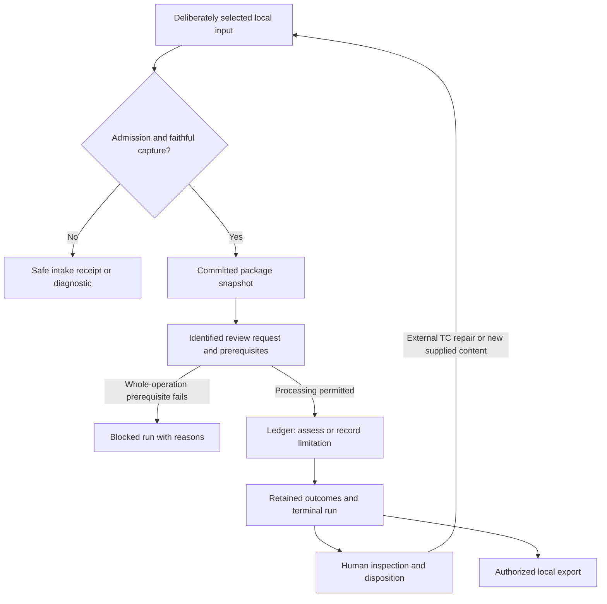

# Test Design Gatekeeper

## SAD-01 — Component Responsibilities and Review Package Flow

| Field | State |
| --- | --- |
| Version / date | 0.1 — 2026-09-22 |
| SDLC phase | Solution and Architecture Design; entry GO recorded in SR-RA-001 v0.2 |
| Work allocation | B-01, first activity: component boundaries, one local review flow and operational entry points |
| Document status | PROPOSED — ready for Owner walkthrough after the author check in Section 10 |
| Design decisions | Three proposals in Section 3; none is recorded as accepted |
| Requirements baseline | The 249 accepted requirements identified by SR-RA-001 v0.2 remain authoritative |
| Evidence boundary | Document-level design and synthetic walkthrough; no product implementation or executed product tests |
| Author / review independence | AI-assisted draft and author check by the same assistant; no independent review claimed |

## 1. Purpose and reading convention

This document proposes how one bounded Review Package moves through local intake, review, human decisions and local export, and assigns responsibility for each step. RA-02 established the required business workflow. SAD-01 adds application boundaries, permitted dependencies, commit points and failure handling to realize that workflow.

Statements describing the proposed solution remain design proposals until accepted. Quoted status values and inherited obligations retain their accepted RA meanings. This document creates no new product requirements, role grants or numerical acceptance thresholds. A disagreement with an accepted requirement must become an explicit change request rather than a quiet design exception.

The first operational target is a laboratory path using eligible public or synthetic material. The design reserves the necessary protection boundaries for sealed operation; its concrete deployment controls and verification remain part of the later B-01 security activity and B-09. Acceptance of SAD-01 alone will not authorize implementation or confidential use.

## 2. Governing sources and bounded deliverable

The inspected repository baseline is commit `8fa720fc453e5457a361fd5f4cb8ba386050750a`. The later acceptance and correction records identified in [SR-RA-001 v0.2][gate] govern historical pending notices inside retained wording sources.

| Source | Used here for |
| --- | --- |
| [SR-RA-001 v0.2, Sections 4–7][gate] | Design authorization, four B-01 activities, flexible capacity and active R-08 |
| [RA-01 v0.3][ra01] and [RA-02 v0.3][ra02] | Acting roles, bounded workflow and decisions outside TDG authority |
| [RA-03 v0.4, Sections 6 and 15–16][ra03] | Three information layers, corrected input-sufficiency rules and version consequences |
| [RA-04 v0.2, Sections 2–5][ra04] | Item eligibility, classification criteria and defensible within-TC views |
| [RA-05 v0.2, Sections 2–7][ra05] | Run/ledger/result separation, interpretation, disposition and durable history |
| [RA-06 v0.2, Sections 2–9][ra06] | Technique applicability, planned exercise, expected results and supported metrics |
| [RA-07 v0.2, Sections 3–7][ra07] | Permitted model tasks, qualification, output checks and change consequences |
| [RA-08 v0.2, Sections 3–7][ra08] | Admission, trust boundaries, protected copies and safe failure |
| [RA-09 v0.2, Sections 2–7][ra09] | Local JSON/CSV intake, receipt and controlled JSON/Markdown export |
| [RA-10 v0.2][ra10] and the [accepted trace ledger][trace] | Evaluation separation and existing REQ-to-VAL evidence |

The deliverable is one coherent first design document. Physical schemas, database selection, exact command syntax, parser limits, model/runtime selection and security mechanisms have named follow-up allocations in Section 11. Their absence here is explicit; they must be resolved before enabling the corresponding implementation path.

## 3. Proposed design decisions

These choices are recommendations derived from the accepted scope and solo working model. All three remain **PROPOSED**.

| Decision | Proposal and reason | Consequence to review |
| --- | --- | --- |
| SAD-D-001 — Application shape | One local application with the seven logical modules in Section 4, limiting deployment and coordination work for the solo project. Keep the application core in one process; a selected local inference runtime may be a separate controlled process. | Module interfaces and fault boundaries need verification. A module boundary is not an OS security boundary, and a local process does not establish confidentiality. |
| SAD-D-002 — First operational interface | Begin the laboratory implementation with a command-line interface, native JSON/defined CSV intake, readable local inspection and deliberate JSON/Markdown export. This exercises the accepted contracts while keeping the first interaction design small. Route all actions through application services. | Human interpretation and disposition actions must be usable from this interface. GUI choice remains open for later usability evidence; introducing another interface must reuse the same authority and lifecycle rules. |
| SAD-D-003 — Execution model | Process one review run at a time in the foreground, making active work and cancellation explicit for the first operator workflow. Coordinate bounded work through an explicit ledger, persist safe outcomes incrementally and finalize the run separately. | A live run may obtain a permitted first human interpretation before its dependent entry is assessed. Interruption needs explicit recovery; a terminal run cannot resume. Sequential execution does not eliminate stale human actions or retry conflicts. |

The foreground workflow can allow the operator to answer a clarification, leave it unresolved, or cancel. Waiting within an active run does not add a new run state. It cannot create an indefinite hidden background job. Exact interaction, interruption detection and bounded waiting policy belong to the implementation-ready contracts in the remaining B-01 work.

The architecture supports a deterministic-only review where its actual prerequisites and qualified controls are available. This is a bounded capability, not an assumption that scripts can interpret arbitrary business prose. The LLM gateway is optional for independent work and mandatory for every permitted runtime model invocation.

## 4. Components, ownership and permitted dependencies

Components are logical responsibilities, not seven services to deploy. Actor/profile checks use trusted operational context rather than authority claims inside a submitted file.

| Component | Responsibility and owned output | Allowed boundary |
| --- | --- | --- |
| CMP-01 — Application coordinator | Accept identified human operations; apply action/profile policy; invoke capture, review, decision and export services; coordinate run state. | Receives CLI actions and trusted configuration. No command gains scope, qualification or protected-data permission from supplied content. |
| CMP-02 — Intake and capture | Check supported contracts and selected bindings; preserve originals and identified mechanical projections; produce coherent package snapshots and import receipts. | Reads only explicitly selected sources through approved paths. No LLM capture mapping, code execution, URL following or automatic directory search. |
| CMP-03 — Review planner | Account for the original inventory; check minimums, item eligibility, criterion-level qualification and per-dimension prerequisites; prepare the requested-work ledger. | Reads the identified snapshot and applicable decision/configuration context. Semantic assistance goes through CMP-05; no blanket verdict from labels. |
| CMP-04 — Assessment services | Assess requested quality/technique dimensions; preserve models, mappings, premise status and derivation; propose evidence-bearing outcomes and review items. | Deterministic controls receive established structured premises. Semantic model contributions use CMP-05. Neither path repairs source TC or confirms its own business interpretation. |
| CMP-05 — LLM gateway | Check task/envelope permission, construct bounded context, invoke the configured local runtime, validate response structure/references and retain permitted attempt evidence. | Receives only selected package/run evidence. The runtime receives no record-store access, filesystem discovery, arbitrary command, policy-change or network-retrieval capability. |
| CMP-06 — Record and history store | Preserve coherent snapshots, runs, ledger entries, evidence, interpretation/disposition events, operation outcomes and exports; expose controlled reads. | Writes pass through invariant-preserving application operations. Failed writes cannot be reported as success; imported statuses are data rather than trusted history. Storage technology remains open. |
| CMP-07 — Inspection and export | Present authorized selected records; prepare coherent JSON/Markdown export with source limits and a fixed human-history boundary. | Uses retained records and current permission. Presentation adds no semantic findings, executes no supplied content and loads no remote rendering resources. |

CMP-01 coordinates dependencies; CMP-06 supplies the retained record boundary. CMP-03 and CMP-04 may request bounded model assistance through CMP-05. Model responses return as candidate contributions to be checked, never as direct commands or database writes. CMP-07 reads the selected committed records rather than asking the model to reconstruct the result.

Three storage domains remain distinguishable within that design: submission/operation context, immutable captured content, and derived assessment/history. This is logical separation; the physical design must decide how it is enforced without unnecessary source duplication.

The common policy interface is checked at each exposed operation and again before an affected privileged commit or disclosure. Sealed use requires current actor/action/object authorization on every path, including record lookup, history, interpretation, disposition and export. A typed role in the laboratory provides logical attribution only.

## 5. One package through the application

### 5.1 Flow overview

The diagram shows operation order. A committed snapshot can fail the core minimum. The explicit review request in E can then be recorded as blocked; a rejection before D has no fabricated package or run. G includes the case where every requested dimension is explicitly limited and no substantive conclusion becomes available. Human interpretation can also occur during G under Section 6.2; disposition follows an identifiable retained item.

### 5.2 Step responsibilities and commit points

| Step | Operation and responsible component | Inspectable consequence |
| --- | --- | --- |
| FLOW-01 — Admit | CMP-01 checks the selected operation, actor/role, profile, declared classification, purpose and policy before prohibited processing. | A refused path returns only permitted intake information. No automatic profile switch or external classification call. |
| FLOW-02 — Capture | CMP-02 validates the supported input contract and explicit source bindings, inventories exact sources and applies the identified mechanical mapping. | CMP-06 exposes `CAPTURED` only after a coherent durable snapshot and receipt linkage exist. Rejected/failed capture has no committed package reference. |
| FLOW-03 — Check minimums | CMP-02/CMP-03 apply the RA-03 sequence to the captured candidate, preserving origin, accountability, gaps, provenance and conflicts. | Receipt minimum is `MET`, `NOT_MET` or `NOT_EVALUATED`. An unresolved free-text origin is preserved, not inferred from writing style. |
| FLOW-04 — Request review | CMP-01 records one deliberate request against one immutable package version, with the authorized dimensions and actual behavior context. | A unique `REQUESTED` run exists. Retrying the same identified request does not create another run; a new deliberate request does. |
| FLOW-05 — Plan bounded work | CMP-01 checks start prerequisites and records `RUNNING` before authorized qualification/assessment activity begins. CMP-03 applies RA-04 and accounts for all supplied TC/candidates, exclusions and requested dimensions. | A whole-run impediment can lead from `REQUESTED` or `RUNNING` to `BLOCKED`, as applicable. Each entry retains eligibility, domain, capability and evidence separately. No domain exclusion is invented from a capability failure. |
| FLOW-06 — Establish premises | CMP-03/CMP-04 inspect supported evidence, reuse applicable recorded decisions and expose unresolved interpretations. | Candidate models and mappings remain derived. A qualified LLM may assist; ROLE-04 owns interpretation confirmation. Unsupported dependent claims remain ungradable or unperformed according to their actual cause. |
| FLOW-07 — Assess | CMP-04 applies available qualified controls and, where permitted, CMP-05 assistance within the unchanged requested boundary. | Applicability is separate from conditional coverage, planned exercise from expected-result alignment. Every completed conclusion retains evidence and derivation; new review items start `PENDING`. |
| FLOW-08 — Commit and finalize | CMP-01/CMP-06 commit coherent entry outcomes and related items, then finalize state with an explicit outcome for every requested entry. | Run state and availability derive from actual retained work. No empty model response, successful parser or finding count establishes completion or `AVAILABLE`. |
| FLOW-09 — Human review | CMP-01/CMP-07 expose evidence and record authorized interpretation/disposition operations with their distinct effects. | ROLE-05 disposition is attributable; self-review is visible. ROLE-03 repairs the TC externally. Earlier findings can remain pending while a revised package is submitted. |
| FLOW-10 — Export or revisit | CMP-07 exports a deliberate selection/history cutoff after current permission checks; CMP-01 accepts a separate re-review or explicit comparison request. | Export failure leaves canonical records intact. Re-review has its own run; revised supplied content has a new package version; comparison history cannot silently enrich its basis. |

In the standard technique request, applicability is assessed and coverage is conditional on established applicability. A justified negative applicability conclusion leaves that conditional coverage unrequested, with its reason recorded. Explicitly requested coverage cannot be removed after the fact to improve availability. Techniques outside the request remain visibly outside the assessment boundary.

CMP-07 may also present safely committed interim records during an active run, subject to current access policy. They retain availability `NOT_FINAL` and cannot be shown as a terminal result. An uncommitted preview is separately labelled unsaved; it is not retained evidence for a human disposition.

## 6. Control points that determine whether the flow is trustworthy

### 6.1 Persistence and processing

The design uses four logical commit boundaries: coherent capture; identified review request; coherent assessment entry with its evidence/items; and terminal run finalization after ledger reconciliation. Human decisions and exports have their own identified operations. These are required effects to design, not a selected database transaction API.

If a later entry fails, safely committed earlier entries remain attributable. Recovery reconciles interrupted operational records and current permission; it does not rerun an assessment or reconstruct lost conclusions. An unresolved interrupted entry stays explicitly incomplete until its operational outcome is reconciled under RA-05. A failed or cancelled terminal run with safely completed substantive entries may have availability `PARTIAL`.

The persisted operation identity includes enough comparison information to distinguish an identical retry from reuse with different content/configuration. A save followed by a lost response must return the original committed outcome on an authorized identical retry. An intentional new review request remains a new run even with identical parameters. Equal source text or hashes cannot merge independent package identities.

### 6.2 Human authority and change impact

| Human action | Effect in this design |
| --- | --- |
| ROLE-02 changes supplied scope, or ROLE-03 supplies corrected TC/origin/accountability | Capture a new package version with lineage; preserve the old snapshot. |
| ROLE-04 makes the first applicable interpretation decision about already supplied evidence during an active run | It may support an entry not yet assessed only if no applied premise is replaced and no configured behavior artifact changes. Retain the exact decision version. |
| ROLE-04 replaces an interpretation already used, or an assessment behavior artifact changes | New run for subsequent assessment; retain earlier conclusions. A behavior change requires a new run even before the first substantive entry commits. |
| A human supplies a genuinely new business rule or clarification document | New package version, even if supplied during an interpretation discussion. |
| ROLE-05 accepts, rejects, defers or reopens a finding | Append a disposition event; preserve the claim and its derivation. Acceptance neither confirms a business rule nor verifies TC repair. |
| A role grant, qualification or required protection becomes invalid | Recheck before affected invocation, result promotion, authority-bearing write and disclosure; stop affected work and retain safe history under policy. |

After a run is terminal, a new interpretation can be recorded for later use, but assessment using it belongs to a new run. There is no TDG action for formal testware approval or an SDLC GO decision. ROLE-10 makes project gates outside the product workflow; project ownership alone does not confer other acting roles.

### 6.3 Model contribution and protection

CMP-05 accepts only a permitted RA-07 task and an applicable current qualification envelope. LLM-03 is assessment relationship assistance, not source-field/capture mapping. Candidate evaluation uses a separately identified, ROLE-08-authorized laboratory evaluation context; its unqualified outputs cannot be promoted into an operational supported review.

Mechanically decidable checks include response shape, allowed values, subject identity, source-locator existence, version matching and configured bounds. They do not prove that a real citation supports a claim. Semantic support and uncertainty remain inspectable against the original evidence; an unsupported claim is withheld. A correct calculation over an unconfirmed premise retains that limitation. Deterministic findings can receive separately identified LLM explanations without changing their original derivation.

Qualification and data permission are checked before invocation and again before relevant result promotion/delivery. Retry budgets and permitted instruction variants belong to the identified behavior configuration. No fallback changes a model, task, context policy or processing destination silently. Raw model text cannot write records, confer authority or cause tool execution even if it contains such instructions.

The later protection design must allocate concrete enforcement for process access, local inference endpoints, context isolation/reset, egress, protected storage/keys, temporary copies, audit, backups and export destinations. Sealed runtime denies egress outside its approved boundary. Missing shared protection or mandatory audit blocks dependent deterministic work too. Optional debug-log failure has a narrower consequence. Emergency stopping and containment remain possible when audit is unavailable.

## 7. Alternate and fault paths

The following are design walkthrough obligations, not observed runtime results. Exact states follow the cited RA contracts and the actual work performed.

| Challenge | Required path through the proposed components |
| --- | --- |
| Protected or unresolved classification submitted to the laboratory | CMP-01 refuses prohibited processing before capture/review; any allowed containment or metadata follows RA-08. A later suspicion stops affected work and delivery. |
| Unsupported envelope, unreadable selected source, or unsafe parser limit | CMP-02 reports bounded rejection/failure. It does not report a coherent snapshot after partial or unfaithful capture. A safely captured opaque attachment remains distinct from a lost source. |
| Faithful capture with no substantive basis or no positive accountable recognizable TC | Snapshot may remain captured; minimum is not met. Explicit subsequent review is blocked, without fabricated qualification or findings. |
| Conflict with an independent unaffected subset | CMP-03 applies corrected RA-03 IS-09 and RA-04 separation. Every excluded item/assertion stays visible; a non-separable conflict receives no guessed precedence. |
| Minimum met but conditional evidence absent | Preserve admission. An attempted dependent dimension is `UNGRADABLE`; untouched work is not presented as attempted. Availability comes from actual substantive ledger entries, including any genuinely completed requested basis-gap review. |
| TC genuinely outside MVP, or qualification is undecidable | Record criterion-level exclusion or `UNDETERMINED` separately. Retain the original inventory and any defensible views; no excluded assertion becomes coverage credit. |
| No applicable qualified LLM capability | Dependent unstarted work is `NOT_PERFORMED`. Independent authorized controls may proceed; loss of a shared protection prerequisite still blocks all dependent paths. |
| Model timeout, resource failure or unusable response after invocation | Unfinished work is `INCOMPLETE`, with an operational cause. It is not a missing-business-rule finding. A contained failure can leave other work completed. |
| Cancellation, lost persistence response, crash or disk failure | CMP-01/CMP-06 preserve only coherent committed work, reconcile interrupted records and respect retry identity. No success from unsaved output, silent reassessment or terminal restart. |
| Stale disposition, authority revoked in flight, or missing mandatory audit | Reject/conflict the affected action before its unauthorized effect. Preserve existing history and any policy-permitted attempted-action evidence; no last-write-wins human judgment. |
| Export denied, interrupted or unsafe rendering requested | CMP-07 releases no unsafe partial artifact; canonical results remain unchanged. Evidence omissions, history cutoff and export failure are explicit. |

For a normally completed review, zero findings can coexist with `AVAILABLE` only when the RA-05 completeness conditions for the requested ledger boundary are met. Diagnostics alone mean no completed substantive entry and therefore availability `NONE`. Neither outcome is official ISTQB conformity or testware approval.

## 8. Synthetic customer-creation walkthrough

This small example belongs to exposed design/development material. It is not an accepted benchmark, human oracle, executed test or a new requirement for TDG. It narrows the already selected customer-creation reference process to age validation. The numerical rule below is an explicit synthetic example assumption, not inferred from earlier documents.

The supplied basis states: the age input domain is all integers; an otherwise valid Create Customer request with age 18 through 75 inclusive creates a customer; other integer ages reject creation and create no customer. The supplied shared setup identifies the whole customer system, an authorized operator, a fresh identity with no existing duplicate, and valid values for the other required inputs.

The package contains three distinct TC with explicit attributable human accountability and positive canonical origin declarations:

| TC | Supplied behavior and expectation | Qualification consequence |
| --- | --- | --- |
| CUST-01 | Submit Create Customer with age 18 through the product API; expect customer creation. The stated objective is system functional behavior. | System-level, externally specified behavior can be supported from this full context. API access alone is not the classifier. |
| CUST-02 | Submit the same operation with age 40; no expected result is supplied in any applicable content. | Remains a recognizable system functional TC. The missing expectation is a separate quality gap. |
| CUST-03 | Invoke an isolated internal age-validator method with age 75 to cover a named implementation branch. | The supplied isolated object and structural objective establish an MVP exclusion; the word “unit” is unnecessary to reach it. |

For this walkthrough the request selects BVA applicability, coverage under an explicitly selected two-value criterion, and expected-result alignment. Other techniques are not requested. Assume the necessary controls, structured model/mappings and applicable human interpretation evidence have been established; absence of those prerequisites in an actual implementation would limit the corresponding assessment.

1. Capture preserves all three TC and their original identities. Package minimum can be met without making CUST-03 eligible for system-level review.
2. The planner retains CUST-03 as excluded and assesses the supported CUST-01/CUST-02 subset. It does not count its age 75 as planned system-level exercise.
3. For the supplied integer model, the selected two-value BVA targets are 17, 18, 75 and 76. CUST-01 plans 18. Complete inspection of this named supported subset establishes no planned exercise of 17, 75 or 76. Age 40 is not one of these selected boundary targets.
4. CUST-02's absent expectation produces a bounded observation about missing expected behavior. Its supplied action/data are preserved; the tool does not add the assumed expected result to its steps.
5. Supported items enter the review record with disposition `PENDING`. Assuming all planned processing finishes normally, the run is `COMPLETED` and availability is `PARTIAL` because a supplied TC is excluded. A detected gap is still a completed assessment, not automatically an ungradable assessment.
6. ROLE-05 may accept the findings; ROLE-03 may then repair or extend source TC externally. New supplied testware becomes a new package version and a subsequent review has a new run. Neither action automatically resolves historical findings.

This example exercises the architecture without requiring all four techniques or inventing promotion, credit or insurance rules for the first increment. Other reference domains remain later corpus work.

## 9. Static review and STLC handoff

The table maps this design to selected accepted obligations. It is a focused design allocation, not a replacement for the 249-requirement trace ledger or a claim that the whole architecture is covered.

| Design surface | Principal accepted requirement anchors | Existing validation obligations to develop into tests |
| --- | --- | --- |
| FLOW-01–03: admission, coherent capture and minimums | RA09-REQ-013, RA09-REQ-014, RA09-REQ-015; RA08-REQ-004 | RA09-VAL-002, RA09-VAL-011, RA09-VAL-012; RA08-VAL-004 |
| CMP-03: independent axes and mixed inventory | RA04-REQ-002, RA04-REQ-003, RA04-REQ-005, RA04-REQ-006, RA04-REQ-007, RA04-REQ-009; RA05-REQ-003 | RA04-VAL-003, RA04-VAL-004; RA05-VAL-003 |
| FLOW-04/08: run, ledger, availability and counts | RA05-REQ-001, RA05-REQ-002, RA05-REQ-004, RA05-REQ-005 | RA05-VAL-001, RA05-VAL-002, RA05-VAL-004 |
| FLOW-06/07: interpretation and technique evidence | RA05-REQ-007, RA05-REQ-008; RA06-REQ-005, RA06-REQ-007, RA06-REQ-016 | RA05-VAL-006; RA06-VAL-004, RA06-VAL-007; RA07-VAL-005 |
| CMP-05: bounded model context and current permission | RA07-REQ-001, RA07-REQ-003, RA07-REQ-004, RA07-REQ-009, RA07-REQ-016 | RA07-VAL-003, RA07-VAL-004, RA07-VAL-009, RA07-VAL-010 |
| FLOW-09: human history, retries and version effects | RA05-REQ-009, RA05-REQ-010, RA05-REQ-011, RA05-REQ-017, RA05-REQ-018, RA05-REQ-019 | RA05-VAL-006, RA05-VAL-008, RA05-VAL-009, RA05-VAL-012 |
| FLOW-10: export and imported authority | RA09-REQ-018, RA09-REQ-019, RA09-REQ-020, RA09-REQ-024 | RA09-VAL-012, RA09-VAL-015, RA09-VAL-016 |
| Cross-cutting protection and later sealed readiness | RA08-REQ-001, RA08-REQ-006, RA08-REQ-015, RA08-REQ-020, RA08-REQ-023 | RA08-VAL-001, RA08-VAL-006, RA08-VAL-007, RA08-VAL-008, RA08-VAL-016 |

The immediate static walkthrough should follow the same example across capture, ledger, evidence, human history and export. Reviewers should challenge at least one path that stops before capture, one that preserves a deficient snapshot, one supported partial result, a semantic uncertainty, a model fault and a failed durable write.

Later test analysis turns the accepted VAL obligations and Section 7 into specific conditions. Test design then chooses representative data, mutations, expected records and fault points. Test implementation follows the separate implementation gate. Execution records observed outcomes and defects; completion reports distinguish tested behavior, unresolved limitations and the release envelope. A fake model response can exercise gateway contract/failure behavior, but cannot qualify a real model or establish semantic accuracy.

## 10. Author check and review status

| Check | Status and scope |
| --- | --- |
| Existing source links and full REQ/VAL identifiers | PASS, author check — 12 local source links resolve; 68 distinct full REQ/VAL identifiers exist in their cited effective wording sources; 11 tables have consistent column counts. This checks reference integrity, not exhaustive design coverage. |
| Acceptance/status wording | PASS, author check — three design decisions remain PROPOSED; no RA requirement, earlier acceptance or phase authority was changed. |
| Lifecycle and authority walkthrough | PASS within the inspected paths — capture/minimum separation, explicit start transition, interim versus terminal results, partial inventory, first-confirmation limits, new-run rules and cause-specific failures inspected against RA-03–RA-09. Start/interim wording was clarified before delivery. |
| Requirements or implementation changes | None proposed outside the explicit architecture choices; no product code or executable TC in this artifact |
| Formal static review / Owner decision | PENDING — not replaced by the author check |

The author check is a preparation step. It cannot establish runtime behavior, security readiness or independent assurance. After the Owner walkthrough, material findings and corrections can be recorded in a compact review entry; a separate large report is unnecessary unless the actual findings warrant it.

## 11. Next work and completion boundary

| Remaining B-01 activity | Concrete follow-up |
| --- | --- |
| Complete this first activity | Review Sections 3–8, resolve material findings and decide SAD-D-001 through SAD-D-003. Record the result and revisit the first activity's 4–8-hour estimate using actual human effort when available. |
| Data, identity and contracts | Select local persistence; design physical records, commit/recovery behavior, operation identity and stale-write checks; specify schemas, source binding, errors, parser limits and usable command/decision inputs. |
| Model and protection architecture | Specify the gateway, permitted qualification/evaluation paths, resource/retry/context bounds and actual trust/copy boundaries; allocate enforcement, diagnostics, containment and sealed verification. |
| Consolidated design review and increment plan | Check cross-component contracts, settle blocking design issues, estimate the first implementation increment including reference fixtures and tests, and prepare the later implementation gate. |

Security and testability influence all activities; they are not postponed until after coding. Schema, parser, interaction and model limits need concrete values before their affected paths are enabled. No unsupported default is established by omission in this document.

R-08 remains active. Keep the seven modules as responsibility boundaries, avoid one document per module or requirement, and reuse the accepted source and trace records. The approximate five-hour weekly capacity remains flexible. No actual human effort, delivery date or model feasibility is inferred from the time taken to generate this draft.

**Current next action:** Owner walkthrough of SAD-01 v0.1 and the three proposed design choices. Requirements Analysis stays closed. Completion of this first activity does not complete B-01 or grant implementation GO.

[gate]: ../requirements-analysis/ra-10/test-design-gatekeeper-requirements-analysis-readiness-v0.2.md
[ra01]: ../requirements-analysis/test-design-gatekeeper-ra-01-stakeholders-actors-authority-v0.3.md
[ra02]: ../requirements-analysis/test-design-gatekeeper-ra-02-system-context-workflows-use-cases-v0.3.md
[ra03]: ../requirements-analysis/ra-10/test-design-gatekeeper-ra-03-review-package-content-provenance-validation-v0.4.md
[ra04]: ../requirements-analysis/test-design-gatekeeper-ra-04-scope-qualification-classification-boundaries-v0.2.md
[ra05]: ../requirements-analysis/ra-05/test-design-gatekeeper-ra-05-findings-dispositions-persistence-v0.2.md
[ra06]: ../requirements-analysis/ra-06/test-design-gatekeeper-ra-06-technique-applicability-design-coverage-v0.2.md
[ra07]: ../requirements-analysis/ra-07/test-design-gatekeeper-ra-07-llm-roles-qualification-v0.2.md
[ra08]: ../requirements-analysis/ra-08/test-design-gatekeeper-ra-08-confidentiality-security-privacy-v0.2.md
[ra09]: ../requirements-analysis/ra-09/test-design-gatekeeper-ra-09-data-representations-import-export-contracts-v0.2.md
[ra10]: ../requirements-analysis/ra-10/test-design-gatekeeper-ra-10-evaluation-acceptance-v0.2.md
[trace]: ../requirements-analysis/ra-10/test-design-gatekeeper-requirements-analysis-traceability-audit-v0.1.json
