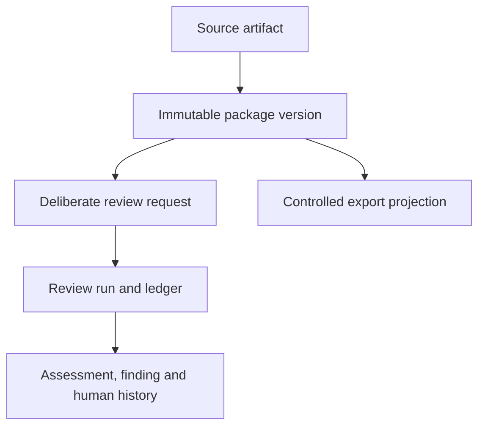

# Test Design Gatekeeper

## SAD-02 — Data, Identity and Contract Boundaries

| Field | State |
| --- | --- |
| Version / date | 0.1 — 2026-09-23; review-closure update |
| SDLC phase | Solution and Architecture Design; continuation of B-01 after SAD-01 |
| Work allocation | B-01, second activity: logical data model, identity, persistence effects and import/export contracts |
| Document status | ACCEPTED — Sections 3–14 reviewed; SAD-02 logical data, identity and contract activity closed within its stated boundary |
| Design decisions | SAD-D-004 through SAD-D-008 accepted; §14 clarification on TDG advisory-only behavior recorded |
| Requirements baseline | The 249 accepted requirements identified by SR-RA-001 v0.2 remain authoritative |
| Evidence boundary | Document-level design and contract walkthrough; no product implementation, migration or executed product tests |
| Author / review independence | AI-assisted draft and author check by the same assistant; no independent review claimed |

## 1. Purpose and reading convention

SAD-01 established one local modular application, a terminal-first entry point and one active review run. SAD-02 defines the logical records and contracts that allow those boundaries to preserve a Review Package, perform a bounded review, record human decisions and export an inspectable result without confusing supplied content with derived assessment.

This document specifies logical ownership, identity, lineage, state and contract behavior. It intentionally does not select a database engine, a file encryption mechanism, a model runtime, a GUI, a cloud service or a final command syntax. Those physical choices remain proposals until the later design work and their own review gates.

The words **PROPOSED**, **MUST**, **SHOULD** and **MAY** in this draft describe design language, not newly accepted product requirements. Inherited obligations retain the meaning and status established by the accepted Requirements Analysis baseline. A conflict with an accepted requirement must be raised as an explicit change request.

The first operational target remains a local laboratory path using deliberately supplied public or synthetic material. No confidential project input, sealed deployment or implementation authorization follows from this document.

## 2. Governing sources and bounded deliverable

| Source | Used here for |
| --- | --- |
| [SR-RA-001 v0.2][gate] | B-01 allocation, flexible solo capacity, active R-08 and the design-phase boundary |
| [SAD-01 v0.1][sad01] | Accepted component responsibilities, one active run, flow commit points and failure principles |
| [RA-03 v0.4][ra03] | Review Package content, source preservation, provenance, version consequences and input sufficiency |
| [RA-04 v0.2][ra04] | Eligibility, classification axes and separate capability/domain views |
| [RA-05 v0.2][ra05] | Run, ledger, result, interpretation, disposition and durable history separation |
| [RA-06 v0.2][ra06] | Technique applicability, planned exercise, expected-result alignment and evidence |
| [RA-07 v0.2][ra07] | Bounded model contribution, qualification and behavior-version consequences |
| [RA-08 v0.2][ra08] | Admission, trust boundaries, protected copies and safe failure |
| [RA-09 v0.2][ra09] | Serialization-neutral input, local JSON/CSV intake and controlled JSON/Markdown export |
| [RA-10 v0.2][ra10] | Evaluation separation, human oracle and acceptance governance |

The bounded deliverable is one coherent logical contract model. It must provide enough precision for the next design activity to select a physical persistence approach and prepare implementation-ready schemas, but it does not pretend that an unselected technology is already verified.

## 3. Design goals and constraints

The design shall make the following distinctions inspectable:

1. supplied source content versus a mechanical projection;
2. a package identity versus a package version;
3. a review run versus an assessment entry;
4. a finding claim versus its evidence and derivation;
5. a human interpretation/disposition event versus an assessment result;
6. a source identifier versus a TDG-generated internal identifier;
7. an operation retry versus a deliberately new review request;
8. a schema version versus a source version, behavior version or configuration version;
9. a successful import/capture versus a package that meets minimum review conditions;
10. a canonical retained record versus a readable export projection.

The design is constrained by the following accepted boundaries:

| Constraint | Design consequence |
| --- | --- |
| Supplied-data only | No contract may imply URL following, external repository search or automatic directory discovery. A reference is data unless a later authorized operation explicitly resolves it. |
| Human authority | Actor identity and acting role come from trusted runtime context. A role, approval or disposition written inside a submitted file cannot grant authority. |
| Immutable review history | Captured versions and events are append-only in meaning. Corrections create lineage rather than silently rewriting an earlier basis. |
| One active run | The logical model supports one active run in the first operator workflow; it still protects individual records against stale human writes and lost responses. |
| Local laboratory first | The physical design must work without a network service or external model. Confidential/sealed controls remain a later verification boundary. |
| R-08 active | Reuse this model across components and future tests; avoid a separate document or bespoke record for every requirement. |

### 3.1 Recorded Owner acceptance — 2026-09-22

The Owner accepted Section 3 without changes. This acceptance covers the ten required data distinctions and the six inherited operational constraints. It does not accept the proposed SAD-D-004 through SAD-D-008 directions in Section 4, select a physical persistence technology or authorize implementation.

> tak, akceptuje paragraf 3 bez zmian

The accepted Requirements Analysis baseline, SAD-01 boundaries and R-08 documentation-growth control remain in force.

## 4. Proposed design directions

The following directions are deliberately proposed for Owner review. They refine the accepted SAD-01 shape without granting implementation authority.

| Decision | Proposed direction | Reason and review consequence |
| --- | --- | --- |
| SAD-D-004 — Logical data domains | Keep three distinguishable logical domains: captured submission, derived review/history and operational/authority context. They may share a physical store only if ownership and write invariants remain enforceable. | Prevents a model suggestion, imported status or UI projection from becoming indistinguishable from source truth. Physical placement remains open. |
| SAD-D-005 — Immutable identity and lineage | Give each package version, run, ledger entry and human event a TDG identity while preserving all supplied source identities. Revised supplied content creates a new package version and does not overwrite the prior snapshot. | Supports replay, comparison, provenance and causality. Equality of text or hashes does not merge independent submissions. |
| SAD-D-006 — Contract-first serialization | Use a versioned native JSON envelope as the canonical interchange contract, a bounded CSV adapter for the TC portion and JSON/Markdown as controlled result projections. | Keeps the core independent of a source tool and makes lossy formats explicit. Exact schemas and CSV companion rules remain to be settled. |
| SAD-D-007 — Idempotent operations and guarded writes | Associate durable operations with an operation identity and request fingerprint. Identical authorized retries return the prior committed outcome; changed content or behavior is a conflict or a new deliberate request. Human updates use an expected record version. | Protects against lost responses, duplicate runs and stale dispositions without relying on last-write-wins behavior. |
| SAD-D-008 — Explicit incomplete states | Preserve `NOT_EVALUATED`, `NOT_PERFORMED`, `UNGRADABLE`, `INCOMPLETE`, `BLOCKED`, `PARTIAL` and equivalent causes as distinct values where the governing RA contract requires them. | A missing result must not be normalized to a pass, zero findings or an empty successful response. Exact enumerations require cross-contract verification. |

### 4.1 Decision boundary for this activity

Acceptance of SAD-D-004 through SAD-D-008 would accept the logical direction only. It would not select SQLite or another database, establish encryption, approve a parser limit, qualify an LLM, authorize confidential input or permit implementation. The exact physical schema, migration strategy and executable CLI contract remain follow-up work.

### 4.1 Recorded Owner acceptance — 2026-09-23

The Owner accepted Section 4 and SAD-D-004 through SAD-D-008 without changes. This acceptance covers the proposed logical data-domain separation, immutable identity and lineage, contract-first serialization, guarded retries/writes and explicit incomplete-state direction. It does not select a physical database, encryption mechanism, model runtime, parser limit or implementation path.

> tak, akceptuje bez zmian

The Section 3 acceptance, SAD-01 boundaries, accepted Requirements Analysis baseline and R-08 control remain in force.

## 5. Logical record model

Components own logical records, not necessarily separate database tables or processes. A physical implementation may normalize, embed or split records only when it preserves the identities, lineage and invariants below.

| Logical record | Owning responsibility | Minimum meaning and invariant |
| --- | --- | --- |
| `OperationContext` | CMP-01 | Trusted actor/action/profile context, operation identity, request fingerprint and policy decision. Submitted content cannot populate its authority fields. |
| `SourceArtifact` | CMP-02 | The deliberately selected source or opaque attachment, its source locator, media/profile declaration, receipt identity, hash where available and capture outcome. The original is distinguished from projections. |
| `PackageVersion` | CMP-02/CMP-06 | One coherent retained snapshot of scope, test basis, test cases, provenance declarations, gaps, conflicts and source lineage. It is immutable after capture commit. |
| `TestCaseRecord` | CMP-02 | One recognizable supplied TC item with TDG identity, preserved source identity, supplied fields, unknown/unmapped content and package-version lineage. It is not silently repaired. |
| `ReviewRequest` | CMP-01/CMP-06 | The deliberate request for one package version, requested dimensions, behavior/configuration references and operation identity. A retry is not automatically a second request. |
| `ReviewRun` | CMP-01/CMP-06 | The retained lifecycle and terminal state for one review request, including start/finalization effects and availability consequences. |
| `LedgerEntry` | CMP-03/CMP-04/CMP-06 | The requested assessment boundary for one recognizable item and dimension, with eligibility, prerequisites, attempt state, evidence references and cause-specific outcome. |
| `AssessmentResult` | CMP-04/CMP-06 | A conclusion or limitation with derivation, evidence and premise status. It cannot be written directly by raw model text. |
| `EvidenceItem` | CMP-04/CMP-06 | A source locator, deterministic check, model attempt reference, interpretation reference or other inspectable basis. Evidence does not become an authority grant. |
| `InterpretationEvent` | CMP-01/CMP-06 | An attributable human interpretation or clarification, including its input basis, version and impact on later work. It does not rewrite earlier results. |
| `Finding` | CMP-04/CMP-06 | A claim about the supplied testware or review basis with severity/status, evidence and derivation. Findings remain distinct from dispositions. |
| `DispositionEvent` | CMP-01/CMP-06 | An attributable accept/reject/defer/reopen decision over a finding. It records human handling; it does not prove business-rule correctness or TC repair. |
| `ExportArtifact` | CMP-07/CMP-06 | A deliberate projection of selected committed records, history cutoff, format/schema version, export identity and failure/outcome. It is never the canonical source of history. |
| `Policy/QualificationContext` | CMP-01/CMP-05/CMP-06 | The effective profile, permitted task, model/configuration qualification and policy versions used for a relevant operation. It is referenced, not inferred from the package. |

### 5.1 Identity and lineage map



The arrows express provenance, not ownership transfer. A package version remains the source basis of a run even when derived records or an export are later created. A new supplied source or changed substantive basis creates a new package version; a new assessment behavior creates a new run even if the package is unchanged.

### 5.2 Canonical versus derived content

Captured source text, source field presence, opaque attachments, declared provenance and supplied gaps are canonical for that package version. Mechanical projections may be retained as derived views but cannot replace the original. Classification, technique applicability, coverage, expected-result alignment, findings, model output and human interpretation are derived or historical records with explicit derivation links.

The store must retain unrecognized fields and content in a form that can be inspected or safely reported. A parser that cannot map a field must not discard it silently. A missing field and an unreadable source are different conditions and must have different operational evidence.

### 5.3 Recorded Owner acceptance — 2026-09-23

The Owner accepted Section 5 without changes. This acceptance covers the logical record boundaries, the distinction between canonical and derived content, the package-to-run lineage and the rule that logical records do not mandate separate physical tables or services.

> tak, akceptuje paragraf 5 bez zmian

The accepted Section 3 constraints, SAD-D-004 through SAD-D-008 and the SAD-01 component boundaries remain in force.

## 6. Identifier, version and provenance contract

### 6.1 TDG-generated identities

The first implementation should use opaque, non-semantic identifiers generated by TDG for at least:

| Identifier | Scope | Must remain stable across |
| --- | --- | --- |
| `package_id` | Logical package lineage | New review runs and exports of the same lineage |
| `package_version_id` | One immutable captured snapshot | All derived runs, entries, findings and exports based on that snapshot |
| `source_artifact_id` | One retained source or opaque attachment | Mechanical projections and re-reading within the same snapshot |
| `test_case_id` | One recognizable TC within a package version | Assessment entries and human history for that item |
| `review_request_id` | One deliberate request | Identical authorized retry of that request |
| `run_id` | One assessment lifecycle | Entries, terminal result and export references |
| `ledger_entry_id` | One item/dimension assessment boundary | Attempts, outcomes and later explanatory evidence |
| `event_id` | One interpretation/disposition/operation event | Audit and conflict handling |
| `export_id` | One export attempt/projection | Export receipt, failure or delivered artifact |

The exact identifier encoding remains open. IDs must not embed a mutable status, human role or guessed source origin. Hashes can support integrity and comparison but cannot replace these identities or decide that two independently submitted packages are one package.

### 6.2 Preserved source identities and versions

The model preserves, where supplied:

- source-system identifier and source-system version;
- source file name/path or bounded source locator;
- source row/record/document locator;
- source author/origin declaration and its authority status;
- source content hash and capture timestamp where the operation can establish them;
- source version, project revision or external reference as data only.

An absent or malformed source identifier is retained as a problem attached to the relevant item. A TDG-generated identity must not be presented as if it came from Jira, Xray, Zephyr or another source.

### 6.3 Version dimensions

The following versions remain independent:

| Version dimension | Meaning | Change consequence |
| --- | --- | --- |
| Contract/schema version | Shape and interpretation of an interchange or retained record | Adapter or migration decision; historical records remain attributable |
| Package version | Captured supplied content and substantive basis | New package lineage snapshot; later review uses a new version |
| Source version | Version declared by the submitting system/document | Preserved provenance; not treated as TDG approval |
| Review-run version/configuration | Behavior, thresholds, technique request and policy context used by a run | New run when a behavior-affecting artifact changes |
| Model/qualification version | Qualified model/runtime/task envelope | New or limited run according to RA-07; no silent fallback |
| Export version | Format and projection rules used for delivery | New export artifact; canonical history is unchanged |

No migration or export may collapse these dimensions into one generic `version` field.

### 6.4 Recorded Owner acceptance — 2026-09-23

The Owner accepted Section 6 without changes. This acceptance covers the TDG-generated identity set, preservation of source identities, hash limitations, independent version dimensions and the rule against collapsing them into one generic version field.

> ok, akceptuje bez zmian

The accepted package lineage, canonical/derived record boundary and guarded-write direction remain in force.

## 7. Review lifecycle and durable commit effects

### 7.1 Proposed lifecycle vocabulary

The logical vocabulary below is aligned to the accepted RA contracts and SAD-01. Exact enum names remain subject to cross-contract verification before implementation.

| Object | Non-terminal states | Terminal or outcome states | Rule |
| --- | --- | --- | --- |
| Capture receipt | `RECEIVED`, `CAPTURING` | `CAPTURED`, `REJECTED`, `FAILED` | `CAPTURED` requires a coherent durable package snapshot and receipt linkage. |
| Review request/run | `REQUESTED`, `RUNNING` | `COMPLETED`, `BLOCKED`, `CANCELLED`, `FAILED` | A terminal run cannot resume; a new deliberate request creates a new run. |
| Ledger entry | `PENDING`, `IN_PROGRESS` | `COMPLETED`, `NOT_PERFORMED`, `UNGRADABLE`, `INCOMPLETE`, `BLOCKED` | The cause and evidence determine the outcome; empty output is not completion. |
| Assessment availability | `NONE`, `NOT_FINAL` | `AVAILABLE`, `PARTIAL` | Availability derives from the requested ledger and actual retained work, not finding count. |
| Export | `REQUESTED`, `BUILDING` | `DELIVERED`, `FAILED`, `CANCELLED` | An export failure leaves canonical records unchanged and cannot produce a misleading partial artifact. |

### 7.2 Commit boundaries

The first implementation must design durable effects around these logical boundaries:

1. **Capture commit:** source receipt, coherent `PackageVersion`, package inventory and capture outcome become visible together.
2. **Review-request commit:** one deliberate request and its operation identity become visible before assessment work starts.
3. **Entry commit:** an individual ledger outcome, evidence references and related findings/items become visible coherently.
4. **Run-finalization commit:** the ledger is reconciled, every requested entry has an explicit terminal or permitted incomplete outcome, and the run is finalized.
5. **Human-event commit:** an interpretation or disposition is appended with actor, expected record version and impact information.
6. **Export commit/receipt:** the selected history cutoff and export outcome are retained separately from the canonical records.

A record exposed as committed must be readable after process restart. A failed later entry cannot erase safely committed earlier entries. A terminal success cannot be reported if the finalization commit did not complete.

### 7.3 Retry, lost response and stale write behavior

An operation request carries a unique operation identity and a comparison fingerprint covering the relevant package version, requested scope/dimensions, behavior/configuration references and actor context. On an authorized identical retry:

- a previously committed result is returned or safely re-read;
- an in-progress operation is reported as such rather than duplicated;
- a failed operation is classified according to its actual durable effect;
- a changed request is rejected as a conflict or treated as a new deliberate request, never silently merged.

Human interpretation and disposition writes include an expected current record version or equivalent compare-and-append check. A stale write becomes a visible conflict; last-write-wins is not an acceptable default for human history.

### 7.4 Recorded Owner acceptance — 2026-09-23

The Owner accepted Section 7 without changes. This acceptance covers the proposed lifecycle vocabulary, logical durable commit boundaries, retry/lost-response behavior, explicit incomplete outcomes and stale-write protection for human history.

> ok, akceptuje paragraf bez zmian

The physical transaction API, database technology and exact enum implementation remain open for the later design work.

## 8. Import and export contracts

### 8.1 Canonical JSON envelope — proposed shape

The canonical JSON contract should carry an explicit envelope rather than relying on a file name or top-level array. The exact JSON Schema remains a follow-up deliverable, but the envelope is expected to distinguish:

```json
{
  "contract_version": "tdg.review-package.v1",
  "package": {
    "package_id": "tdg-pkg-…",
    "package_version_id": "tdg-pkgv-…",
    "scope": {},
    "test_basis": {},
    "source_artifacts": [],
    "test_cases": [],
    "provenance": {},
    "unrecognized_content": []
  },
  "submission": {
    "submitted_by": {},
    "declared_origin": {},
    "received_at": "…"
  }
}
```

The example is illustrative, not an accepted schema. The envelope must not allow `submitted_by`, role, approval or protected-use authority from the payload to override trusted runtime context. A missing field is retained as a bounded input condition rather than filled by inference.

### 8.2 CSV adapter — proposed boundary

CSV is suitable for a bounded TC row profile but cannot safely carry every Review Package concern in one generic table. The implementation-ready design must therefore settle one of two explicit contracts:

1. a CSV TC table accompanied by a package manifest containing scope, test basis, source and provenance; or
2. a CSV profile whose required metadata columns carry those fields without ambiguity.

Until that decision is accepted, a CSV import cannot claim that omitted scope, test basis, provenance or unrecognized content was absent from the source. The adapter must record the exact profile/version, delimiter/encoding assumptions, row locator and unmapped columns. A CSV row is not automatically a complete package or a qualifying TC.

### 8.3 Result JSON and Markdown projection

Result JSON is the machine-readable projection of committed records and must retain identities, status, evidence references, limitations, history cutoff and export metadata. Markdown is a readable projection for human inspection; it is not a replacement for canonical history and must not be used as an authority-bearing re-import without an explicit contract.

Export must declare:

- the selected package version and run;
- the selection/history cutoff;
- schema/export version;
- whether interim, partial or failed records are included;
- omitted evidence or unavailable projections;
- export identity and outcome.

No remote rendering resource, embedded active content or supplied instruction is executed during local rendering.

### 8.4 Error and diagnostic contract

Every rejected, failed, blocked or incomplete operation should expose a bounded diagnostic with:

| Diagnostic field | Purpose |
| --- | --- |
| `diagnostic_id` | Correlate the visible message with retained operational evidence |
| `stage` | Identify capture, planning, qualification, assessment, persistence, human event or export stage |
| `scope` | Identify package, version, run, entry or export without exposing unrelated content |
| `category` | Distinguish contract, permission, source, policy, resource, model, persistence, conflict and cancellation causes |
| `retryable` | State whether the same operation may be retried safely |
| `durable_effect` | State whether a coherent record was committed, partially committed or not committed |
| `next_action` | Give a bounded human action without inventing missing business rules |

Diagnostics must not include unapproved source excerpts, secrets, protected data or raw model instructions. A user-facing message may be shorter than retained evidence, but it cannot misstate a successful commit.

### 8.5 Recorded Owner acceptance — 2026-09-23

The Owner accepted Section 8 without changes. This acceptance covers the proposed JSON envelope direction, the deliberately open CSV companion/metadata decision, the distinction between canonical JSON and Markdown projection, export disclosure fields and bounded diagnostics.

> tak, akceptuje paragraf 8 bez zmian

`OD-SAD02-004` remains open. Exact JSON Schema, CSV profile, parser limits and physical export implementation require later design decisions.

## 9. Identity, authority and protected boundaries

The trusted runtime supplies actor identity, selected action, logical role/profile and current authorization. The submitted package can declare origin and accountability as information to assess; it cannot grant a role or establish a sealed profile.

The policy check applies before capture, review request, record lookup, model invocation, human event, finalization and export. A permission or qualification change is checked again before an affected privileged commit or disclosure. A role stored in a laboratory record provides attribution only until the later identity and RBAC design establishes enforceable controls.

The physical design must later decide how to protect:

- local files, database pages and temporary copies;
- model context, local inference endpoints and process boundaries;
- keys, backups, diagnostics and export destinations;
- deletion/retention behavior and recovery media;
- audit availability and emergency containment.

SAD-02 defines references to those protections but does not claim that a local directory, database or model endpoint is a security boundary. Missing mandatory protection or audit blocks the dependent operation according to RA-08.

### 9.1 Recorded Owner acceptance — 2026-09-23

The Owner accepted Section 9 without changes. This acceptance covers trusted runtime identity, the supplied-data authority boundary, permission rechecks, the laboratory role limitation and the deferred physical protection responsibilities.

> tak, akceptuje bez zmian

Concrete RBAC, sealed enforcement, key management, retention and audit mechanisms remain allocated to later design work.

## 10. Schema evolution and recovery boundary

Historical package versions, runs, findings and human events must remain readable under a supported contract or through an explicit versioned adapter. A migration may create a new physical representation, but it must not rewrite the meaning of an earlier captured source or turn an old export into a new canonical record without an identified operation.

The implementation-ready design must include:

1. a schema/contract compatibility matrix;
2. a migration and rollback policy for local storage;
3. a record integrity check and recovery report;
4. interrupted-operation reconciliation;
5. a policy for unsupported future versions and unknown fields;
6. backup/export separation from canonical in-process commits.

An interrupted run can leave safely completed entries and incomplete entries. Recovery reconciles the durable operation record; it does not silently rerun an assessment or promote an uncommitted preview.

### 10.1 Recorded Owner acceptance — 2026-09-23

The Owner accepted Section 10 without changes. This acceptance covers versioned contract compatibility, non-destructive migration, historical readability, interrupted-operation reconciliation and the separation of backup/export from canonical in-process commits.

> tak, akceptuje bez zmian

Concrete migration tooling, rollback implementation and recovery storage remain open for the next design activities.

## 11. Static review and STLC handoff

The following is a focused allocation for this design activity, not complete architectural coverage.

| Design surface | Principal accepted requirement anchors | Validation work to develop |
| --- | --- | --- |
| Source, package version and unrecognized content | RA03-REQ-003, RA03-REQ-006, RA03-REQ-009, RA03-REQ-022, RA03-REQ-025 | Capture preserves originals, gaps, source locators and opaque content |
| Run, ledger and durable history | RA05-REQ-001 through RA05-REQ-005, RA05-REQ-009, RA05-REQ-010 | Restart, partial completion, terminal finalization and availability consequences |
| Provenance, identity and independent axes | RA03-REQ-004, RA03-REQ-013, RA03-REQ-021; RA04-REQ-002, RA04-REQ-003 | Source/TDG identity distinction, package lineage and classification separation |
| Human interpretation and disposition | RA05-REQ-007 through RA05-REQ-011, RA05-REQ-017 through RA05-REQ-019 | Append-only human events, stale-write conflict and new-run consequences |
| JSON/CSV intake and controlled export | RA09-REQ-001 through RA09-REQ-024 | Contract versions, CSV loss boundaries, export cutoff and failed export |
| Model/policy context references | RA07-REQ-001, RA07-REQ-003, RA07-REQ-004, RA07-REQ-009; RA08-REQ-004, RA08-REQ-015 | Qualification/configuration identity, permission recheck and safe diagnostics |

The immediate static walkthrough should challenge at least:

- a faithful capture with an incomplete minimum;
- two identical retry requests and one changed request;
- a revised TC submitted after a finding;
- a stale human disposition;
- a CSV row with omitted scope or unmapped columns;
- an export failure after canonical records were committed;
- an unknown future contract field;
- a model or policy version changing between request and result promotion.

The later STLC work will convert these obligations into test conditions, representative fixtures, fault injections, expected records and observed outcomes. A fake model can exercise gateway and persistence contracts but cannot establish semantic model accuracy.

### 11.1 Recorded Owner acceptance — 2026-09-23

The Owner accepted Section 11 without changes. This acceptance covers the focused design-to-requirement allocation, the proposed static-review challenges and the staged handoff to future STLC test conditions. It does not claim complete architectural coverage, executed tests or implementation authorization.

> tak, akceptuje w całości bez zmian

The accepted requirements, trace ledger and prior SAD-01 boundaries remain authoritative.

## 12. Open decisions for the next review

| ID | Decision still open | Why it matters |
| --- | --- | --- |
| OD-SAD02-001 | Select the physical local persistence approach and its durability guarantees | Determines transaction, recovery, backup and inspection mechanisms |
| OD-SAD02-002 | Select the ID and integrity-hash representation | Affects portability, collision handling, display and evidence correlation |
| OD-SAD02-003 | Accept the canonical JSON envelope and exact JSON Schema versioning policy | Prevents incompatible producers and ambiguous missing fields |
| OD-SAD02-004 | Choose the CSV companion/metadata contract | Prevents a row-oriented import from hiding scope, basis or provenance gaps |
| OD-SAD02-005 | Set parser, payload, row, field and retained-evidence limits | Provides bounded failure behavior and protects the local process |
| OD-SAD02-006 | Define local storage path, temporary-copy, backup and retention policy | Connects data contracts to RA-08 protection and recovery controls |
| OD-SAD02-007 | Define exact CLI commands and human decision input contracts | Makes the terminal workflow testable without prematurely designing a GUI |
| OD-SAD02-008 | Define schema migration/unsupported-version behavior | Prevents silent rewriting or unsafe downgrade of historical records |

### 12.1 Review questions for the Owner

1. Is the three-domain logical separation understandable without prescribing three physical stores?
2. Should CSV use a manifest sidecar, required metadata columns or be limited to a TC-table adapter with scope supplied separately?
3. Is the proposed identity set sufficient for traceability without turning hashes into package identity?
4. Are the retry, lost-response and stale-write rules clear enough to become deterministic tests?
5. Which physical choices should remain open until the next B-01 activity, and which must be settled before a prototype?
6. Are any proposed state names too strong or inconsistent with RA-03, RA-05 and RA-09?

### 12.2 Recorded Owner acceptance — 2026-09-23

The Owner accepted Section 12 as a register of open decisions without resolving the listed decisions prematurely. The physical persistence approach, identifier/hash representation, exact schemas, CSV contract, limits, storage/retention, CLI inputs and migration behavior remain explicitly open for later design work.

> tak, przychylam sie do Twojej rekomendacji

This acceptance does not authorize implementation or convert any open decision into a default.

## 13. Author check and review status

| Check | Status and scope |
| --- | --- |
| Source links and referenced identifiers | PASS, bounded author check — 10 local source references resolve; 26 referenced REQ identifiers occur in their cited effective wording sources; no whitespace errors |
| Cross-document lifecycle consistency | PASS within the inspected boundary — lifecycle, identity, commit and safe-failure rules reviewed against SAD-01 and RA-03, RA-05, RA-08 and RA-09 |
| Contract loss/unknown-content walkthrough | PASS at logical design level — Owner accepted the JSON/CSV/export and diagnostic boundaries; exact schemas remain future work |
| Physical implementation choices | INTENTIONALLY OPEN; not selected by this document |
| Formal static review / Owner decision | CLOSED — Owner accepted Sections 3–14 on 2026-09-23; §14 records that TDG may advise but must not approve or directly modify/repair TC |

The author check cannot establish runtime persistence, parser safety, security readiness, LLM qualification or independent assurance. Material findings from the Owner walkthrough should be captured in a compact review record rather than expanding this document without a concrete design decision.

### 13.1 Recorded Owner acceptance — 2026-09-23

The Owner accepted Section 13 without changes. This acceptance covers the bounded author-check status, the remaining cross-document and contract checks, the intentionally open physical choices and the distinction between draft review evidence and runtime assurance.

> szybki punkt wiec nie bede sie wczytywał, akceptuję bez zmian

No independent assurance, implementation authorization or product-test evidence is inferred from this acceptance.

## 14. Completion boundary and next work

Acceptance of SAD-02 would close only the logical data, identity and contract activity within its stated scope. It would not:

- authorize product implementation;
- select a database, encryption method or model runtime;
- authorize confidential input or sealed deployment;
- establish full-MVP feasibility;
- replace RA-03–RA-10 or the accepted trace ledger;
- turn a Markdown export into canonical testware;
- grant TDG authority to approve a TC or directly modify/repair it. TDG may provide findings, indicate missing or incorrect content and suggest possible directions; the human remains responsible for changing the TC.

After this review, the next B-01 activity is the model/protection architecture: gateway contracts, qualification/evaluation paths, resource/retry/context limits, trust/copy boundaries, diagnostics, containment and sealed verification. A consolidated design review and implementation-gate assessment remain after those activities.

R-08 remains active. Keep this document as one bounded contract design, reuse the accepted records and avoid creating separate artifacts for each entity or requirement. The approximate five-hour weekly capacity remains flexible; no delivery date or feasibility claim is inferred from this draft.

**Current next action:** begin the bounded next B-01 activity for model/protection architecture after the SAD-02 closure record is published. Requirements Analysis remains closed; implementation remains unauthorized.

### 14.1 Recorded Owner acceptance — 2026-09-23

The Owner accepted Section 14 with one clarification: TDG must not approve, directly modify or repair a test case. TDG may identify missing or incorrect content and provide guidance or suggestions; the human remains responsible for changing the TC. The remaining completion boundary and next-work statements were accepted without change.

> nadania TDG prawa do zatwierdzania lub naprawiania TC — TDG ma wskazywać braki i problemy, ale nie naprawiać TC

This closes the SAD-02 section walkthrough within the stated design boundary; it does not close the B-01 activity or authorize implementation.

## 15. SAD-02 review closure

| Closure item | Recorded result |
| --- | --- |
| Review scope | Sections 3–14 reviewed by the Owner and accepted without changes, with the §14 advisory-only clarification |
| Design directions | SAD-D-004 logical data domains, SAD-D-005 immutable identity/lineage, SAD-D-006 contract-first serialization, SAD-D-007 guarded retry/write behavior and SAD-D-008 explicit incomplete states — ACCEPTED |
| B-01 activity | CLOSED for logical data, identity and import/export contract boundaries |
| Author check | PASS within the documented scope; source references, requirement identifiers, lifecycle rules and loss/unknown-content boundaries checked |
| Independent assurance | NOT CLAIMED — draft and author check used the same AI-assisted authoring path |
| Product implementation and execution | NOT AUTHORIZED / NOT EXECUTED |
| Physical persistence, schema and protection mechanisms | NOT SELECTED; retained as explicit open decisions |
| Confidential/sealed use | NOT ESTABLISHED / NOT AUTHORIZED by this closure |
| Full-MVP feasibility | UNESTABLISHED |
| R-08 documentation-growth risk | ACTIVE; subsequent artifacts remain bounded and tied to concrete decisions, requirements, risks or future tests |
| Next authorized design work | Model/protection architecture: gateway contracts, qualification/evaluation paths, resource/retry/context limits, trust/copy boundaries, diagnostics, containment and sealed verification |

This is a documentation and design-review closure, not a product acceptance or implementation phase gate. Requirements Analysis remains closed and the project remains in Solution and Architecture Design. The next design activity must produce its own reviewed evidence before any implementation authorization is requested.

[gate]: ../requirements-analysis/ra-10/test-design-gatekeeper-requirements-analysis-readiness-v0.2.md
[sad01]: test-design-gatekeeper-sad-01-components-review-flow-v0.1.md
[ra03]: ../requirements-analysis/ra-10/test-design-gatekeeper-ra-03-review-package-content-provenance-validation-v0.4.md
[ra04]: ../requirements-analysis/test-design-gatekeeper-ra-04-scope-qualification-classification-boundaries-v0.2.md
[ra05]: ../requirements-analysis/ra-05/test-design-gatekeeper-ra-05-findings-dispositions-persistence-v0.2.md
[ra06]: ../requirements-analysis/ra-06/test-design-gatekeeper-ra-06-technique-applicability-design-coverage-v0.2.md
[ra07]: ../requirements-analysis/ra-07/test-design-gatekeeper-ra-07-llm-roles-qualification-v0.2.md
[ra08]: ../requirements-analysis/ra-08/test-design-gatekeeper-ra-08-confidentiality-security-privacy-v0.2.md
[ra09]: ../requirements-analysis/ra-09/test-design-gatekeeper-ra-09-data-representations-import-export-contracts-v0.2.md
[ra10]: ../requirements-analysis/ra-10/test-design-gatekeeper-ra-10-evaluation-acceptance-v0.2.md
